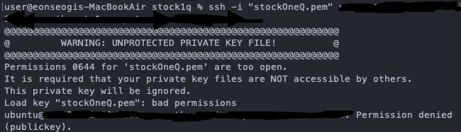
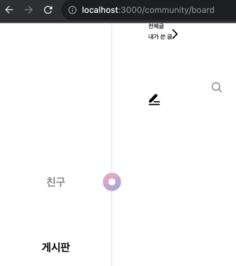

### ec2 인스턴스 생성하기.

아주 야무지게 하나 뚞딲 만들어 버렸다.

### ubuntu 접속하기.

ssh 명령어를 통해, 접속을하려고 하였다.

접속을 하기 위한 명령어는 인스턴스 아이디를 통해, 인스턴스 정보로 들어간 뒤, 오른쪽 상단의 ‘연결’버튼을 누르면


ssh 클라이언트 항목이 뜬다 거기서 제일 아래에 있는 ssh로 시작하는 명령어를 터미널에 입력해주면 된다.


그런데 아래와 같은 오류가 떴다.



키를 공개적으로 볼 수 없도록 설정을 해주었다.

```bash
chmod 400 stockOneQ.pem
```


_성공!_

### nodeJS 설치.

ubuntu에 접속하여 nodeJS를 설치해주었다.

```bash
sudo apt-get update
sudo apt install nodejs
sudo apt install npm
```

그런 뒤 node -v을 확인해보니, v12.22.9 였다.
node를 최신 버전으로 업그레이드 시켜주기 위해, nvm을 설치하였다.

```bash
curl -o- https://raw.githubusercontent.com/nvm-sh/nvm/v0.34.0/install.sh | bash
. ~/.nvm/nvm.sh
nvm install --lts
```


_헤헤 이때까진 좋았다,,,_

배포를 하기 전에, main에 코드들을 다 옮기기 위해, merge를 진행 하였다.
develop에서 main으로 pr날렸더니 conflict 해결하라길래 github가 알려준 대로,

```bash
git pull origin main
git checkout develop
git merge main
```

이렇게 진행을 해주었다.


그런데 도대체 도대체 왜 이따구로 충돌이 나는지 모르겠다.
icon이나 저런 코드들 다 필요한 것들인데, delete 된 걸로 merge가 되려고 하는 것이다. 🤯
몇 시간 째 이거 붙잡고 끙끙 거리고 있는데, 아오 이거 왜 이러는 거지,,
서터레스로 병 걸릴 거 같다,,, (시름시름)

merge하고 나서, 어찌어찌 없어진 아이콘 파일들 다 복구하고, 사라진 코드들 복사해서 붙여넣기 하고, npm run dev
했는데


_이 난리 떨고 있길래 노트북 허리 꺾어 버릴 뻔. 🤕_

하지만 그러기엔 난 돈이 없기에,,, 빠르게 평정심을 되찾고 다른 해결책을 생각해 보았다.
아무래도 이 방법은 아닌 거 같아서, 2개의 방법을 생각했다.
(둘 다 좋은 생각은 아닌 거 같지만,,)

1. develop의 모든 코드를 main에 복붙하기.
2. main에서 develop을 merge한 뒤, main push 하기.

1번을 하려다가, develop과 완벽하게 동일한 코드를 가지면, git push origin develop 했을 때, 달라진 게 없다고,
push가 안 될 거 같아서 그냥 2번으로 하기로 했다.
main을 직접적으로 건드리는 거라 진짜 이 방법은 쓰고 싶지 않았는데 이대로 계속 가다간 제명에 살지 못할 거 같아 😇 빠르게 타협하였다.

<del>자야 하는데,,</del>
<br />

진짜 conflict 오백만 개 해결하고, 심호흡하고 npm run dev 돌려봤다.


_🪦 언석, 스트레스로 여기에 잠들다._

알고봤더니 conflict 해결하면서 코드들 박살나버려서 아예 버리고 새로 clone 했었는데, npm install을 안해줬던 것이었다.

<del>후후,,, 진짜 npm install 딱 대,, 이제 성공이 눈 앞에 아른거린다,,🙊</del>


_🙈_

내가 뭘 그리 잘못했길래, 이 야밤에 이런 봉변을 당해야 하는 걸까?
침착하게 다시 없는 파일들 추가해주고, 없는 종속성 추가 해주고, npm run dev,,,


_도대체 헤더 어디갔지?? 히히 진짜 죽고싶당. 😋_

진짜 이건 안 되겠다, 그냥 develop 고대로 복붙해서 main에 넣어줘야겠다.

완료,,! ✨
그냥 노가다로 폴더 하나하나 붙여넣어주었다 이게 맞나 싶지만, 그래도 드디어 다음 단계로 넘어갈 수 있게 되었다.

### 타입 에러 해결

그 후, ubuntu에 내 github를 clone하고, 인바운드 규칙을 http로 수정해주었다.


그리고 `npm run build`를 해주었더니
무수한 에러들의 악수요청이 있었다. 🤝
작은 type 에러가 있어도 build가 되지 않았다.

여태껏 빨간줄 떴을 때, 해결 안되면 고냥 무시하고 코드 짰는데, 그러면 안되는 거였다. ㅜㅜㅜㅜ 💦
`npm run build`하고 `npm run start`만 하면 build 끝나는데
수많은 에러들의 환대에 어질어질해진다,,,💩

일단 출근하고, 다시 해봐야겠다,,

### 재도전

일단 type 에러 나는 모든 부분을 수정해 주었다.
그런 다음 다시 build를 진행해 보았다.
그러자 또 새로운 에러가 발생하였다,,😧


처음엔 동적으로 주소 받는건데 getStaticPaths 안 해줘서 그런가? 하고 코드 작성을 해줬지만 여전히 오류가 발생하였다.
그래서 오류가 발생하는 파일로 가서, 하나하나 코드를 주석처리 하면서 오류가 없어질 때를 기다려 보았다.


결국 그렇게 오류를 찾아냈고, selectedImage 옆에 instanceof File 코드를 추가해줘서 발생한 오류였다.
이유는 머리를 너무 많이 썼더니 어지러워져서 일단 찾지 않았고, 저 부분 삭제하고 바로 npm run build 해주었다.

build 성공,,!!!!!!!!!!!!! 응애 💃🏻

npm run start을 해준뒤, ec2 public IP 주소로 접속을 해보았다.


_바로 이거지! 슬플 때 웃는 난 어쩌면 1류일지도,,?_

원인을 찾아보니 보안 그룹을 설정해 줘야 한다고,,,!!!


처음에는 http만 0.0.0.0으로 모두가 들어올 수 있게 해주었다 실패!
그럼 https도,,? 실패!
아 내 IP 주소를 설정 안 해줘서 그런가?!
실패!
아 오케이,,! 진짜 알았다,, 포트번호 3000번 안 열어줘서 그랬음!!
실패!

ㅜㅜㅜㅜㅜㅜㅜㅜㅜㅜㅜㅜㅜ ec2 폭파시켜도 합법,,

몇 시간 동안 구글링 해서 결국 이유를 찾아냈다,,!!!

```bash
sudo iptables -A PREROUTING -t nat -i eth0 -p tcp --dport 80 -j REDIRECT --to-port 3000
```

80번 포트 접근을 3000번 포트 접근으로 보내주는 포트포워딩 설정이 필요했던 것이다,,,,
동적 ip 주소 설정한 뒤, 접속을 해보았다.


_야호 💃🏻🕺🏻💃🏻🕺🏻💃🏻🕺🏻💃🏻🕺🏻💃🏻🕺🏻💃🏻🕺🏻👯‍♀️👯‍♀️👯‍♀️👯‍♀️👯‍♀️_

배포에 성공하였다.
