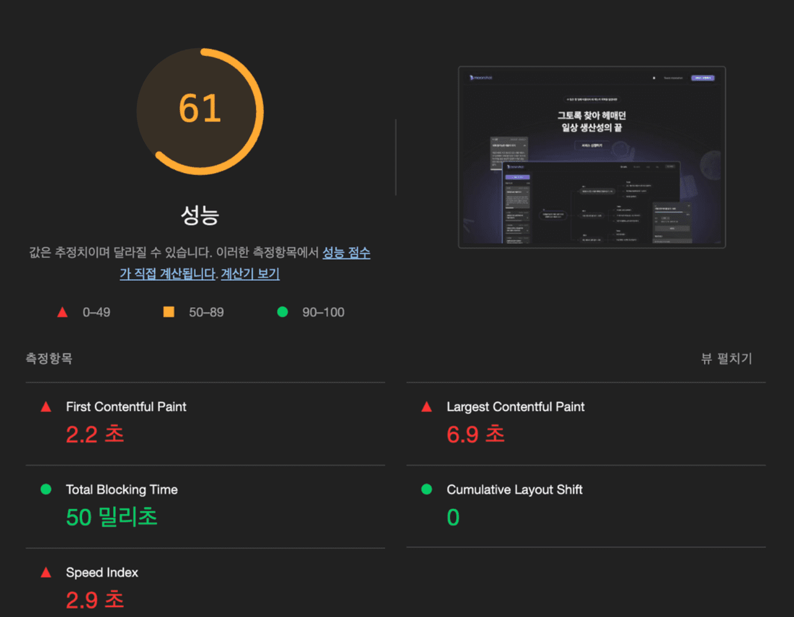
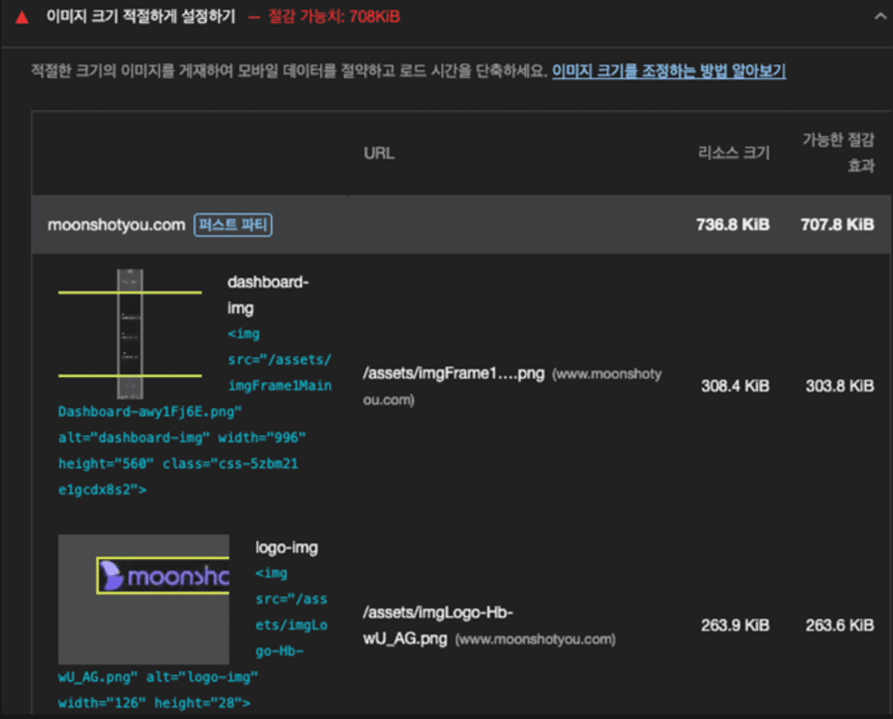
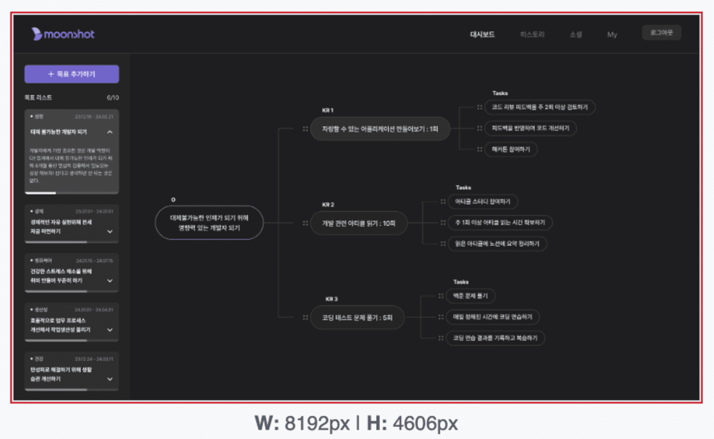
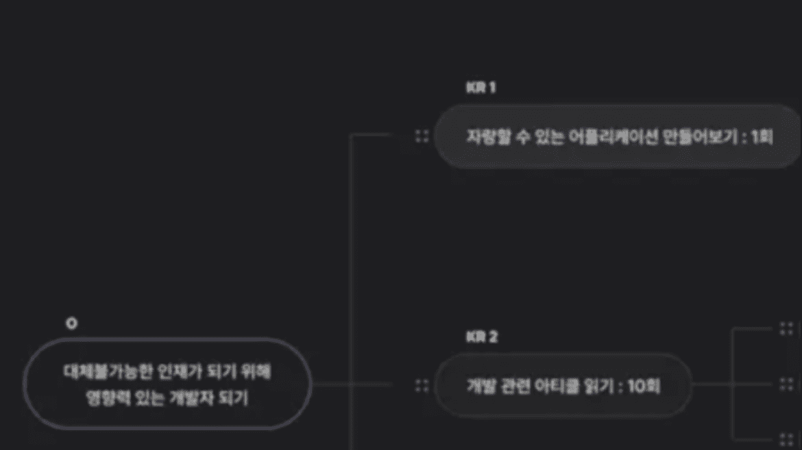
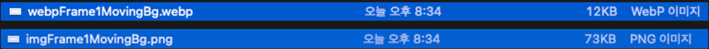
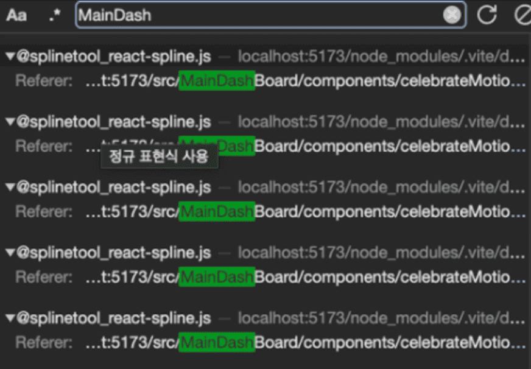
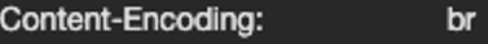
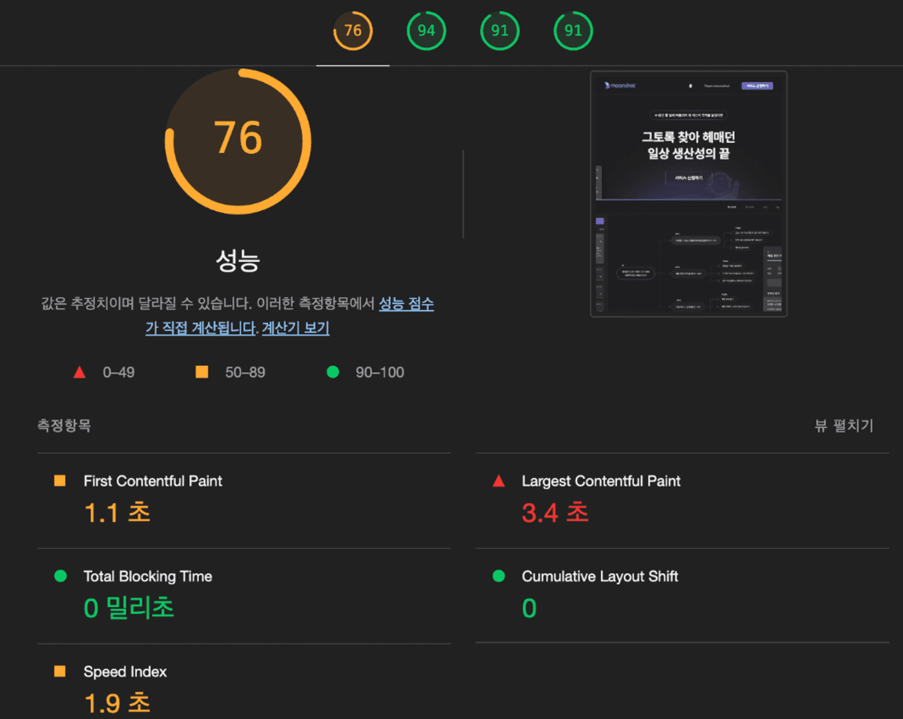
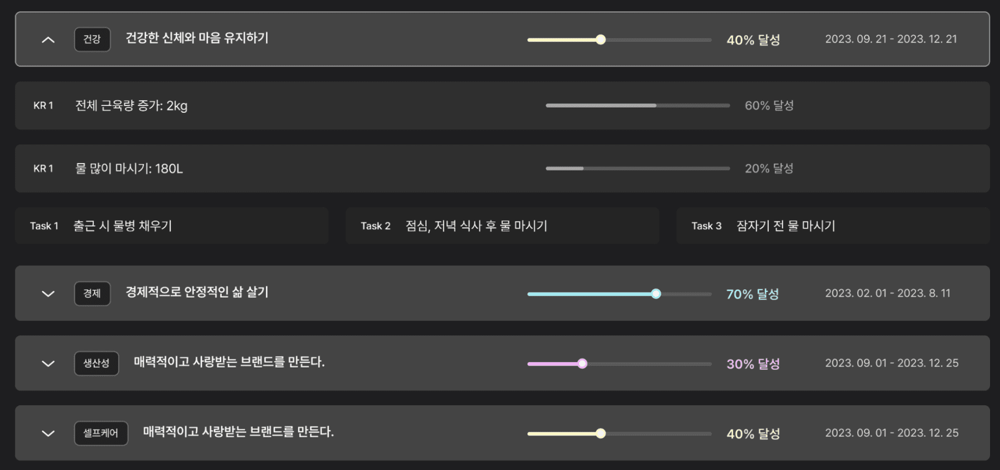
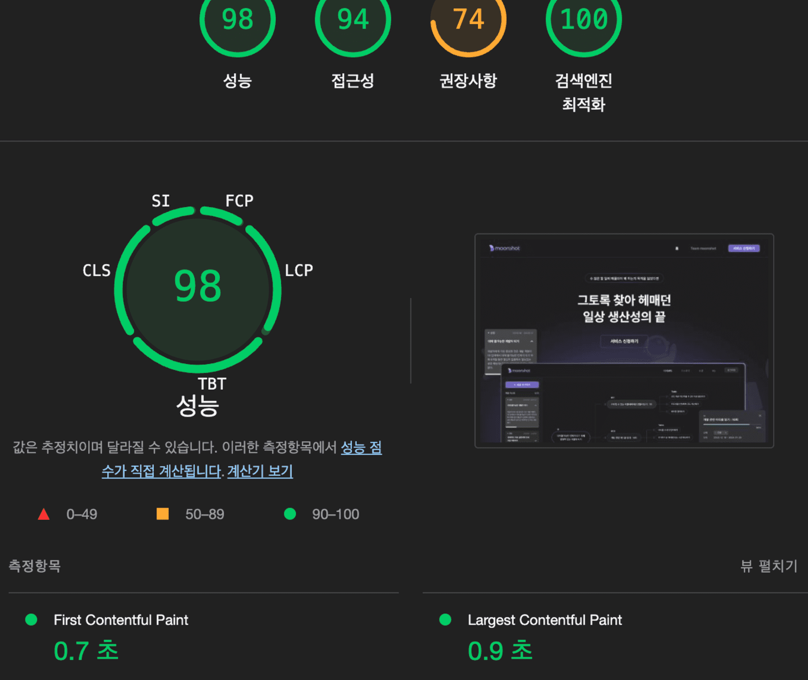

랜딩 페이지 접속 시 이미지가 느리게 뜨는 현상 발생.
이를 해결하기 위해 이미지 최적화를 하기로 결정하였다.

# Lighthouse

이를 위한 지표를 측정하기 위해 구글 크롬의 `lighthouse` 도구를 사용하였다.




성능 총점은 61점이고, 10.1MB의 리소스가 모두 렌더링 되었을 시 405ms가 소요 되었다.

# 이미지 최적화

lighthouse는 친절하게도 어디서 점수가 감점 되었는지 알려주었다.

## 이미지 사이즈 조절



첫 번째 이유로는 실제 렌더링 되는 사이즈에 비해 원본 이미지 크기가 크다는 것이었다.
실제로 `frame1`의 `main dashboard` 이미지는 `996 x 560`의 사이즈로 렌더링 된다.
하나, 파일에 저장되어 있던 이미지 크기는 그의 8배인 `8192 x 4606` 이었다.



이 외에도 대부분의 이미지들이 터무니 없이 크게 추출되어 있었다.

[적절한 이미지 크기 조정  |  Lighthouse  |  Chrome for Developers](https://developer.chrome.com/docs/lighthouse/performance/uses-responsive-images?utm_source=lighthouse&utm_medium=devtools&hl=ko)

위의 참고 페이지를 보면 아래와 같은 설명이 있다.

> 💡 페이지에서 사용자 화면에 렌더링된 버전보다 큰 이미지를 제공하지 않는 것이 좋습니다. 이보다 크면 바이트가 낭비되고 페이지 로드 시간이 느려집니다.

따라서, 랜딩 페이지에 필요한 이미지들은 `x1`로 재추출한 뒤 교체해 주었다.

### x1의 문제점



그렇게 하니 용량은 많이 줄었으나, 페이지 확대 시 위와 같이 이미지가 깨지는 문제가 발생했다.
따라서, 더 큰 사이즈로 이미지를 추출해야 했다.

### 이미지 사이즈 테스트

그렇다면 몇 배의 크기로 이미지를 추출해야 할 지 테스트를 해보았다.
[이미지 배율 조절 사이트](https://www.iloveimg.com/ko/resize-image)를 이용하여, `x2`로 만들어보았다.
하지만 역시나, 이미지가 깨지는 문제가 발생했다.

그래서, `x3`으로 해보았다.
이제서야 깨짐 없이 깨끗한 이미지가 보이기 시작했다.

결론은 `x2.5 ~ x3` 사이로 뽑으면 되는 거 같다.

다른 페이지는 몇 배로 뽑았는지 궁금해서 [당근 사이트](https://www.daangn.com/)를 들어가 보았다.


당근 역시 `x3` 정도의 비율로 이미지를 추출한 것을 확인할 수 있었다.

## 이미지 용량 줄이기


다음 문제점으로 `FCP`와 `LCP`가 높게 나온다는 것이었다.
`FCP(First Contentful Paint)`란 페이지가 처음 로드되고 유효한 content가 렌더링 되기까지 걸린 시간을 의미하고,
`LCP(Largest Contentful Paint)`란 페이지가 로드를 시작한 후 view port 내에 가장 큰 이미지 또는 텍스트 블록이 렌더링 되기까지 걸린 시간을 의미한다.

아무래도 용량이 크면 클수록 이미지를 불러오는데 까지 걸리는 시간은 길어질 것이다.
그렇기에 이미지 압축을 진행해 주었다.

[이 사이트](https://www.iloveimg.com/ko/compress-image)를 이용해 주었고, 꽤나 많은 용량을 줄일 수 있었다.

간혹 압축을 하는 과정에서 이미지의 색이 회색으로 바뀌거나 하는 경우가 있었는데, 이런 경우엔 압축을 하지 않았다.

## 차세대 이미지 파일 사용

압축을 하지 않을 경우, 파일 사이즈가 상당히 커서 (최대 1~2MB) 이를 다른 방식으로 해결해 주어야 했다.
lighthouse가 추천해준 방법은 차세대 이미지 파일인 `WebP`나 `AVIF`를 이용하는 것이었다.

[최신 형식으로 이미지 제공  |  Lighthouse  |  Chrome for Developers](https://developer.chrome.com/docs/lighthouse/performance/uses-webp-images?utm_source=lighthouse&utm_medium=devtools&hl=ko)

> 💡 AVIF 및 WebP는 이전의 JPEG 및 PNG에 비해 압축 및 품질 특성이 뛰어난 이미지 형식입니다. 이미지를 JPEG 또는 PNG가 아닌 이러한 형식으로 인코딩하면 로드 속도가 빨라지고 모바일 데이터를 적게 소비할 수 있습니다.

> 💡 WebP는 최신 버전의 Chrome, Firefox, Safari, Edge 및 Opera를 지원하는 반면 AVIF 지원은 더 제한됩니다.

둘 중 더 많은 브라우저를 지원하는 `WebP`를 이용하기로 하였다.

`png`를 `WebP` 파일로 변환하기 위해 [변환 사이트](https://cloudconvert.com/png-to-webp)를 이용하였다.

명령어로 `WebP`를 만드는 방법도 있으니 다음에는 이를 이용해 볼 생각이다.

[명령줄로 WebP 이미지 만들기  |  Articles  |  web.dev](https://web.dev/articles/codelab-serve-images-webp?hl=ko#convert_images_to_webp)



확실히 압축이 더 되는 것을 확인할 수 있었다.
물론 WebP 이미지도 [사이트](https://imagecompressor.11zon.com/ko/compress-webp/)를 이용하여 한 번 더 압축해 주었다.

### WebP의 문제점

이런 `WebP`의 문제점은 모든 브라우저에서 `WebP`를 지원하는 것은 아니라는 것이었다.
따라서 지원하지 않는 브라우저를 위한 또 다른 처리가 필요했다.

<del>아오 귀찮아;</del>

[자주 묻는 질문(FAQ)  |  WebP  |  Google for Developers](https://developers.google.com/speed/webp/faq?hl=ko#how_can_i_detect_browser_support_for_webp)

[[React] 웹 성능 최적화 [이미지]](https://velog.io/@svk5496/React-웹-성능-최적화-이미지)

위는 내가 참고한 글이다.

짧게 요약하자면 `picture` tag를 이용해주면 된다.
`picture` tag는 `srcSet` 중에서 지금 상황에서 최선의 이미지를 선택하고 이를 렌더링 해준다.

```tsx
<picture>
  <source srcSet={webpFrame1ObjectiveItem} type="image/webp" />
  
</picture>
```

일단은 `WebP` 하나만 설정해 주었지만, 다른 글들을 보니, `vw`에 따라 다른 이미지를 렌더링 할 수도 있는 거 같다.
지금은 그 정도까진 필요한 거 같지 않으니 그냥 넘어갔다. (아래 사진이 그 예시이다.) ([참고사이트](https://about.daangn.com/))


참고로 `picture` tag 안에는 `img` tag가 꼭 들어가야 한다고 한다.

### background image도 WebP로 변경

img를 모두 `png`에서 `WebP`로 변경해 주었다.
그런데 한 가지 문제점은 `img`tag가 아닌 `background-image` 속성을 사용한 곳에서는 `picture` tag 사용이 조금 어렵다는 것이었다.
귀찮아서 그냥 넘어가려다가, 찜찜s한 느낌이 들어서 이를 해결해보기로 하였다.

[Detecting WebP support](https://stackoverflow.com/questions/5573096/detecting-webp-support)

접근 방법은 해당 브라우저가 `WebP`를 지원하는 브라우저인지 체크를 한 뒤 이에 따른 조건부 렌더링을 하는 것이었다.
따라서 이를 체크하는 함수를 하나 만든 뒤,

```tsx
// isWebPSupported.ts

const isWebPSupported = () => {
  const elem = document.createElement('canvas');

  if (elem.getContext && elem.getContext('2d')) {
    // was able or not to get WebP representation
    return elem.toDataURL('image/webp').indexOf('data:image/webp') == 0;
  } else {
    // very old browser like IE 8, canvas not supported
    return false;
  }
};

export default isWebPSupported;
```

이를 적용해 주었다.

```tsx
background-image: url(${isWebPSupported() ? webpFrame1MovingBg : imgFrame1MovingBg});
```

이와 같은 방법으로 모든 이미지 파일을 `WebP`로 바꿔주었다.

## 좀 더 참고해 볼 만한 것

[Largest Contentful Paint (LCP): What It Is & How to Improve It](https://www.semrush.com/blog/lcp/)

[React Image Optimization: A Guide for Web Developers](https://imagekit.io/blog/react-image-optimization/)

# lazy loading

[Lazy loading - Web performance | MDN](https://developer.mozilla.org/en-US/docs/Web/Performance/Lazy_loading#fonts)

다음 문제는 사용하지 않는 JS를 줄이는 것이었다.


첫 렌더링 시 랜딩 페이지에서 사용되지 않는 파일들도 같이 `import` 되고 있었다.


이는 로그인 하고 들어갔을 때 렌더링 되어야 할 파일들이다.




네트워크 창에 검색을 해보면, 이와 같이 상관 없는 파일들이 많이 검색 되었다.
쓸데없는 요청이 많았다.

이를 줄이기 위해, `lazy loading`을 적용해 보았다.
일단 모든 컴포넌트가 모여있는 `Router.tsx`에서 진행을 해주었다.

```tsx
import AddOkr from './AddOkr';
import AuthGoogle from './Auth/AuthGoogle';
...
```

랜딩 페이지와 관련된 `import` 제외한 나머지 `import`들을

```tsx
const AddOkr = lazy(() => import('./AddOkr'));
const AuthGoogle = lazy(() => import('./Auth/AuthGoogle'));
...
```

위와 같이 수정해 주었다.


그 결과, 요청이 절반으로 줄어들었고, 로드 속도 또한 2배 증가하였다.

`lazy loading`을 사용하면 해당 `content`가 `import` 되는 동안 보여줄 `Suspense`가 필요하다.
그런데 우리 `Router`는 분기가 여러 개 되어 있어서 각각에 마다 `Suspense`를 넣어주는 것이 비효율적으로 보였다.
따라서 `RouterProvider` 전체에 `Suspense`를 감싸주어, 모든 곳에서 `Loading` 이미지를 볼 수 있도록 해주었다.

```tsx
const App = () => {
  return (
    <ThemeProvider theme={theme}>
      <Global styles={globalStyles} />
      <Suspense fallback={<Loading />}>
        <RouterProvider router={router} />
      </Suspense>
    </ThemeProvider>
  );
};
```

### 더 알아볼 것

위와 같은 지표는 내가 `localhost`에서 `lighthoue`를 돌렸을 때의 얘기였다.
하나, 나중에 실제 배포된 사이트에서 이미지 최적화 전후 비교를 해보기 위해 다시 `lighthouse`를 돌려봤을 때는 위와 같은 오류가 뜨지 않았었다.
다시 말해, 랜딩 페이지에서 `dashboard`의 js 파일들이 요청되지 않았다.
배포가 되는 과정에서 `React vite`가 이를 알아서 처리해 주는 것인지 잘 모르겠지만 그렇다면 `lazy loading`이 필요했을까 라는 의문이 들었다.
이 부분에 대해선 조금 더 공부가 필요한 거 같다.

# 텍스트 압축


위와 같은 문제가 있다고 알려주었다.
이를 해결하기 위해 많은 구글링을 해보았다.
그러나 꽤나 어려웠다.

`Minify`와 `Uglify`, 웹폰트 최적화 등등의 여러 기술들이 있었지만,
이를 `React Vite`에 적용하는 예시는 쉽게 찾아볼 수 없었다.

일단 js 파일을 압축해서 보내기 위해 `br`이나 `gzip`을 이용한다는 것을 알게 되었다.

[텍스트 압축 사용  |  Lighthouse  |  Chrome for Developers](https://developer.chrome.com/docs/lighthouse/performance/uses-text-compression?utm_source=lighthouse&utm_medium=devtools&hl=ko#how_lighthouse_handles_text_compression)

그래서 FE 측에선 어떻게 `gzip`으로 압축을 해서 넘겨주어야 하는지 구글링 해보았지만 쉽게 찾을 수 없었다.
알고 보니, 서버 측에서 해줘야 하는 것이었고, 실제 배포된 사이트 가서 확인해 보니



이미 잘되고 있었다.

또한 불필요한 공백 등을 없애주는 `Minify`와 변수명을 알아볼 수 없는 간단한 문자로 변환시켜주는 `Uglify` 또한 `Vite`가 `build` 시에 자동으로 해주는 것 같았다. (80% 확신.)
따라서 이에 대해 무언가를 해줄 필요가 없었다.

추가로, 텍스트 압축 사용 문제는 `localhost`에서 `lighthouse` 돌렸을 때만 떴고, 실제 사이트에선 뜨지 않았다.

결론은 알아서 해주니 신경 쓸 필요 없는 거 같다는 것이다!

### 참고해 볼 것

[웹폰트 최적화 하기](https://velog.io/@vnthf/웹폰트-최적화-하기)

[(번역) 이미지 최적화에 대한 명확한 가이드](https://velog.io/@sehyunny/the-definitive-guide-to-image-optimization)

# 결과




성능이 61 → 76,
`FCP`가 2.2s → 1.1s,
`LCP`가 6.9s → 3.4s,
`리소스`가 10.1MB → 4.6MB,
`로드 속도`가 405ms → 326ms
향상되었다.

# 개선할 점

## LCP 개선

`LCP`가 아직 오래 걸린다는 문제가 있다.


이 background-image를 이미지가 아닌 css 속성으로 만들어주면 어떨까 싶다.

[radial-gradient() - CSS: Cascading Style Sheets | MDN](https://developer.mozilla.org/en-US/docs/Web/CSS/gradient/radial-gradient)

## Frame 5 개선



이 부분은 img로 처리되고 있는데, 사실 이미지로 박을 필요 없이 `history` component 가져와서 사용하면 될 거 같다.
`history` refactoring 끝낸 뒤에 코드로 대체할 생각이다.
그래서 이 부분은 `WebP`로 변경도 하지 않았다.

# 배포 사이트 변경

배포 사이트를 cloudflare에서 vercel로 변경해 주었다.
이유는 여러가지가 있었다.
간단히 정리하자만 우리가 원하는 기능들이 cloudflare에선 잘 작동되지 않았다.

배포 사이트를 변경한 후 다시 테스트를 해보았다.



성능이 많이 향상된 것을 확인할 수 있었다.

## 진짜일까?

사실 위의 이미지 최적화를 진행한 후 시간이 좀 지난 뒤 배포 사이트를 변경했다.
그렇기에 배포 사이트가 변경이 되어서 점수가 오른 것인지,
내가 이미지 최적화한 것들이 cloudflare에 천천히 반영이 되어서 점수가 나중에 오른 것인지는
정확하게 구분이 되지 않았다.
이러한 과정 속에서 서버도 리팩토링을 계속 해왔었기에 서버 측에서 리팩토링 한 결과가 점수에 반영이 되었을 가능성도 나는 있다고 본다.

따라서 배포 사이트 변경이 실제 서비스에 영향을 어느정도 끼치는 지 등에 대한 공부가 추가로 더 필요한 거 같다.
