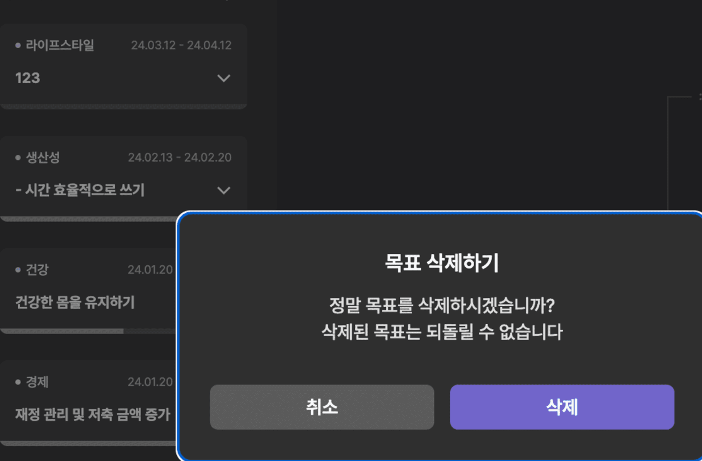

# 시작

## 문제 발생



`dashboard` 목표 리스트에서 우클릭으로 목표 삭제 시 바로 반영되지 않고 새로고침이나 re-focus 시에 반영이 되는 오류가 발생하였다.
data가 re-fetching 되지 않는 것인지 잘 모르겠지만 어쨌든 SWR과 관련이 있다고 판단이 되었다.

## 현재 코드

```tsx
// Index.tsx
const url = currentGoalId
  ? `/v1/objective?objectiveId=${currentGoalId}`
  : '/v1/objective';

const { data: treeData, isLoading } = useSWR(url, getDashBoardData);

const goalListTreeData = treeData?.data.objList;

// fetcher.ts
export const getDashBoardData = async (url: string) => {
  const response = await instance.get(url);
  return response.data;
};
```

위와 같이 요청을 보낸 뒤 `objList`를 `goalListTreeData`에 저장시킨 후 이를 렌더링 하고,

```tsx
const { mutate } = useSWRConfig();

//우클릭의 삭제 버튼 클릭 시의 핸들러
const handleClickDelObjBtn = () => {
  setTargetModal(MAINDASHBOARD_MODAL_CASE.OBJ.DEL);
};

//목표 삭제 모달 -> 삭제 버튼 클릭 시의 핸들러
const handleComfirmDelObj = async () => {
  setTargetModal(null);
  try {
    await deleteObj(`/v1/objective/${rightClickState.rightClickId}`);
    await mutate('/v1/objective');
  } catch {
    navigate('/error');
  }
};
```

모달을 통해 삭제하기 버튼을 클릭하게 되면 delete API를 보내고, mutate를 통해 re-fetching 하는 방식이다.

# 원인

원인은 global mutate를 사용해서 그랬었다.

[global mutate에 대한 설명](https://swr.vercel.app/ko/docs/mutation#global-mutate)을 보면 아래와 같이 나와있다.

> 💡 `key` 매개변수만 있는 global mutator를 사용하면 동일한 키를 사용하는 마운트된 SWR hook이 없는 한 **캐시를 업데이트하거나 재검증을 트리거하지 않습니다.**

마우스 우클릭을 하는 순간 `currentGoalId`에 Id값이 지정된다.
그렇게 되면 url이 `/v1/objective?objectiveId=${currentGoalId}` 로 변하게 된다.
하지만 우리가 mutate 하는 것은 `/v1/objective`로 위와 다른 url 값이다.

다시 말해 mutate 될 때, `/v1/objective`와 동일한 키(url)을 사용하는 SWR hook이 없게 되어 재검증을 하지 않게 되는 것이다.

예시를 들어보자.
만약 아래와 같이 2개의 hook이 mount 되어있다고 한다면,

```tsx
const { data: data1 } = useSWR('/v1/objective');
const { data: data2 } = useSWR('/v1/objective?objectiveId=${currentGoalId}');
```

`mutate('/v1/objective')` 의 호출은 첫 번째 hook만 revalidate 할 것이다.

[Global mutate doesn't work · vercel swr · Discussion #746](https://github.com/vercel/swr/discussions/746#discussioncomment-123351)

# 해결

## 첫 번째 방법

우리가 mutate하는 url은 `/v1/objective` 이다.
하지만 목표 삭제를 누르면 해당 objId를 params로 넘겨주어야 하기 때문에 objId 값이 설정되어 있어, `/v1/objective?objectiveId=${currentGoalId}` 가 실행이 된다.

`/v1/objective`가 실행되도록 하려면 어떻게 하면 될까?

답은 간단하다.
objId의 값을 초기화 시켜주면 된다.

```tsx
const [currentGoalId, setCurrentGoalId] = useState<number>();
// ...
const handleComfirmDelObj = async () => {
  setTargetModal(null);
  setCurrentGoalId(undefined); // 바로 이 부분 추가!!!!
  try {
    await deleteObj(`/v1/objective/${rightClickState.rightClickId}`);
    mutate('/v1/objective');
  } catch {
    navigate('/error');
  }
};
```

이렇게 한다면 mutate 할 때, `currentGoalId`가 정의 되어 있지 않아, `/v1/objective`의 url key 값이 마운트 되게 된다.

## 두 번째 방법

global mutate가 아닌 `bound mutate`를 사용하는 것이다.
사실 이 방법이 더 쉬운 거 같다.

```tsx
const { data: treeData, isLoading, mutate } = useSWR(url, getDashBoardData);
```

방법은 간단하다. 위와 같이 mutate를 추가해주면 된다.
이렇게 했을 때 장점은 key 값을 따로 전달해주지 않아도 되게 된다.

```tsx
const handleComfirmDelObj = async () => {
  setTargetModal(null);
  try {
    await deleteObj(`/v1/objective/${rightClickState.rightClickId}`);
    mutate(); // 이 부분 추가!!!
  } catch {
    navigate('/error');
  }
};
```

변경되는 data는 없으니 인자값 없이 `mutate`를 실행시키면 된다.
참고로 공식문서에서는 `mutate` 앞에 `await`를 붙이지 않은 것으로 보아 `await`를 제거 해도 무방할 거 같다.

다른 거 건들일 필요 없이 저렇게만 설정해주면 자동으로 revalidate 해준다.

# key 값이 여러 개인 경우

## 시작

데이터 정렬하는 로직을 위해,
year, category, criteria
이 3개의 request body data가 필요하다.

또한 이 값들 중 하나라도 바뀔 때마다 data re-fetching이 발생해야 한다.

## 처음 코드

```tsx
const [selectedFilter, setSelectedFilter] =
  useState<filterOptionTypes>('최신순');
const [selectedTheme, setSelectedTheme] = useState(null);
const [selectedYear, setSelectedYear] = useState(null);
const isSelectedYear = selectedYear ? Number(selectedYear.slice(0, 4)) : null;

const { data, isLoading } = useSWR('/api/user', (url) =>
  getOKRHistory(url, isSelectedYear, selectedTheme, selectedFilter),
);
```

처음에는 위와 같이 데이터를 넘겨주었다.

하지만 값이 변경되어도 위에서 발생했던 것과 같이 바로바로 업데이트가 되지 않는 오류가 발생했다.

## 해결 과정

### refreshInterval

자동으로 interval로 refresh 해주는 것이 있다고 해서 바로 적용해 보았다.

```tsx
const { data, isLoading } = useSWR(url, getDashBoardData, {
  refreshInterval: 100,
});
```

위와 같이 설정을 해주니 값이 변경된 후 0.1초 후에 바로 업데이트가 되었다.

그런데 이런 식으로 하면 매 0.1초마다 업데이트를 해주는 것인데 이는 분명히 불필요하며 이보다 더 좋은 방법이 있을 것이란 생각이 강하게 들었다.

### 다른 더 좋은 방법

[인자 – SWR](https://swr.vercel.app/ko/docs/arguments#multiple-arguments)

애초에 잘못 사용 하고 있었다.

공식문서에 보면

> 💡 이는 **올바르지 않습니다**. 왜냐하면 데이터의 식별자(또한 캐시 키)가 `'/api/user'`이고, 만약 `token`이 변경되어도 SWR은 여전히 동일한 키를 사용하기 때문에 잘못된 데이터를 반환합니다.

라고 이렇게 사용하면 안 된다고 나와있었다.

대신 아래와 같이 key값을 배열로 넘겨주어야 한다고 한다.

```tsx
const { data, isLoading } = useSWR(
  ['/v1/objective/history', isSelectedYear, selectedTheme, selectedFilter],
  ([url, isSelectedYear, selectedTheme, selectedFilter]) =>
    getOKRHistory(url, isSelectedYear, selectedTheme, selectedFilter),
);
```

이렇게 수정을 하니, 3개의 값 중 하나라도 달라지면 key 값이 변경된 것으로 간주되어 re-fetching이 진행되었다.

끗!
