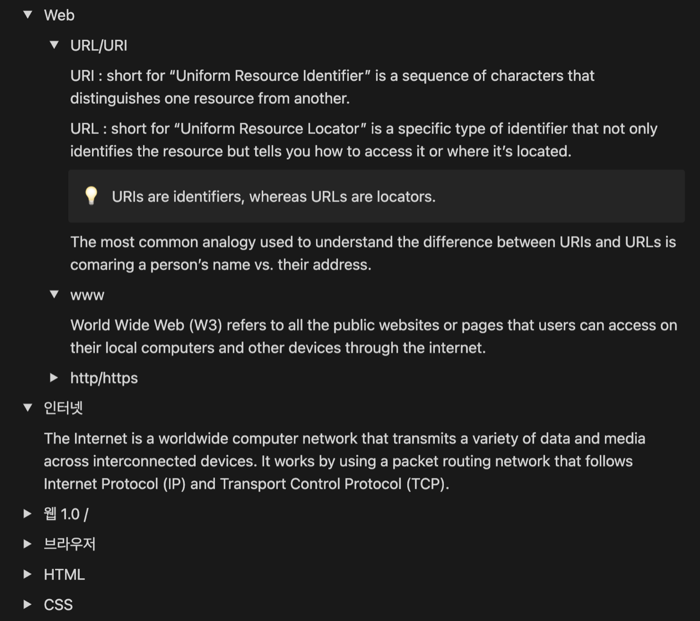
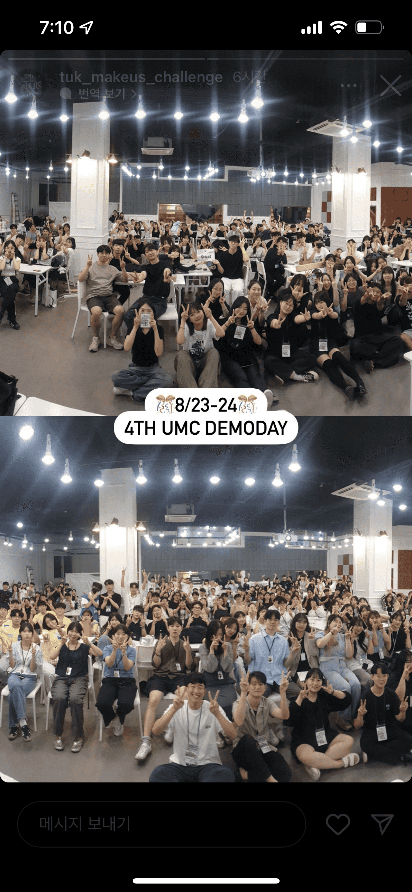
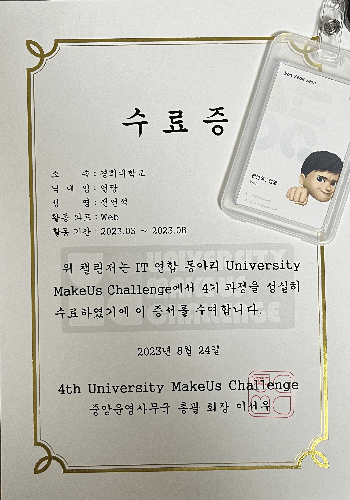

# 지원 및 면접

2022년 말 드디어 정신을 차리고, 이대로 살면은 안 되겠단 생각이 강하게 빡 들어가지고, 할 수 있는 건
다해야겠다는 생각을 하였다

그러던 중, UMC 4기 지원 공고가 동아리톡 방에 올라왔다

그때, 다른 프로젝트를 진행하고 있었던 상태에, 20학점을 듣고 있었어 가지고, 솔직히 이 3개의 활동을 동시에 다
진행할 수 있을 지에 대해 조금은 두렵기도 했고, 할 수 있을까 의심이 들기도 했지만,

늦은 만큼, 더 부지런히 해야 하니까, 바로 지원을 하였다

그 당시, 프론트를 본격적으로 시작한지, 3~4개월 정도 밖에 안 됐어가지고, 지식도 많이 부족하고, 실력도 너무
부족한 상태여서, 솔직히 떨어져도 크게 이상할 건 없다고 생각을 하였다

그런 상태로 면접을 진행하였는데, 여기서 기술 면접이란 걸 처음 보게 되었다

> CRA가 뭔지 아세요?

어,, 음,,,,

> 리액트 생명주기에 대해 설명해 보세요

,,? 음,,,

이렇게 40분 동안 16개 정도의 질문을 받았다

지금 생각해보면, 너무나도 당연히 알아야 하는 거고, 그렇게 막 어려웠던 질문들도 아니었는데, 그때는 무지 그
자체여서, 제대로 답변을 한 게 거의 없었었다

그렇게 머쓱한 웃음과, 삐질거리는 표정으로 면접을 마치고, 나는 떨어짐을 확신하게 되었다

근데 왠걸, 지원자가 적었는지 합격이 덜컥 되버린 것이다,,?! 이게 맞나,,

<del>어쨋든 핵꿀 :D</del>

# 스터디 (2023.03 - 2023.06)

진짜 농담 안 하고 너무 바빴다

학교 수업 따라가기도 벅찬데, 방학 동안 진행하던 프로젝트 마무리를 못해서, 지금까지 끌고 가고 있는 상태였는데,
거기에 매주 스터디 준비하는 건 내게 쉽지 않은 일이었다

스터디는 한 주 주제를 정해주면 그 부분을 공부하고 조사해서, 매 주 서로 검사를 하는 방식이었다

_괜히 겉멋 들어서 영어로 작성해가지고는,,,_

이건 1주차 때, 내가 정리한 내용들이다 처음엔 정말 열심히 해보려고 하였다

나중에 이 자료들을 보고, pm이 개발자를 뽑는다고 하였기에, 좋은 프로젝트 팀에 들어가기 위해선 잘 정리를
해야한다고 생각했다
그런데, 3주차 넘어가면서 중간고사도 끼고, (축제도 보고,, 놀기도 하고,, ㅎㅎ) 이래저래 할 게 너무 많다 보니,
지쳐가기 시작했다
거기에 플러스로, 매주 진행하는 스터디도 솔직히, 누군가 끌어준다는 느낌 없이 우리끼리 우당탕탕하는 느낌이었다

그러다 보니 점점 과제도 대충하게 되고, 나중에 다시 정리하지 하며 미루게 되었다

그래도 조금은 기대를 하고 들어왔는데, 내 생각과는 다르게 흘러가는 거 같아, 좋지는
않았다

활동비(5만 원)도 너무 아까웠고, 크게 나에게 도움이 되지도 않는 거 같아서 솔직히 지금이라도 그만하라하면 그만할
수 있을 정도였다

그래도, 10주 간의 스터디 중 중간 고사 기간 한 주 빼고는 모두 참가하였다
정말 방학동안 하는 프로젝트 그것만이라도 건져보자는 마인드로, 버텼던 거 같다

그래도 스터디 같이 하는 사람들은 다 좋으신 분들이어서 다행이었다 스터디 장을 맡으신
분은 정말 너무 친절하게 진행을 해주셨고, 같은 과 후배들도 있었고,

또 1학년 신입생 친구들도 있었는데, 뭔가 내 예전 모습을 보는 거 같아 내가 아는 선에선 최대한 도와주고 싶었다

물론 언제든지 질문해도 괜찮다 했는데 단 한 번의 질문도 안했지만 말이다,,,

스터디 종료와 동시에 대부분 연락이 끊겼지만, 다들 잘 됐으면 하는 바람이 있다

# 프로젝트 (2023.07 - 2023.08)

<h3>프젝 시작</h3>

지원 기간이 기말고사 기간이었나? 당연히 7월 부터 프로젝트 진행하니까, 팀 꾸리는데 있어서 여유있게 뽑을 줄
알았다

근데 1차 지원 기간이 단 하루였던 것이었다
응 바로 기한 놓쳐버려~

시간 체크도 안 한 멍청한 나 자신을 질책하며, 다음 날 오전이었나? 지원 페이지를 들어갔는데, 구글폼 제출이
가능한 상태였다

그래도 일단 해보자라는 생각으로 하루 늦어서 기한 놓쳤지만 일단 지원서를 제출해 봤다

‘포토랜서’라는 프로젝트였는데, 이미지 처리? 뭐 이런 것들을 한다 해가지고, 재밌을 거 같기도 하고, 안 해본
새로운 걸 배울 수 있을 거 같기도 해서 바로 지원을 했다

바로 똑! 떨어져 버렸다

나보다 잘 하는 사람들이 많았구나 싶어서, 아쉽지만 어쩔 수 없지 하고 누가 뽑혔나 봤는데
프론트 총 3자리 중에 1명만 뽑았길래 이게 뭐지 싶었다 빈 자리가 있는데 날 왜 떨어트린거지?

나중에 이 프로젝트 pm을 만나 얘기를 들어보니, 2차, 3차 지원 때, 더 좋은 참가자들이 지원할까봐, 나를 안
뽑았다고 하였다

솔직히 2안은 생각 안했었어 가지고, 어디를 지원할 지 되게 고민을 했었다 ‘스톡원큐’라는
프로젝트가 제일 끌리긴 했는데, 개발해야할 양이 너무나도 많았다 스톡원큐는 내가 방학동안
진행했던 프로젝트와 유사했다 하지만 이 프로젝트 하는데 6개월이 걸렸었다 근데 스톡원큐는
이 보다 양이 더 많은데, 2개월 내로 끝내야 했다 심지어 나는 그때, 인턴을 붙은 상태라,
방학 동안 인턴 생활을 했어야 하는 상황이었다 너무나도 바쁘고, 시간이 부족할 거 같아서
지원을 망설였다

‘익키’라는 키오스크 프로그램 만드는 프로젝트가 양도 적어 보였고, 구현도 쉬워보여서,
이거로 할까하다가, 나 공부하려고 하는 건데, 쉬운 거 할 거면 뭐하러 하나 생각이 들어서,
결국 스톡원큐에 지원을 하게 되었다 지금 UMC 활동 마무리하고 돌이켜 봤을 때, 이때의
선택은 정말 잘한 선택이었다고 생각이 든다

하지만 그때는 미래를 몰랐기에, 걱정이 많이 되었다 가장 큰 걱정은 인턴 일로 인해 내가
너무 바빠서 팀원들에게 피해를 주게 될까봐였다

심지어 오픈소스 컨트리뷰션(OSSCA)에 지원했던 것도 붙은 상황이라, 방학 동안 인턴, UMC, OSSCA까지 진행을 해야
했다
누군가에게 민폐 끼치는 걸 굉장히 싫어하기에, 차라리 다들 열심히 안 해가지고, 그냥 흐지부지 되었으면 하는
바람도 조금은 있었다

아 근데 첫 회의 하는데, 우리 PM 왤케 열정 넘치는지,,,, 다른 사람들도 다 열심히 할
거 같은 분위기라, 미안한 마음이 더 커지게 되었다 그래도 이왕 하기로 한 거 열심히
해봐야지라는 마음을 갖고 임하기로 하였다

다행히, 팀원이 초기 레이아웃 구현 하는 동안 내가 할 게 없어서, 인턴 일에 더 집중할
수 있었다 초반이라 일이 너무 많았고, 적응하기에 급급했었었는데, 좀 다행이었다

이제 본격적으로 내 맡은 분량의 개발을 들어가게 되었는데, 너무나도 바빴다 그때 내
하루 일과는 이랬다

7월에는 아침 영어 학원을 다녔던 터라, 5시 반에 일어나서 강남가서 영어 수업 듣고, 바로 출근해서 밤 늦게까지
근무하고, 집 가는데 편도 2시간 걸리니, 집 도착하면 거의 11시에서 12시 사이었다

이 사이에, OSSCA활동과 UMC를 집어 넣었어야 하는데, 너무 벅찼었다
도저히 시간이 안 나서, 출퇴근 버스 안에서 코드르 짰다
지하철에선 서서 가기 때문에 할 수가 없었다
정말 다 그만 두고 싶었고, 가끔은 이게 뭐하는 건가 싶기도 했다

난 이런 일을 감당하기엔 아직 너무 어리다고,,

7월 초중반은 회사 일도 많았었다 사실 많았다기 보단 내 실력이 많이 부족했었다는게
더 맞는 표현인 거 같다 그래서 스톡원큐 프론트 톡방에 같은 팀원이 헬프를 요청해도,
바로바로 답변을 해주지 못했었다 한 번은 한 팀원이 오류가 나서, 헬프 요청을 했었는데,
바빠서 답장을 못했었던 적이 있었다

그러고 시간 좀 지난 뒤 혼자 오류를 해결했다는 톡이 왔었는데, 나중에서야 내가 해결되어서 다행이다라고 답장을
했었었다

나중에 다같이 모여 밥 먹는 자리에서 그때 팀원이 조금 섭섭? 했었다는 느낌으로? 지나가는 말로 얘기를 했었다

사실 그때, 카톡을 못 봤었던 거 아니었고, 미리보기로 다 보고 있었지만, 회사 일을 하느라, 나중에 답장을 해줘야지
했었던 터라, 그 얘기를 들으니 미안한 마음이 들었다

그래서 그때 이후론 최대한 바로바로 답장을 해주려 노력을 하였다

다행히 8월 초에는 회사에서도 일이 별로 없었고, 영어 학원도 그만 둬서, 프로젝트에 조금 더 신경을 쓸 수 있었다

사실 처음 지원할 때, 채팅 기능을 보고 지원을 했었다 해보면 좋은 경험이 될 거 같았기
때문이다

그런데 시간 상 이유로 채팅 기능 없애고, 그냥 CRUD만 한다 했을 때, 전에 했었던 것들이니까, 나에게 새로운 지식이
될 만한 건 크게 없을 거라고 생각했다

하지만 이는 정말 큰 오만이었다

NextJS getStaticProps 사용법, EC2 이용한 배포, 프로젝트 초기 설정 등 내가 몰랐던 부분들이 너무나도 많았었고,
이 프로젝트를 진행하면서 많은 걸 배울 수 있었다 하면서도, 하길 잘했다는 생각이 들 정도였으니 말이다

<h3>데모데이</h3>
어찌어찌 데모데이날이 다가오고야 말았다 전날, 밤을 새면서 계속 개발에 몰두 하였다
결국 끝내야 할 부분까지 다 끝내진 못했지만 그래도 마지막까지 구현할 수 있는 모든
걸 구현하려고 하였다 당일날 회사로 출근을 했어야 했기에 나는 데모데이에 참여를 할
수가 없었다 정말 가고 싶었는데 너무나도 아쉬웠다ㅜ 출근길 버스에서도 계속 코드를
작성했고, 회사에서도 중간중간 수정을 하였다

_데모데이 우리 부스 사진._
_처음부터 계속 참여하고 싶었는데 아쉽아쉽_

나중에 얘기를 들어보니 데모데이때 다른 팀원들이 정말 고생을 해주었던 거 같다

_UMC 4th 전체사진_

물론 모든 걸 다 개발하진 못했지만 그래도 나름대로 잘 마무리 한 거 같아 뿌듯한 마음이
들었다 만약 다른 팀원들이 계속해서 프로젝트를 끌고 간다면 나도 끝까지 갈 생각이다

_옙뺭이 만들어준 멋진 명함과 나의 수료증,,_

# 끝

이번 UMC 활동을 통해 얻은 게 무엇이냐고 한 가지만 말해보라고 한다면 난 팀원들이라고 얘기하고 싶다
정말 그 정도로 좋은 팀원들을 만나서 행복하게? 개발을 했던 거 같다
진짜 열정 넘쳐 보이는 PM이랑 예쁜 브랜딩 해준 디자이너, 든든한 프론트, 백엔드 팀원들까지
마지막까지 포기하지 않고 끝까지 같이 해줘서 너무나도 감사하다는 말을 전하고 싶다
(사실 내가 포기하고 싶었음ㅋㅎ)

_우주 최강 우리팀 ^^_

**자, 그럼 이제 SOPT에 지원을 해볼까?**
