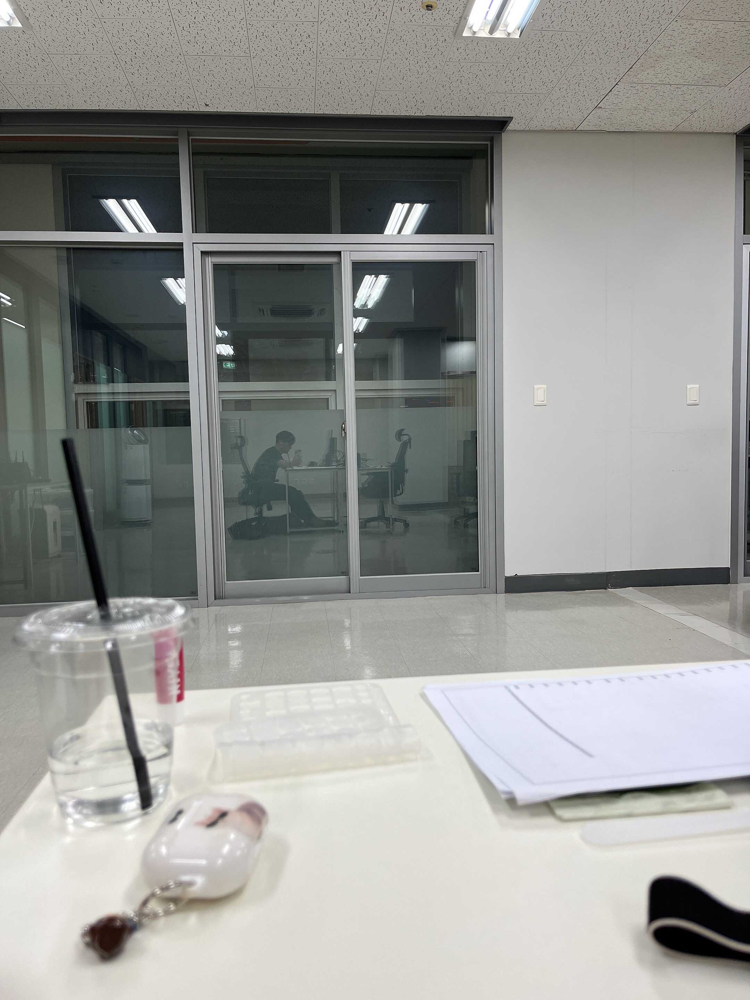
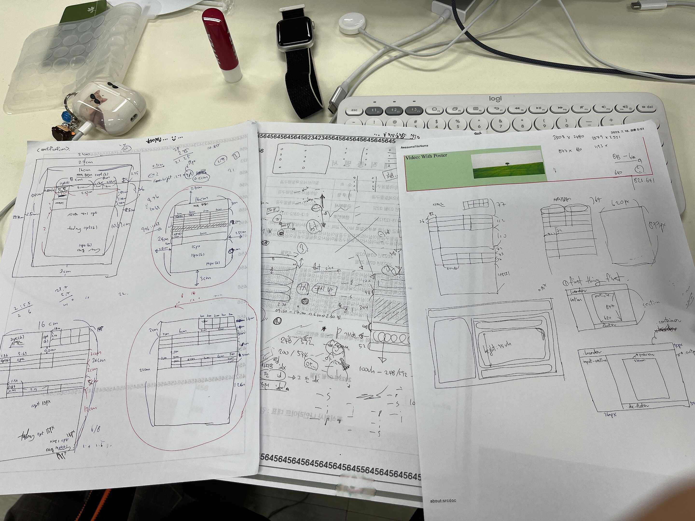
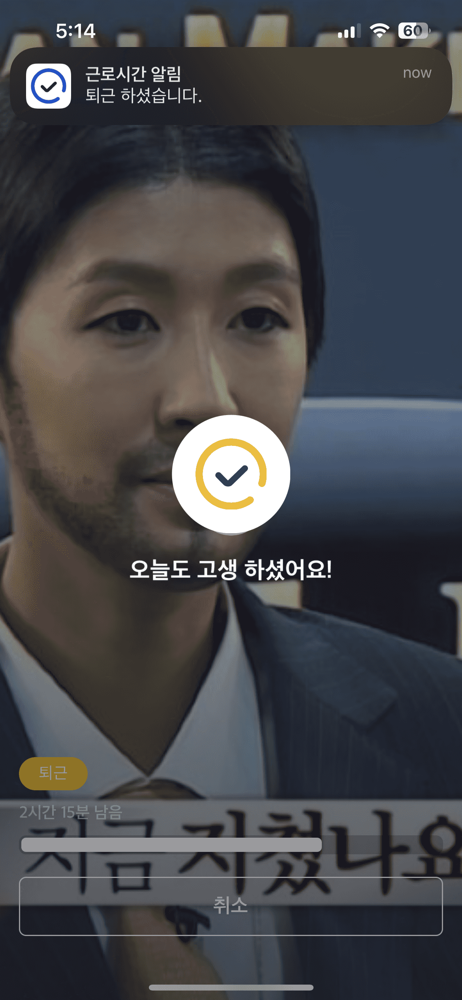
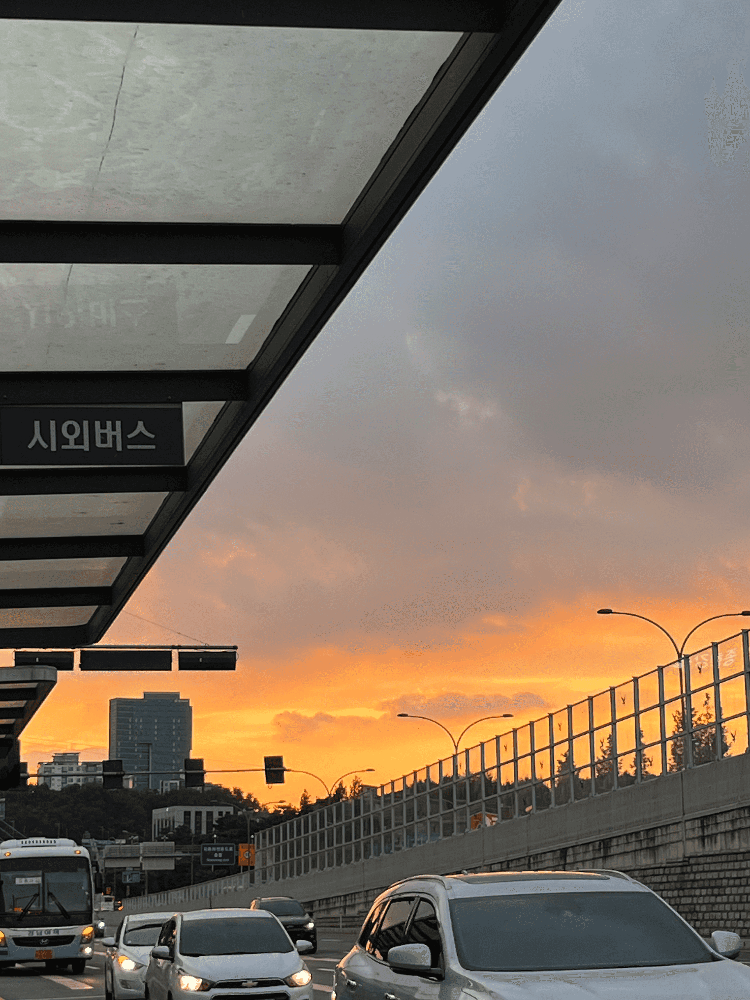
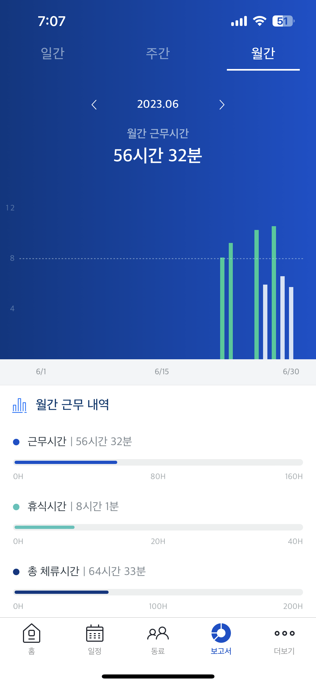
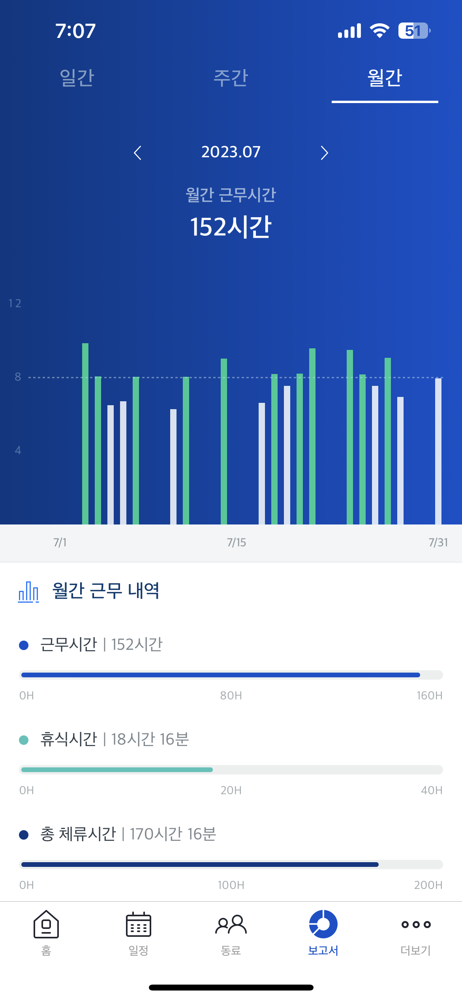
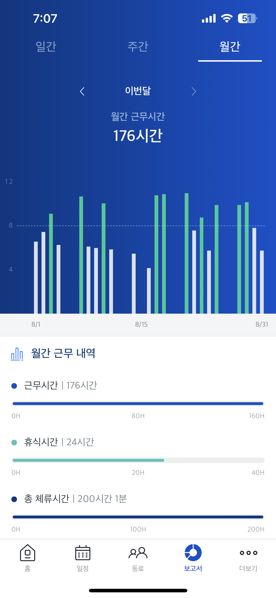

# 인턴에 지원을 해봅시다.

인턴 활동을 너무나도 하고 싶었었다.
저번 학기부터 지원을 했었지만, 다 떨어져서 할 수가 없었었다.
사실 당연한 결과였을 지도 모른다 개발 공부 시작한 지도 별로 안 됐고, 지금까지 한 것도 많이 없고, 실력도 없었으니 말이다.

이번에도 인턴에 지원을 하면서, 떨어져도 이상할 게 하나 없다고 생각을 하였다.
1차 떨어지면 2차 바로 지원해보고 안 되면 실력을 더 키워, 내년에 다시 도전을 할 생각이었다.

1차 지원 리스트를 보는데, 내가 가려는 프론트를 뽑는 회사가 많지는 않았다. 꾸역꾸역 리스트를 추려봐도, 3~4 군데 정도였다.
그 중에서 제일 가고 싶었던 곳은 ‘나인라이트’라는 회사였다. 내가 하는 분야랑 정확히 일치했었기 때문이다.
하지만, 수원에 있어서 거리가 너무 멀었고, 회사 검색을 해보니, 직원 10명 정도의 si 업체라 가도 괜찮을까 걱정이 살짝 되긴 했었다.
그래도, 출퇴근이야, 하면 되는 거고, si 업체여도 배울 점이 있을 테니 그냥 지원을 해보기로 했다.

<del>안 되면 뭐,, 2차 지원하면 되는 거고,,,,</del>

# 기다림,,

3명을 뽑는 거였는데, 우리 학교에서만 3명이 지원을 했었다.
다른 학교도 포함해서 총 3명 뽑는 거라, 무조건 붙는 건 아니었다.
결과 발표 날짜가 딱 정해져있는 건 아니었어서 결과 통보가 오기만을 계속 기다렸다.

처음에는 그냥 결과가 늦게 나오는 건 줄 알았다.
하지만 주변 애들을 하나 둘 씩, 결과가 나오기 시작했지만, 나는 계속 결과가 나오지 않았다.
설상가상으로, 2차 지원이 시작되어 버린 것이다.
이게 연락이 없으면 그냥 떨어진 것으로 봐야한다는 얘기가 있어서, 그제서야 아 내가 떨어졌구나를 알 수가 있었다.
떨어져도 이상할 거 없다 생각은 했지만, 막상 떨어졌다고 생각을 하니, 기분이 좋지는 않았다.

그래도 2차가 있으니, 진정하고 2차를 지원하려 하였다.
그런데 1차에서 지원했던 나인라이트 쪽에서 탈락 여부를 등록하지 않아, 아직 난 1차 심사 중 상태여가지고 2차에 지원을 할 수가 없었다.
2차 지원 기간 시간 엄청 짧은데, 빨리 지원해야 하는데, 얘네는 일 빨리빨리 처리 안 하고 뭐하는지 엄청 욕했었다.

진짜 전화해보려다가 그 당시 너무 바빴어가지고, 나중에 전화해야겠다 생각하던 참에, 문자 한 통이 왔다.

> 안녕하세요 나인라이트 채용팀입니다 ~~ 채용 결과는 금일 확정될 예정이며, 보유한 포트폴리오가 있으시다면 ~~로 오후 3시까지 전달부탁드립니다 ~~

띠요잉 😳 역시, 난 떨어진 게 아니었어,,,!!!! 그냥 저 사람들이 일 처리를 늦게 한 거였어,,,!!!! 라고 생각하며,
부랴부랴 있는 활동, 없는 활동 다 끌어모아, 포트폴리오를 빠르게 만들고, 메일을 보냈었다.
진짜 제발 됐으면 좋겠다고 빌면서 문자 답장을 기다렸다.

결과는

**축 합격! 🎉**

# 내 첫 직장

_흥덕 IT 밸리_

설렘 반, 긴장 반으로 6/22 목 첫 출근을 하였다.
10시 반까지 가야 했었는데, 처음 가는 길이고, 또 지각 하면 안 되니까, 아침 8시 전에 나갔었던 거 같다.

가는데만 2시간이라 꽤나 빡셌다.
그래도 학교 가는 길이랑 비슷해서, 가는 데 큰 어려움은 없었다.

흥덕 IT 밸리 처음 들어 봤는데, 회사들이 꽤 많이 모여있는 곳이었다. 덕분에 다와서 길을 못찾아가지고, 지각을 할 뻔 했다.
인턴은 총 4명이었었다. 그 중에 내가 제일 먼저 도착했었다. 그 덕에 제일 좋은 자리에 배정을 받았다. <del>후후,,, 정말 딴짓하기 딱 좋았다.</del>

아무튼 뭘 해야 할 지 전혀 모르겠고, 다들 일 너무 열심히 하고 계서서 굉장히 뻘쭘했었다.

_제일 끝 자리 ㅋㅎ_

# 실무,, 꽤나 어려운 걸,,?

나는 이번 회사를 다니는 동안 총 4개의 프로젝트를 맡았다.
사실 2, 3번째 프로젝트는 비슷한 거여서 하나로 묶을 수 있으니 크게 3개라고 말할 수도 있다.

그래도 어느 정도 CSS 기술도 쌓았고, React도 익숙해 져서, TypeScript만 잘하면, 큰 무리 없이 할 수 있겠다 싶었는데, 전혀 아니었다.
일단 난 진짜 진짜 진짜 진짜 못하는 수준이었고, 완전 나의 자만이었다.
피그마 보는 법도 몰랐었고, 폴더 구조 짜는 법, 초기 셋팅 하는 법 아무 것도 몰랐었다.
나는 정말 우물 안 개구리 수준도 안 되는 개발자였던 것이다. <del>근데 인턴 어캐 붙었지,,,?</del>

두 번째, 세 번째 프로젝트를 하면서, 라이브러리 사용에 있어서 따져야 할 것들,
공식 문서의 중요성, 질문의 중요성 등 많은 것을 배웠다.

마지막으로 네 번째 프로젝트,
이제까지 배워왔던 걸 다 적용해야 하는 프로젝트 였다.
실제 외주를 받은 프로젝트였고, 잘 했어야 했다. <del>결국 잘 하진 못했지만,,, ㅜㅜㅜ</del>

_나의 와이어 프레임_

# 이제 그만하고 싶어요

정말 두 달이 어떻게 흘러갔는지도 모르겠다.
6월에 처음 딱 들어가서 일주일 정도 했을 때, 너무 막막했다.
하루종일 컴퓨터만 보고 있고, 내가 이 짓을 20년이나 넘게 할 수 있을까 많은 고민이 들었다.

영어 회화 학원에 UMC에, OSSCA에, 인턴에, 운동도 가야 했고,
너무 바쁜 스케쥴을 보냈었고, 정말 그만 하고 싶었다.
인턴 뿐만이 아니라 그냥 모든 걸 다 그만 하고 싶었다.
전역 하고 나서 부터, 아무것도 안하고 며칠간 푹 제대로 쉬어 본 적이 거의 없었기에, 정말 지칠대로 지쳤던 거 같다.
그랬기에, 하루 빨리 인턴을 그만 두고 싶었다.

**(언석’s 하루 일과 : 5시 반 기상 > 강남 영어 회화 수업 가기 > 회사 출근 > 퇴근 후 헬스 > 00시 집 도착 > 5시 반 기상 오고 가는 버스에서 UMC 코드 짜기, OSSCA 강의 듣기)**

# 아쉬움이 쌓이네

결국 4번 째 프로젝트에서 내가 맡은 분량을 다 못 끝내고 인턴을 마치게 되었다.
솔직히, 끝나기 10일 쯤 되니까, 더 이상 하고 싶지 않았다.
그래도 끝까지, 최대한 할 수 있는데 까진 하려고 노력 했었다. 다 끝내고 가고 싶었는데 아쉬웠다.

이 외에도 많은 아쉬움들이 있다
좀 더 질문해 볼 걸, 좀 더 공부해 볼 걸,,,
뭔가 바로바로 질문하고 싶었지만, 본인 스스로 고민도 안 해보고, 바로 질문하는 개발자로 보일까봐,
최대한 스스로 해보려고 했었고, 또 뭔가 내가 그 답을 찾을 수도 있을 거 같다는 느낌도 받았어서, 질문을 많이 하지 않았었다.
팀장님도 성하님도 계속 질문을 많이 하라고 하셨지만, 그러지 못했었다.
나중에서야 이 사실을 깨닫고, 많이 하려고 하였지만, 그때는 시간이 많이 흐른 뒤였다.
이번 인턴은 나에게 있어서 되게 좋은 기회였고 경험이었는데, 있을 때 하나라도 더 물어보고, 더 배웠어야 하는 아쉬움이 남는다.

# 이별은 너무 어려워

늘 그랬었던 거 같다.
알바를 하던, 개학을 하던,
항상 빨리 이 일들이 다 끝나고 푹 쉬었으면 좋겠다고 생각을 하지만 막상 마지막 날이 되면, 슬퍼진다.
퇴사하는 날만 손 꼽아 기다리면서, 며칠만 더 버티자 더 버티자 했지만 당일날이 되니, 아침 출근길부터 마음이 싱숭생숭했다.

시간도 미리 다 채워놔서, 마지막날은 5시간 반만 근무 해도 됐었기에, 출근길 풍경들을 찍으며 천천히 회사로 갔다.
마지막 근무를 다 마치고, 작별 인사를 하고 나왔다.
버스를 타고 집을 가는데, 노래를 들으며 버스 창가 너머 보이는 노을을 바라보니,
이제까지 인턴 활동하며 있었던 일들이 주마등 처럼 지나가는 거 같았다.
혜미랑 스트레스 받아가면서 코드 짜던 거,
세연님이랑 종화형이랑 매일 같이 점심 먹던 거,
인턴 새로 들어왔다고 다같이 소고기 사 먹은 거,
질문하면 귀찮은 내색 전혀 없이 본인 일 처럼 답변해주시던 성하님,
날카롭지만 맞는 말만 하셔서 나 자신을 반성하고 성장하게 만드는 민철 팀장님,
이제는 볼 일이 없을 테지만, 또 나중에는 얼굴도 가물가물해지고, 심지어 이름 조차 까먹게 되겠지만
이제 끝났다고 생각을 하니 살짝 공허함이 느껴지기도 했다.
나만 그런 건지, 같이 인턴을 한 혜미한테 물어봤는데, 퇴사해서 완전 신난다고,,,,

<del>나만 F야?ㅜㅜㅜㅜㅜ</del>

# 다들 안녕~

_마지막 퇴근_

마지막으로 인사를 하고 퇴근을 찍었다 정말 시원섭섭한 감정이 들었다.

_퇴근길 노을_

그래도 정말 고생했다 나 자신!

_6월 근무 시간_

_7월 근무 시간_

_8월 근무 시간_

이제 진짜 푹 쉬어야지~
