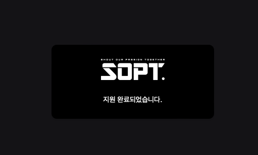

# 23.09.04 ~ 23.09.09 6일 남았다.

드디어 SOPT YB 모집 공고가 떴다.
너무나도 가고 싶은 동아리였기에 빨리 모집 공고가 뜨길 바랬지만 생각보다 짧은 모집 기한에 살짝 당황 하였다.
하지만 매일 부지런히 하면 충분히 다 할 수 있다고 생각했다.

<del>많이 기다린 만큼 멋진 자소서로 보답을 해주지,,,</del>

그렇게 자소서 작성을 시작하였다.

# 질문 왤케 어렵냐 😢

내 예상 질문은 SOPT에 왜 지원을 하려는지, SOPT을 통해 무엇을 이룰 것인지 등 단순 1차적인 질문들이었다.
하나, 막상 질문들을 보니, 꽤나 복잡하고 어려웠다.
써야할 분량 또한 많아서 잠시 어지러워졌다.
다른 후기들을 찾아봐도 본인의 개발 실력과 합격은 무관한 거 같았다.
열정이 있는 사람을 뽑는 거 같았다.
3번이나 SOPT 활동을 했던 종화형도 비슷한 얘기를 해주었다. <del>열정 있는 사람,,? 그거 완전 난데,,,</del>

어떻게 하면 내 열정을 자소서에 보여줄 수 있을지 고민을 하였다. 생각보다 쉽지 않았다.
특히, 이번 기수의 핵심 가치인 몰입, 실천, 공유를 자소서에 녹이면서 열정까지 보여야 했기에 더더욱 어려웠던 거 같다.
생각보다 글이 너무나도 안 써졌고, 시간은 계속 흘러만 갔다.

# 몰입

자소서 작성을 완료하기 위해 원래 잡혀 있었던 약속도 취소 시켰다.
노는 걸 좋아하는 나로써는 너무나도 슬픈 결정이었지만 어쩔 수 없었다.
생각보다 더 많은 시간이 필요했고, 이를 위해선 선택과 집중을 해야만 했다.
하나의 문항에 대한 답변을 작성하는데 기본 3시간 이상은 걸렸다.
처음 틀을 잡고, 살을 붙인 뒤, 어색한 내용들 삭제하고, 필요한 내용 추가하고,
글자 수 맞추고 하다보니 시간이 너무나도 많이 소요되었다.
하루종일 자소서만 붙잡고 있으니 머리가 더이상 돌아가지 않았다.
이 짓을 제출 마지막 날까지 계속 하였다.

# 피드백 너무 좋아

SOPT를 나 혼자 준비하는 건 아니었다.
다행히 UMC 같은 팀원들 중 SOPT에 지원하는 분들이 많이 계셨고 같이 준비할 수 있었다.
밤 11시, 서로의 자소서를 보여주면 피드백을 해주었다.
여러 번 다시 읽어보고 수정의 수정의 수정을 거쳐서 나온 나의 자소서였기에 박수 갈채를 받을 준비를 하고 있었다.

하나 왠걸, 무수한 수정 요청이 쏟아지고야 말았다. <del>살려줘,,</del>

생각보다 내가 자소서 쓰는 방법에 대해 몰랐던 거 같다.
대부분의 피드백이 좀 더 구체적으로 자세하게 쓰라는 것이었다.
나는 그냥 뭐뭐 했다 이런 식으로 나열만 했었는데 생각을 해보니,
이를 증명할 구체적인 사례를 제시하지 않았던 것이다.

그렇게 2시간 넘게 피드백이 진행 되었고 나는 좋은 솔루션들을 받을 수 있었다.

# 제출해야 해.

밤을 샜다.
아니 밤을 새려고 했다.
2시간 잤다.
더 잘 수가 없었다.
피드백도 아직 반영 못 했고, 써야할 문항들도 많이 있었기 때문이다.
난 글을 왜 이렇게 못 쓰는 걸까? 어릴 때 논술 학원을 다녔어야 했나보다.

아침에는 그냥 좀비 상태였다.
그래도 오늘만 버티면 쉴 수 있다는 생각으로 버텼다.
SOPT에 우리 팀원들과 다같이 합격하여 프로젝트를 할 생각을 하니 조금은 기운이 났다.
정말 마지막까지 수정의 수정을 거쳤다.
18시 마감이었는데 17시 45분에 제출을 하였다.
다행히 피드백도 다 반영할 수 있었고, 글자 수도 다 채울 수 있었다 정말 모든 걸 불태웠다.

_이제 결과만 기다리면 된다_

# 좀 더 잘할 수 있었을 텐데.

막상 제출을 하고 나니 아쉬움이 생겼다.
더 잘 쓸 수 있었을 텐데, 이제야 어떻게 작성해야 하는지 감이 잡혔는데, 그래도 최선을 다했으니 후회는 없다.

# 우리 팀원들 🥲

정말 고생을 했다 매일 실시간으로 옆에서 지켜보았지만 정말 다들 열심히 준비를 했다.
나야 휴학을 한 상태였지만, 학교를 다니면서 자소서 준비하는 모습은 존경스럽기까지 하였다.
UMC 할 때도 느꼈던 거지만 정말 대단한 거 같다.
그래도 같이 준비해준 덕분에 그 과정이 마냥 힘들지만은 않았다 오히려 재밌었다.
아무리 생각해도 스톡원큐에 지원을 한 건 올 해 한 일 중에 제일 잘한 일 같다.
우리 팀원들 다 같이 붙어서 꼭 SOPT에서 만났으면 좋겠다.

> 끝까지 같이 으쌰으쌰 해준 율카, 언노운, 옙방 그리고 마치 자기 일인 거 마냥 도와준 위즈에게 정말 감사드립니다.
