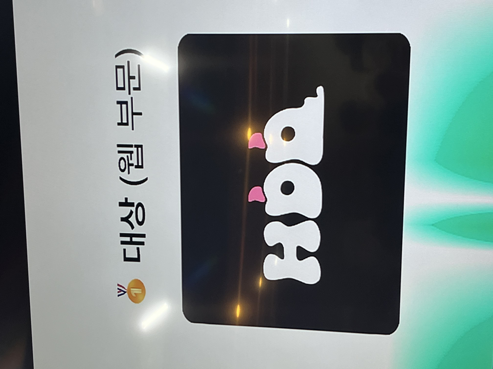

# 솝커톤 너무 하고 싶다!

나는 솝커톤이 너무나도 하고 싶었다.
일단 솝트 들어올 때 목표가 모든 활동을 다 참여하는 것이었기도 하고,
정말 예--전에 학교에서 해커톤을 한 번 나간 적이 있었는데,
그때는 정말 아무것도 모르고 그냥 공짜로 피자 준다고 해서 피자 먹으로 갔던 거라
제대로 해커톤을 해본 적이 없어서 이번엔 꼭 제대로 해커톤을 해보고 싶었기 때문이다.
웹은 15명 갈 수 있었나? 그랬는데, 꼭 그 안에 들고 싶었다.
여러 ob들이 광클 빡세니까 진짜 제대로 해야 성공한다 그래서
긴장 좀 하면서 네이비즘 딱 틀어놓고 두근 거리는 마음으로 티켓팅(?)을 했다.
결과는,,?
생각보다 쉽게 성공!

<del>
  흠,, 그나저나 1차 행사도 그렇고 티켓팅 너무 쉬운데 왜 다들 실패 했을까,,?
  큼큼,,
</del>

# 솝커톤 너무 하기 싫다!

진짜 나도 내 자신을 모르겠다. 분명 아까 전까지만 해도 솝커톤 너무 하고 싶어서 떨어지면 정윤이한테 굽신굽신 넣어달라고 부탁이라도 해야겠다
생각했었는데 갑자기 너무 하기 싫어졌다;

일단 그 이유로는

**귀찮았다.**

사실 솝커톤 뿐만 아니라 그냥 모든 게 다 하기 싫고 귀찮아졌다. 인생 노잼 시기를 겪는 건지, 번아웃이 온 건지 잘 모르겠는데 (요즘 나는 개복치의 삶을 살고 있다,,)
아무튼 너무나도 가기 귀찮았다.

**쉬고 싶었다.**

잠을 잘 못잤었던 것도 있었고, 굳이 내가 내 잠을 포기하면서까지 이걸 해야 하나? 싶었다.
여기에 추가로, 현재 인간에 대한 회의감을 좀 느끼고 있던 터라, 뭔가 또 모르는 사람들 만나서 인사하고 말 놓고 인스타 교환할 생각을 하니 머리가 지끈 거렸다.

**내가 얻어갈 게 있을까?**

해커톤 특성 상 시간 제약이 심해서 솔직히 코드 대충대충 짜고 그냥 퍼블리싱이랑 간단한 API 붙이기 정도 밖에 안 할 거 같은데 그럼 이것들은 다 내가 할 줄 아는 것들인데 내가 또 내 시간 쓰면서 그걸 해야 하는 이유가 있을까? 라는 생각들이 머리 속을 떠나지 않았다.
아 그래도 다른 사람들 가고 싶어도 못 가는 거 이왕 이렇게 붙은 거 일단 해봐야지 하는 마음으로 일단 가보기로 했다.

# 엥? 내가 리드?

일단 웹에서 솝커톤 지원한 ob가 너무 적었다.
한 3명?이었나 4명이었나? 그랬었는데 나머지 다 yb들이어서 yb 중에서 팀 리드가 뽑혀야 했다.
진짜 제발 나는 아니길 빌었다.
나는 아직 본격적으로 개발 시작한 지 1년도 안 됐고 정말 나보다 잘하는 사람 너무나도 많고 지인짜 리더형 인간도 아니고 와안전 팔로워형 인간이라 누군가를 이끌고 싶지 않았다. 그럴 만한 실력도 사실 안 되고 말이다!!!
그리고 무엇보다도 이게 가장 리드를 하기 싫었던 이유 중 하난데 나는 나보다 잘하는 사람들을 보며 성장을 하고 싶었다.
물론 나는 질문 받는 것도 좋아하고, 열심히 하는 친구들 보면 하나라도 더 알려주고 싶은 마음이 큰데 그것들도 중요하지만 나의 성장도 굉장히 중요시 여기기 때문에 옆에서 코드를 보며 따라하고 싶은 마음도 컸다.
아 근데 자꾸 옆에서 뭔가 내가 리드 될 거 같다고 얘기 나오고 그랬지만,, <del>근데 나도 뭔가 내가 리드 될 거 같긴 했어,,</del>

그래도 진짜 제발 나는 리드가 안 되길 바랬다.

_응 너 리드~_

# 리드는 어떻게 해야 하는 걸까?

리드가 처음 되고 나서 주변 사람들에게는 리드라서
부담된다고 말하고 다녔지만 사실은 전혀 부담되진 않았다.
오히려 나는 내 의견이 잘 반영될 거 같아서 편할 지도? 라는 생각을 가지고 있었다.
그럼에도 그렇게 말하고 다닌 건 사실 그냥 리드가 하기 싫어서였다.

<del>
  지금 생각해보면 왜 그렇게 하기 싫어했을까 싶기도 하다,, 그때의 나는 취약하고,
  심신이 미약한 상태였기에 그랬을지도,,?
</del>

리드가 될 거라 조금 예상은 했었는데, 또 막상 리드가 되니 뭘 어떻게 해야할 지 감이 안 잡혔다. 도윤이랑 다은이랑 같이 하게 되었는데 이 친구들 실력도 모르고,
내가 이 친구들에게 뭘 얘기해 줘야할 지도 모르겠고, 솝커톤 시작 전에 뭘 해가야 할 지도 모르겠었다.
사실 킥오프도 안 하려고 했었다.
뭐 정할 게 없어 보이는데 킥오프를 해야 하나 싶었다.
근데 다른 팀들 보니까 다 하는 거 같아서 또 다은이가 우리 팀은 킥오프 언제하냐고 해서 부랴부랴 날짜를 잡았다. 원래는 합세처럼
컨벤션이랑 이런 거 다 정하려고 했는데 솝커톤 했었던 ob 친구들 얘기 들어보니까,
시간 없어서 그런 거 방해 된다고 빼라고 해서 TS도 빼고 컨벤션이랑 브랜치 전략도 다 빼버렸다.
생각해보면 이게 맞는 거 같다.
시간도 없는데 괜히 컨벤션 따지다 개발도 못할 수 있잖아?

<del>음음,, 이게 맞지</del>

# 킥오프

나의 이번 솝커톤의 목표는 사실 단 하나였다.
무언갈 얻어가자도 아니고 프로덕트를 완성시키자도 아니고 즐겁고 행복하게 솝커톤을 마무리 하자였다.
행복은 내가 인생에서 가장 중요시 여기는 부분이며 모든 활동들의 궁극적인 목표이다.
그렇기에 이번 솝커톤에서도 이러한 행복을 추구하며 잘 마무리 하고 싶었다.
그래서 전체 킥오프를 할 때에도 계속해서 **나는 행복하고 싶다**고 얘기를 하였다.
그런데 지금 생각해보면, 다들 나는 이런 이런 걸 하고 싶고, 이러이런 걸 이루고 싶다
하는데 혼자서 '행복'을 외치고 있는 나의 모습이 어쩌면 살짝은 저 사람은 솝커톤을 장난으로 여기나? 라고 보여질 수도 있을 거 같단 생각이 든다. <del>일단 이 부분은 뒤에서 더 얘기를 하는 걸로 하고,,</del>
뭐,, 어찌저찌 킥오프도 끝냈고 이제 시작할 일만 남았다.

 _시작
전 김치찌개_

_볼링 못치는 (괵)재훈이가 사준 음료수_

# 솝커톤 시작!

_벌써 63번째 솝커톤,,?_

드디어 솝커톤이 시작됐다.
솝커톤을 위해 여러가지 물건들을 챙기다 보니 가방이 너무나도 무거웠다.
의자가 딱딱해서 오래 앉으면 엉덩이 아프다고 해서 방석도 챙겨갔다. <del>근데 왠걸 방석을 미리 준비해 주었다,, 회장단 레젼드,,</del>
방석이랑 물병이랑 마우스랑 키보드랑 다 들고오고 만발의 준비 다했는데 정작 노트북 거치대 놔두고 와서 조금 불편하게 코딩했다.
심지어 마우스는 있는데, 마우스랑 노트북 연결하는 usb를 안가져와서 마우스는 쓰지도 못했다. <del>나 바보?</del>

_멋진 우리 팀!!!_

_가형s의 곰돌 슬리퍼_

일단 솝커톤의 주제가 뭐일지 너무나도 궁금했다.
진짜 전혀 감이 안 잡혔고, 재밌는 주제가 나왔으면 좋겠다고 생각했다.

# Unlearn

_주제 발표_

드디어 기대하던 주제가 발표됐다.

> Unlearn

주제가 나오자마자 다은이랑 서로 '근데 unlearn이 뭐야,,? 😮 (긁적긁적)'

주제가 나와도 이해를 하지 못하는 슬픈 언석이와 다은이었다. <del>시연스쿨 열심히 듣자!</del>

다행히 멋진 기팟장님이 설명해주셨다. **당연한 것이 사실 당연하지 않을 수 있다.**
굉장히 심오한 주제인 거 같다. 당연하지만 당연하지 않다라,, <del>뭔 소릴까?</del>

# 아이디어 회의

주제와 관련된 좋은 내용이 없을까 팀원들과 서로 얘기를 하는 시간을 가졌다.
이제 각자 하나씩 얘기를 해보는데 진짜 아무거나 상관 없으니까 생각나는데로 막 던져보라고 하였다.
그러다가 하나씩 걸리는 거라고. 근데 아무리 생각해도 괜찮은 주제가 떠오르지 않았다.
내 머리 속에는 온통 밥은 왜 꼭 숟가락으로 먹어야 하는 걸까?
손가락으로 먹어도 되지 않나? 망고는 왜 동남아에서 잘 자랄까?
우리나라에서 잘 자라도 되지 않나? 이딴 주제 밖에 안 떠올랐다. <del>piece of shit,,</del>

근데 나만 그랬던 건 아니었던 거 같다.

_다은: 붕어빵은 왜 겨울에만 먹을까?_

역시 우리 팀이야! <del>행복하면 됐지 음음.</del>

<del>근데 진짜 왜 겨울에만 먹음? 여름에도 아이스 붕어빵 먹으면 안 되나,,</del>

하지만 우리 팀에는 훌륭한 다른 인재들이 많아서 멋진 주제가 나왔다.

**일기를 왜 오늘 거만 써야할까? 내일을 위한 일기를 쓸 수는 없을까?**

<del>띠용스</del> 진짜 멋진 생각인 거 같다.

_고민의 흔적_

# 시작!

이제 디자이너 분들이 디자인 작업을 시작했다.
뷰가 완성되기 전까지 우리가 할 건 별로 없었다.
내가 이미 집에서 초기세팅 다 해온 상태라 뷰가 나올 때까지 그냥 기다릴 수 밖에 없었다.
그래도 해야할 과제들이 조금 있어서 그거 조금 하고, 애니메이션 어떻게 적용할 지 조금 탐구하면서 시간을 보냈다.

_웨비들의 과제_

사진도 많이 찍었다.
도윤이랑 다은이랑도 같이 찍고, 다른 팀들 하는 모습들도 많이 찍고, 쉬는 시간 될 때마다 웨비들끼리 밖에 모여서 사진도 찍고 그랬다. <del>사진도 공유하고 싶지만 그들의 초상권을 위해,,</del>

신이 났었다. 앞으로 겪게 될 상황은 모른 채 말이다.

# 개발 시작

뷰가 나오기 시작했고, 다은이부터 시작해서 개발에 들어갔다.
그 다음은 나의 뷰가 나왔고 마지막으로 도윤이의 뷰가 나왔다.
도윤이 뷰가 제일 늦게 나와서 조금 걱정이 되긴 했다. <del>도윤이꺼 먼저 해달라고 했던 거 같긴 한데,, 큼큼</del>

사실 우리가 구현해야 할 건 별로 어려운 건 아니었다. API도 3~4개 정도고 거의 다 GET method에, 뷰도 4개 정도 밖에 안 되어서 나는 시간이 조금 남을 지도 모른다고 생각을 했었다. <del>나중에 뷰가 조금 증식을 하긴 했지만,,</del>
나야 퍼블리싱은 이제 너무 익숙해져서 금방금방 끝내니까, 빠르게 하고 도윤이랑 다은이 도와주고 하면 다 하겠는데 싶었다.
큰 오산이었다. 자만이었을까? 생각보다 시간이 촉박했다.
내 부분 끝내기도 급급해서 우다다다 키보드를 두들겼다.
초반에 여유 부리지 말고 공통 컴포넌트 같은 거 미리 빼둘 걸 그랬다,, <del>진짜 초반에 너무 여유 부렸어,,</del>

_Synthia가 졸릴 때 잠 깨라고 준 사탕,, 하지만 먹지 못했다고 한다._

_개발에 정신팔린 주인에게서 버려진 곰돌s,,_

# 행복톤

그래도 우리 팀의 목표? 까진 모르겠고, 일단 나의 목표는 **행복** 이었다.
정말 기능을 다 구현 못해도 나는 상관 없었다.
애초에 상을 탈 생각도 없었고 그냥 좋은 경험 하고 가는 것만으로도 난 좋았다.
다은이랑 도윤이가 뭐 물어보면 최대한 잘 대답해주려고 노력했다. <del>물론 내가 아는 것만 물어보기를 빌긴 하였다. 근데 도윤이가 내가 모르는 것들 물어봐서 당황,, 삐질,, 불안,, 초조,,;</del>

막판에는 내 거 끝내야 해서 질문이 들어오면 조금 조급해지긴 했지만 티 안 내고 대답 잘 해주려고 했다. <del>다시 생각해도 이건 잘한 거 같다,,</del>

# 얘들아 고생 많았어.

그렇게 아침 8시 반이 되었다. 결국 API 하나는 붙이지 못했지만 그래도 모든 뷰를 다 완성 시켰다.
아 물론 배포도 못하긴 했지만,,!!
근데 애초에 나는 배포까지 갈 생각이 없었긴 했다.
그래도 끝까지 계속해서 수정하고 추가하고 키보드를 손에 놓지 않았다.
다은이랑 도윤이가 진짜 고생을 많이 했다.
특히 다은이는 왕초보라서 뷰 짜는 게 쉽지 않았을 텐데 정말 잘해주었다.
도윤이는 나한테 뭐 물어봐도 내가 몰라서 대답을 못 해준 문제들이 많았는데 혼자서 해결하고 그래서 사실 좀 고마웠다.

<del>물론 둘 다 옆에서 머리 몇 번 쥐어 뜯는 거 같긴 했지만,,</del>
<del>근데 뭐, 그러면서 성장하는 거니까?</del>

# 으응,,? 이 분위기 뭐지.

시연 영상 빠르게 찍고 제출을 하니 이제 끝났다는 약간의 해방감? 때문에 살짝 기분이 좋아졌었다.
다른 팀들은 잘했나 구경하러 갔다.
근데 분위기가 생각보다 심각했다.
전혀 뭐 얘기를 걸 분위기가 아니었다.
다들 배포가 잘 안 되었는지 굉장히 심각해보였다.
내 예상과는 완전 다른 분위기였다.
나는 그냥 어차피 제출 시간도 다 끝났고, 배포에 큰 뜻도 없고, 그냥 배고프고, 자고 싶고,
이런 생각들 뿐이어서 발표 끝나고 뭐 먹지 이 생각 중이었는데
그래서, 다른 애들이랑 뭐 먹을 지 얘기를 할 생각이었는데
다들 너무나도 진지하고 심각하게 코드를 짜고 있었다.

이때 정말 많은 생각이 들었던 거 같다.
다들 본인 팀의 프로덕트를 완성하시키 위해 끝까지 최선을 다하는데 나는 뭐하는 거지?
행복을 추구한다고 얘기를 했지만, 어쩌면 그건 변명이었고 사실은 열심히 할 생각이 없었던 건 아닐까?
뭔가 스스로가 너무 부끄러워졌다.
다른 팀원들에게도 너무 미안해졌다.

사실 해커톤이 나 혼자 하는 건 아닌데, 다른 팀원들이 열심히 기획 해주고, 디자인 짜주고, 서버 배포해 줬는데 내가 구현을 다 못하는 걸
'너무나도 그럴 수 있지'라고 생각을 한 건 아니었을까?
물론 구현을 못 할 순 있지만, 그래도 다른 팀들처럼 최대한 노력을 해야 했던 건 아니었을까?
실제로 끝까지 도전해서 배포를 성공 했더라면,
우리 조가 상을 탔을 수도 있을 지 않았을까?
나야 상을 탈 생각이 없어지만 다른 팀원들의 생각은 또 모르는 것이니까,
내가 너무 내 생각만 했던 건 아니었을까? 이런 저런 생각들이 머리 속에서 떠나지 않아 힘들어졌다.

# 발표

너무 졸리고 피곤했다. 발표도 뭐고 그냥 빨리 끝나고 밥 먹고 자고 싶었다.
생각보다 참여한 팀이 많아서 발표 시간도 꽤나 길었다.
그래도 최대한 발표를 들으려고 노력했다. 멋진 아이디어들이 많았다. 정말 디자인도 이쁘게 만든 것들도 많았고, 이렇게 짧은 시간에 이런 기능을 구현했다고? 하는 것들도 많았다.
우리 웹 파트 사람들이 구현한 건 더 집중해서 들었다.

발표를 들으면서 웨비들이 정말 대단하다라는 생각을 많이 했다.
특히 울보산타랑 HDD는 yb로만 이루어져 있었음에도 불구하고 최우수상이랑 대상을 탈 정도로 너무 멋진 프로덕트를 만들어주었다.
CRUD만 구현한 것이 아니라 이메일 보내기, chat GPT API 붙이기 등 여러 기능도 추가한 것들을 보며 정말로 너무 멋있다고 생각을 했다.
나는 시간이 부족하니까 최대한 기능 쳐낼 생각만 했었는데 챌린징 요소도 챙기면서 제 시간 내에 개발을 완성하는 모습을 보니 또 한 번 나를 반성하게 되며, 저런 마인드를 가져야 겠다는 생각을 했다. <del>아무리 생각해도 너무 멋있는 거 같다,,</del>

_대상 너무 축하해 :D_

# 후기

정말 내가 이번 솝커톤을 통해서 얻어갈 게 있을까 싶었던 생각이 부끄러울 만큼 내가 너무나도 부족한 사람이란 걸 깨닫게 되었고, 너무나도 많은 것들을 느꼈던 거 같다. <del>생각이 너무 많아져서 머리가 아플 지경이었다,,</del>

만약 ob를 하게 되면 솝커톤 신청 안해야지 생각을 했었는데, 이번 솝커톤을 끝내고 나니, 아쉬운 점들이 많이 남아 다음에도 한 번 더 해야겠다는 생각을 했다.
지금의 느낀 점들을 잊지 않고 잘 보완해서 후회 없이 마무리 해보고 싶다.

# 모두들 고생하셨습니다 :D

_시간 너무 빨리 갔는걸?_

벌써 솝커톤이 끝났다니,, 시간이 너무 빨리 간 거 같다.
정말 막판에는 개발 하느라 밖에 나가지도 않고 정신없이 휘몰아치느라 더 빨리 지나간 거 같다.
정말 처음부터 끝까지 계속해서 옆에서 응원해주고 할 수 있다고 얘기해준 재훈이랑 너무 멋진 아이디어를 제공하고 발전시켜 준 민정이랑 멋진 디자인을 뚝딱 만들어준 예은이랑
바쁠 텐데도 요구 사항 같은 거 바로바로 들어준 승연이랑 아주 든든하게 서버를
맡아준 승준이랑 에러 사항 생기면 잘 들어주고 바로 수정하려 해준 태욱이랑
특히 많이 부족한 리드였지만 믿고 잘 따라와주고 묵묵히 본인 맡은 일들 잘 해준 도윤이랑 다은이 너무나도 고마웠고 고생 많았다는 얘기를 해주고 싶다.

<del>너희들이랑 또 같은 팀하고 싶어. 그때는 더 잘해줄게.</del>

_우리 팀 너무나도 고생 많았어~_

아 그리고 정말로 정말로 정말로 우리 파트장 서현이한테도 너무나도 고맙단 얘기를 하고 싶다.
본인이 개발하는 것도 아닌데, 같이 밤 새면서 여러 팀들 잘 하는지 어려운 점은 없는지 돌아다니고 모르는 것들 물어봐도 군소리 없이 같이 봐주는 모습을 보며 정말 서현이가 내 파트장이어서 다행이다라는 생각을 많이 했다. <del>계속 얘기하지만 너무나도 고마워.</del>

또 마지막 다들 퇴실한 후 회장단들만 남아서 뒷정리 하는 걸 보면서 회장단이 너무 고생하는 구나 다시 한 번 느낀 거 같다.
솝커톤을 성공적으로 마무리 할 수 있었던 것도 사실 다 회장단 덕분인 거 같다.
특히 와이파이 이슈 해결하려고 인천 공항 갔다온 또 끝나자 마자 반납하러 다시 돌아간 회장 정윤이한테도 너무 고맙다는 얘기를 하고 싶다. <del>늘 고생하는 회장단 모두들 너무 감사합니다.</del>

# 뒷풀이

_감자탕_

뒷풀이를 그렇게 오래까지 있을 생각은 없었는데 뭔가 있다보니까 계속 더 있고 싶었다.
웹이랑 있으면 너무 편한 거 같다. 근데 진짜 너무 졸리긴 했다.
집 도착하니 17시 였나 그랬던 거 같다,,
그래도 뭐 밥 먹고 인생 사진 찍고 뭐 다 했다!

# 회고를 합시다?

같은 조원이 솝커톤 마치고 회고에서 보자고 하길래 엥 뭐 또 우리 만나나? 싶었는데
알고 보니 다같이 디코로 회고를 하는 거였다.
혼자서 회고는 해봤지만 이렇게 단체로 같이 하는 건 또 처음이라 이게 뭐지 싶었다.

## 짧은 웹끼리의 회고

우리 팀 회고 하루 전이었나? 디코 회장님방에 웨비들이 모여있었다.
처음엔 그냥 모여서 수다 떠나 보다 하고 그냥 내 할 일 하고 있었는데 몇 시간 뒤에 다시 돌아와도 계속 그러고 있길래 자려고 누우면서 핸드폰으로 살짝 들어가봤다.
무슨 얘기를 하고 있었나 했더니 솝커톤 회고를 하고 있었다.
근데 들어보니 살짝 진지하게 하고 있었던 거 같았다.
애들이 나의 솝커톤 소감도 물어봐서 살짝 내가 진짜 가지고 있던 생각들을 조금 얘기했다.
그 전까진 사실 생각도 너무 많아졌고 마음도 살짝 복잡해져서 조금 우울했었는데
뭔가 애들한테 내 얘기를 살짝 꺼내고 나니까 마음이 한결 가벼워진 기분이었다.
그리고 가형이의 회고를 듣게 되었는데 되게 속상했다는 말을 들으니 <del>자세한 내용은 말 못하지만,,</del> 마음이 너무 아팠다.
내가 옆에서 본 가형이는 정말 열심히 했었는데 저런 생각을 했다는 게 안쓰러웠다.
충분히 가질 수 있는 생각이었기에 그 친구 마음이 이해가 되면서도
한편으로는, 굳이 그렇게 생각할 필요 없을 텐데 분명 다른 팀원들은 그렇게 생각하지 않았을 텐데 싶었다.
어떤 위로의 말을 해주어야 할까 많이 고민을 했지만 딱히 생각나는 게 없었다.
그래서 뭔가 미안했던 거 같다. <del>나는 위로를 정말 못 하는 거 같다.</del>

그렇게 짧은 회고를 통해 진지한 대화를 주고 받으니 회고라는 것이 되게 좋아졌다. <del>나는 진대를 좋아해,,</del>

## 우리팀 회고

회고에 대한 기대가 많이 높아진 상태에서 이번 회고도 이런 진지한 대화가 많이 오고 갔으면 좋겠다는 마음을 품고 디코에 접속을 했다.
재훈이가 피그잼을 통해 진행을 한다고 해서 피그잼에도 접속을 했다.
그때 나는 놀다가 집에 돌아가는 길이어서 지하철에서 노트북을 키고 들어갔다. 그런데 역시 피그잼을 쓰는 순간 진지함과는 멀어져야 하는 건가,, 내 예상과는 달리 훨씬 난장판이었다. ㅋㅎ

<del>
  아 근데 왜 피그잼만 들어가면 분탕 치고 싶지? 근데 그래서 더 재밌었던 거 같고
  ㅋㅎㅋㅎ
</del>

_회고 맞음 ㅋㅎ_

어쨋든 이번 회고에선 별 감동적인 건 없었고 그냥 재밌었다. 😄

## 웨비 리드들의 회고

처음 승희가 리드들끼리 회고를 한 번 하자고 했을 때 나는 너무나도 좋았다. <del>좋은 자리 열어줘서 고마워 :)</del>

다른 리드들은 어떤 생각을 가지고 임했는지 어떤 고민들을 했는지 들어보고 싶었기 때문이다.
사실 솝커톤 때는 내 정신 상태가 그리 좋지는 않았다.
정확히 말하면 솝커톤 때만 아니라 그 몇 주 전부터 좋지 않았다.
조그만 자극에도 예민하게 반응하고 많이 지쳐있었다. 그로 인해 느꼈던 나의 감정들을 이번 회고를 통해 얘기를 하였다.
그러자 너무나도 고맙게도 많은 위로를 해주었다.
사실 나는 말로 하는 위로는 잘 받아들이지 않는 편이다. <del>개인적으로 말 보다는 글로 전달해 줬을 때 더 위로가 되는 거 같아요.</del>

누군가에게 힘들다는 얘기를 잘 하지 않는 편이고, 위로를 받기 보다는 혼자 이겨내는 편이라서 위로를 받는 것이 조금은 낯 간지럽기도 하지만 이번에 리드들이 해준 말들은 너무나도 고마웠다. <del>글로 써준 것들은 다 캡처해서 소중하게 간직하고 있습니다!</del>
새벽 감성 제대로 올라와서 진짜 눈물을 훔칠 뻔 했다.

_근데 진짜 요즘 우는 법을 잊은 듯;_

잠깐 얘기를 하긴 했지만 정말 진심으로 이번 솝트 활동을 통해서 좋은 사람들을 많이
만나게 된 거 같아 너무나도 감사하고, 참 나는 행운이 좋은 거 같다는 생각이 들었다. <del>서현s 뽑아줘서 고마워~</del>

_너무 감사해요. 진심으로._

# 진짜 후기

정말 많은 것을 배웠다. 많이 부족했단 생각에 조금 힘들었지만, <del>사실 많이,,?</del>
앞으로 어떤 방향으로 나아가야 하는지도 감이 잡혔다.
세상에 의미 없는, 교훈 없는 활동들은 없는 거 같다는 걸 다시 한 번 느끼게 된 거 같다.
많이 약해져 있던 나 자신을 다시 다잡고 전진해야겠다고 다짐을 하며 회고를 마쳐야겠다.

혹시 이 글에 대한 댓글을 달고 싶다면? [솝커톤 회고 | 네이버 블로그](https://blog.naver.com/jiko79/223286222580)에 달아주세요. :)
