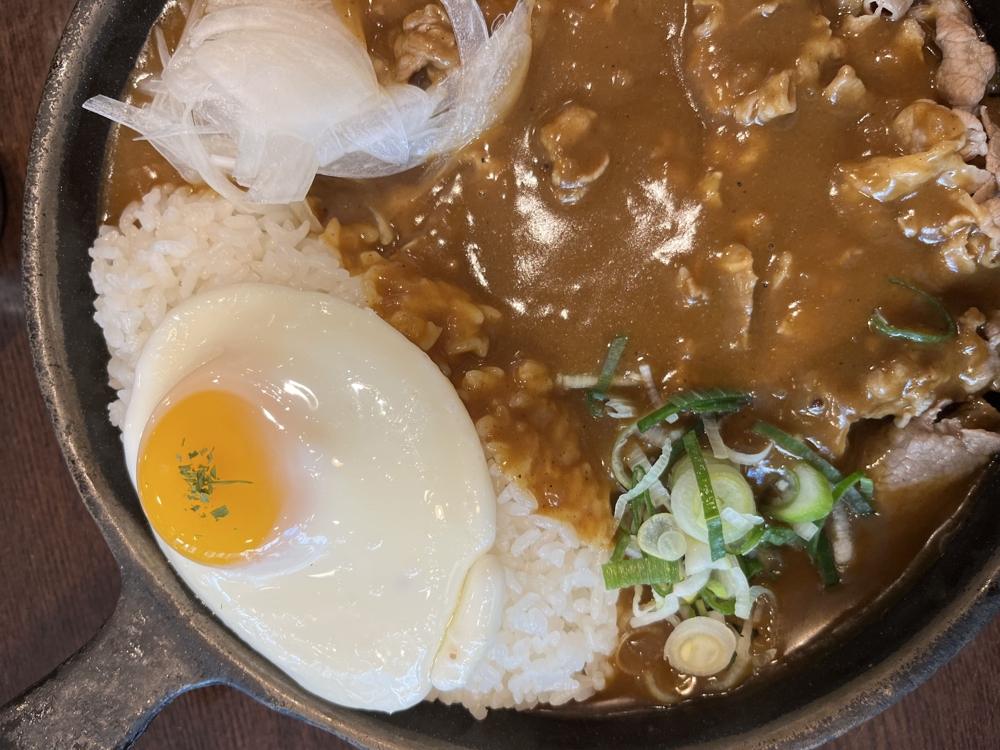
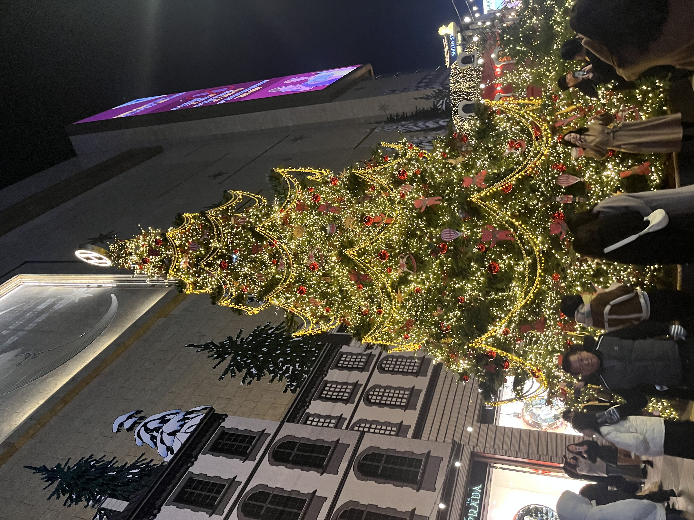
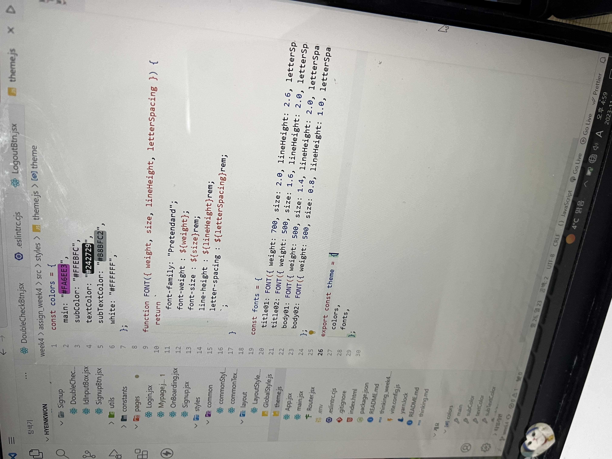
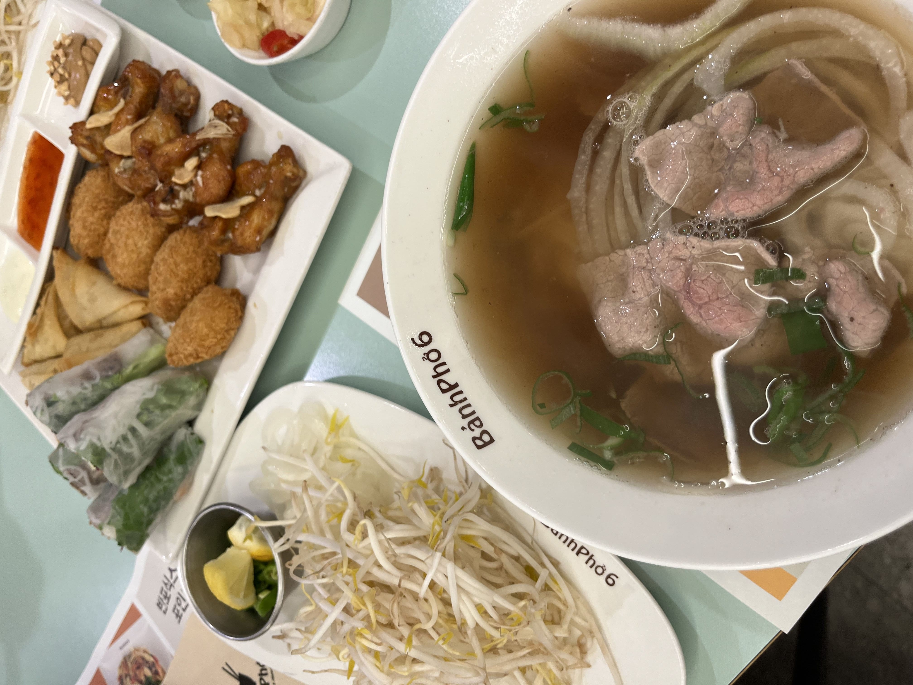
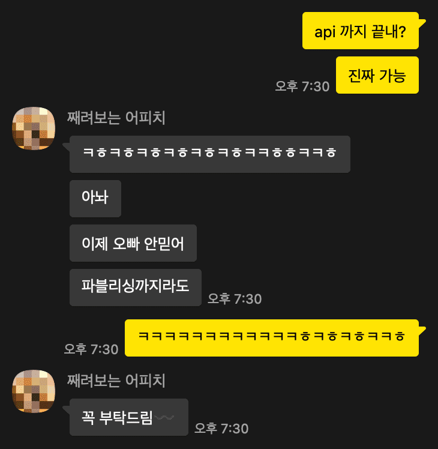
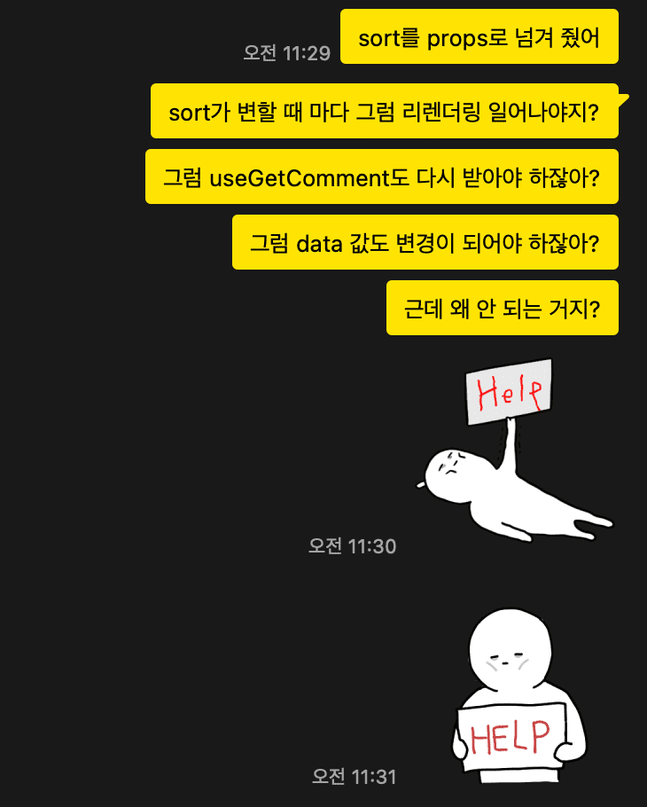
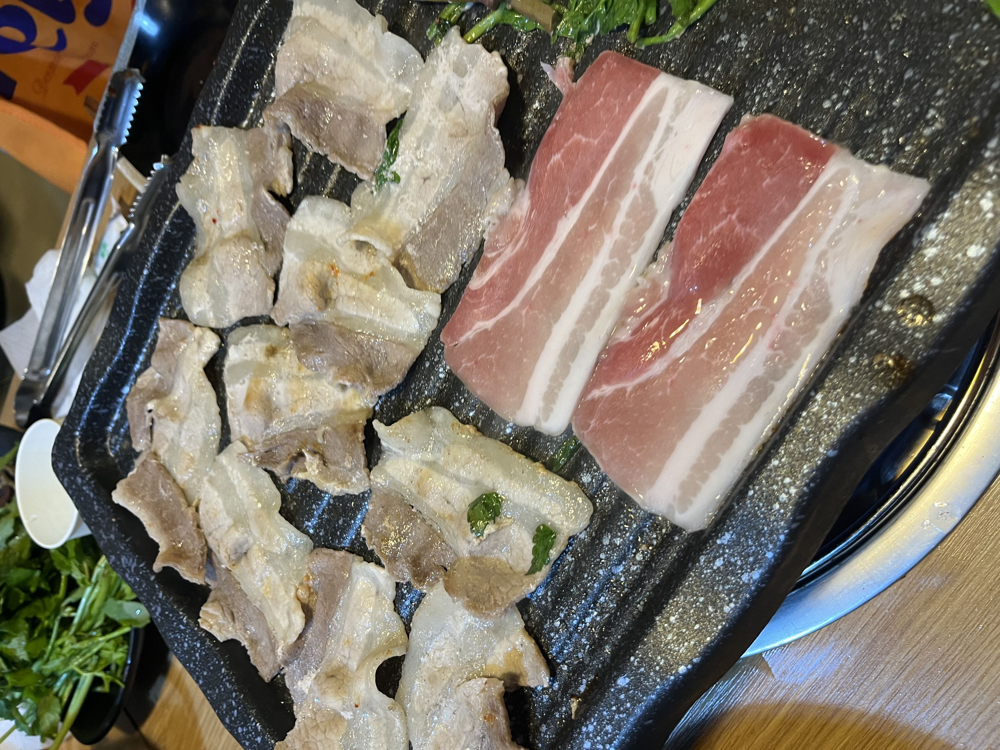
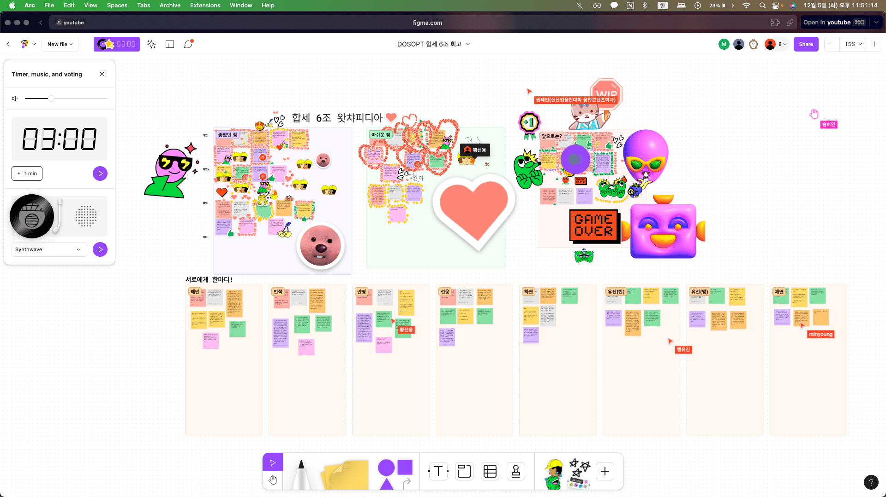

# 합세 시작

드디어 합동 세미나가 시작 되었다.
사실 크게 별 기대는 안 하고 있었어 가지고 뭐 엄청 설레거나 그러진 않았다.
처음 조가 짜졌을 때도 '아 그냥 이 사람들이랑 하는구나' 정도였다.

사실은 솔직히 말하면 합세가 하기 싫었다.
뭐,, 합세만 하기 싫었던 것은 아니지만,, <del>솝커톤도,, 합세도,, 과제도,, 그냥 다,,</del>
변명을 하고 싶지만 그냥 내 태도의 문제였다.
그래도 변명을 하자면 너무 지쳤었다.
그래서 그냥 다 하기 싫었었다.

<del>
  솝커톤 회고도 그렇고 뭔가 계속 우울한 얘기만 하는 거 같은데, 그때는 그랬다.
</del>

그런 상태로 5주차 합세를 하러 갔다.

_합세 전 점심_

# 너 좀 별로다?

아무래도 하기 싫었다 보니 그게 좀 겉으로 드러났던 거 같다.
집중이 전혀 안 됐고, 의욕도 없었다. 디자인분들이 전체적인 디자인에 대해 설명을 해줄 때도 한 귀로 듣고 한 귀로 흘려버렸다. <del>사실 주변도 시끄럽고 멀어서 잘 들리지도 않았다.</del>
의견 제시나 쳐내는 것도 우리 합세 리드인 혜인이가 알아서 하겠지 하고 그냥 나몰라라
했다.

그러면 안 됐었는데 하기 싫은 티가 났던 거 같다. 났던 거 같은게 아니고 그냥 티가 났다.

혜인이도 이에 대해 몇 번 나에게 얘기를 했었다.
너무 의욕이 없고 하기 싫어하는 거 같다고.
혜인이는 그래도 웃으면서 얘기를 해주었지만 혜인이었기에 그럴 수 있었던 거지 지금 생각해보면 사실 너무 민폐인 상황이었다.

사실 합세 세미나를 하는 와중에는 별 생각이 없었다.
그냥 빨리 끝났으면 좋겠고 밥이나 먹으러 갔으면 좋겠다고 생각을 했었다.
하지만 집에서 곰곰히 생각을 해보니,
이건 잘못 돼도 너무 잘못 되었다는 생각이 들었다.

내가 팀에게 부정적인 영향을 끼치고 있다는 느낌이 강하게 들었다.
나의 하기 싫음과 팀원들은 별개의 문제고,
개인적인 기분을 팀에게 전파시키면 안 되었던 것이다.
그리고 솔직히, 거기서 하고 싶어서 하는 사람이 몇이나 될까도 싶었다.
다들 해야 하니까 묵묵히 본인 맡은 바를 해나가는 건데
나는 뭔데 거기서 하기 싫다고 티를 내고 있었을까 의문이 들었다.

디자인분들과 소통을 할 때도 말투가 뭔가 둥글둥글하게 나가지 못했던 거 같다.
**'못하겠는데요?'** 까지는 아니었지만 **'그냥 다 빼죠'**
이런 식으로 살짝 퉁명스럽게 들렸을 수도 있겠다는 생각이 들었다.

정말 내 자신이 부끄러워졌다.
내가 이렇게 별로인 사람이었나?
나 이것밖에 안 되나?
요즘들어 내 기분을 왜 컨트롤하지 못하는 거지?

내가 가장 싫어하는 것이 남에게 민폐를 끼치는 것이었는데 내가 그러고 있었다.
팀원들에게 너무 미안해졌다.
특히 혜인이랑, 디자인분들에게.

_벌써 크리스마스,,_

# 작업

이를 깨달은 뒤로는 하기 싫다는 말이나 티를 내지 않으려 노력했다.
혜인이랑 민영이한테 부정적인 영향 가지 않게 하려 했고, 디자인분들에게 무언갈 요청할 때도 정말 쿠션에 쿠션에 쿠션어을 깔고 얘기를 했다. <del>그들은 어떻게 느꼈을 지는 모르겠지만 말야</del>

어찌댔든 그렇게 작업을 시작했다.
우리는 왓차피디아를 맡게 되었다.
혜인이, 민영이랑 같이 4개의 뷰와 6개의 API를 붙여야 했다.

내가 맡은 부분은 일단 초기 세팅이랑, 공통 컴포넌트 분리, 뷰 1개, API 하나 붙이기 였다.
딱히 챌린징 요소도 없고 해서 꽤나 수월해 보였다.
그나마 챌린징 요소라고 할 만 한 건 react query를 사용해 보는 것이었다.

그런데 생각보다 수월하지만은 않았다.
그렇다고 해서 엄청 힘들었다거나 그런 건 아니었지만 생각처럼 슉슉 진행 되진 않았다.

일단 svg를 컴포넌트화 시키는데 애를 먹었다.
혜인이가 보여준 코드대로 똑같이 했는데 계속 오류가 뜨는 것이었다.

_혜인이가 알려준 코드_

구글링을 해도 뭔가 제대로 된 답을 못 찾겠고, 은근 시간을 소요했다.
그렇게 혜인이한테 이 부분에 대해 물어봤는데, 수연이가 이와 동일한 에러를 겪었고, 이에 대한 트러블 슈팅을 적어놨다고 해서 이를 참고해보라 하였다.

그러던 중 며칠 뒤 우연히 승희와 디스코드에서 만나게 되었고, 이에 대한 해결책을 들을 수 있게 되었다.
사실 며칠 전에 승희가 svg는 컴포넌트화 하지만 img는 컴포넌트화 하지 않는 이유에 대해 설명을 해줬는데
그때 svg 컴포넌트화가 안 되고 있다고 해결법을 알고 있냐 물어보고 싶었지만
한 번에 2번의 질문을 하는 건 뭔가 미안하기도 하고,
이때 엄청 아침이었는데, 승희도 다른 일로 바빠 보여서 물어보지 못했는데,
이렇게 쉽게 해결책을 알려주는 걸 보니 진작 물어볼 걸 그랬다 싶었다.

<del>진짜 조승희 그녀는 모르는 게 뭘까,,?</del>

# 6, 8조 어셈블

8조랑 같이 모각공을 진행하였다.

원래는 우리 조 사람들이랑 하려고 했었는데,
사람들도 선웅이 빼고 다 안 온다하고
마침 8조도 그때 모각공 한다고 해서 같이 모이게 되었다.

마침 또 다같이 모이기도 해서 미국에서 애들 주려고 사온 과자들을 가지고 갔다.
원래는 우리 웹팟 모든 애들 다 주려고 했는데
뭔가 앞에 나가서 한 명씩 나눠주는 게 쑥쓰럽기도 하고
과자 하나 주는건데 뭔가 유난떠는 건가 싶기도 하고,
아무튼 뭔가 좀 선물 나눠주는 내 모습을 상상했을 때 별로인 거 같아서
그냥 모각공 나오는 친구들에게만 주려고 하였다.

<del>결국 모든 친구들 다 주긴 했지만,,</del>

_반포식스 맛도리~_

진짜 tmi

이날 반포식스에서 야무지게 쌀국수 뿌수고 카페에 다시 모각공하러 갔었는데
화장실을 갔다가 바지 버클이 떨어져 버렸다.
그래서 바지를 잡고 있지 않으면 계속 바지가 흘러내렸다.
근데 그렇다고 바지를 계속 잡고 다닐 수도 없고
그렇다고 안 잡을 수도 없고
아주 난감했다.
집 가는 길에 형근이의 미미나가 있어서 그걸 들으면서 갔어야 하는데
하필 그때 비도 오고 그래서 우산을 들고 있는 상황이었고
노트북도 가지고 간 거라 짐도 많았었다.
그래서 한 손으로는 바지 잡고,
다른 한 손으로는 핸드폰 들고 미미나 듣고
우산이랑 가방을 팔에 걸어놓고
낑낑 걸어갔다.

<del>진짜 쉽지 않았다.</del>

# 아 진짜 다 끝낸다고~

토요일날 시작을 했고, 그 다음 주 일요일까지는 API 외의 모든 걸 다 끝낼 수 있을 거 같았다.
근데 띵가띵가 여유를 좀 부렸더니 계속 미뤄지기만 하였다.

> 일요일 : 오늘안엔 다 끝낼 수 있어.
>
> 월요일 : 야야 진짜 오늘안엔 다 한다.
>
> 화요일 : 아 진짜루~~ 금방 해. ~~
>
> 수요일 : 넘무 바빴음 이슈. 오늘 새벽까진 다 끝낸다.

혜인이도 나중에는 결국 내 말을 믿지 않았다,, ㅋㅎ

_계속 약속 못 지켜서 미안~_

아 근데 마냥 논 건 아니었다. 공통 컴포넌트가 수정되었는데 그거 재수정되는 거
기다린 것도 있고, 다른 할 거도 있고 해서,, 뭐,, 나름 바빴다.

그래도 어찌저찌 수요일까진 퍼블리싱을 다 끝냈다.

이제 API를 붙여야 하는데
react query를 처음 사용하다 보니 이에 대한 공부를 해야 했다.
근데 마침 또 다행이도 그 전 주였나 그 주였나 심심스 주제가 react query 였어 가지고,
이에 대해 조금은 공부를 한 상태였다.
그래서 예제 코드를 보며, 또 혜인이가 미리 붙여놓은 API를 참고하면서 코드를 작성했다.

아 근데 진짜 어이없는게 자꾸 안 되는 것이었다. <del>않이 똑같이 했는데 왜 안 되는거야;</del>

이것도 생각보다 시간이 좀 걸렸다. 처음에는 아 이거 서버 쪽 문제 아니야? 생각을 했었다. <del>안 되면 일단 난 잘못 없고 서버를 의심하는 병에 걸림.</del>
구글링을 해도 잘 모르겠어 가지고 react query 버리고 그냥 axios로 해보았다. 진짜 서버
문제가 아닐까? 싶어서 말이다. <del>헹,, 근데 너무 잘 되고,,</del>
내 쪽의 문제인데 도대체 왜 안 되는지 이유를 모르겠어 가지고 혜인이한테 sos 요청을 보냈다.

_혜인이가 원래 카톡 답 진짜 빠른데 이때는 바빴는지 좀 늦게 줬음,,_

근데 진짜 여기서 난 혜인이를 정말 너무나도 리스펙하게 되었다.
물론 원래도 혜인이를 보면서 진짜 혜인이 같은 친구가 리드를 해야 한다고 생각을 하고 있었는데 이번 질문을 통해 확신을 하게 되었다.

일단 이때가 금요일이었고 합세 마지막 날이어서 제출을 해야했었다.
혜인이는 이미 본인 맡은 부분을 다 끝내놔서 개발을 할 건 없었지만 그 외의 문서 작업을 했어야 했다.

그때 답장이 왔을 때도, 혜인이는 README를 작성하고 있었다.
근데 또 이따 오후에 개인적인 사정이 있다고 해서 오전에 빨리 README 작성을 끝내야 하는 상황이었다.
아무튼 정리하자면 본인 할 일 하기에도 바빴단 소리였다.
그런데도 불구하고, 내가 도움을 요청했을 때 귀찮은 내색 전혀 안 하고 내 branch pull 받아서 코드 분석하고, 계속 오류를 찾으려고 노력을 해주었다.
심지어 오류도 해결을 해주었다.
한 1~2시간 걸렸나? 그랬을 거다.
이때 혜인이에게 너무나도 고마웠다. <del>뭐,, 고마움의 연속이었긴 하지만 이땐 특히 더 고마웠다. 그저 빛,,✨</del>

내가 합세를 하면서 느낀 게 나는 디버깅을 잘 못하는 거 같다. <del>오류가 나면 일단 눈물 닦는데 30분 소요.</del>
빨리 해결을 하려 해야 하는데 뭔가 머리 회전이 굳어버리고, 그냥 포기하고 싶어진다. <del>생각을 하기 싫어지고 코딩이 하기 싫어지고 이 세상이 싫어지고,,</del>

접때 가형이가 엄청나게 고민을 하던 문제를 한 번 봐준 적이 있는데
**남의 코드 읽기 + 오류 분석하기**로 인해 뇌가 정지되었다.
차근차근 어떻게 코드가 흘러가는 지 이해를 하면 분명 해결할 수 있었을 텐데 너무 복잡해 보여서 코드가 전혀 눈에 안 들어왔다.

결국 해결하지 못하고 승희에게 넘어가게 되었는데 1시간 조금 안 걸려서 승희가 그 문제를 해결해 버렸다. <del>젠장 또 **조승희**야,,? 그녀의 한계란 없는 걸까,,?</del>

그걸 보면서 승희랑 혜인이처럼 차분하게 오류의 원인들을 따라가며 해결책을 찾아야 하는데 나는 이 부분이 너무 부족하다는 것을 느꼈다.

# 3조와 모각공

3조 칭구들과 같이 모각공을 하게 되었다.
사실 모각공이 목적이다기 보다는 냉삼을 먹으려고 시작된 팟이었다.
그치만 내일까지 합세를 끝내야 했어가지고
겸사겸사 합세 조끼리 모이게 되었다.

진짜 오늘까지는 API를 다 붙이려고 하였다.
왜냐면 내일은 약속이 있기에,
또 어떤 일이 발생할 지 모르기 때문에 미리미리 해두고 싶었다.

그런데 막상 카페에 가서 앉으니 너무나도 하기 싫었다.
일단 민영이가 트러블 슈팅을 하고 있어서 그걸 도와주기로 하였다.
디코로 화면 공유하면서 하고 있는데 와이파이가 너무나도 안 터져서 자꾸 끊기고 소리가 잘 안 들려서 너무 답답했다.
그러니 더 하기 싫어졌다.
그래서 그냥 안했다. <del>뭐,, 내일의 내가 하겠지 싶었다,,</del>

옆에서 가형이가 굉장히 심한 트러블 슈팅을 하고 있어서 도와주고 싶었다.
달력 날짜 선택 기능 구현인데 UI가 원하는 대로 나오지 않았다.
가형이 코드를 봤는데 너무나도 복잡해서 읽기가 너무 어려웠다. <del>남의 코드 보는 건 왜 이렇게 어려울까?</del>
그래도 어떻게든 해결해 보려 했는데 머리가 너무 지끈거렸다.

결국 해결하지 못했다.
근데 시간도 한 6시쯤이 되어서 슬슬 배가 고파져서
빨리 냉삼집에 가고 싶었다.
진짜 냉삼 너무 먹고 싶었어 가지고 너무나도 기대됐다.
그런데 가형이는 그 트러블 슈팅을 해결하고 가고 싶어하는 거 같았다.
그래서 가형이는 승희에게 도움을 요청하였다.
그렇게 둘이 앉아서 코드에 집중을 하였다.
한 몇 분 하고 해결하거나 포기할 줄 알았는데 시간이 점점 흘러만 갔다.
배도 계속 고파지고 있고,
냉삼 너무 먹고 싶고,
코드 더 보고 싶지도 않고
그래서 밥 먹으러 가고 싶었지만
둘이 너무 집중하고 있어서
차마 가자고 말을 하지 못했다.

그렇게 한 시간이 흘렀다.
옆에서 해결되었다고 기뻐하는 소리가 들렸다.
드디어 냉삼 먹으러 갈 수 있겠구나!
내가 더 기뻤다.

<del>물론 가형이가 엄청 힘들어 했었는데 해결해서 기뻤던 것도 있었음,,</del>

진짜 맛있게 먹을 수 있을 자신이 있었다.
그런데 가게에 도착하니 자리가 없었다.
다은이도 뒤늦게 합류를 하게 되어서 총 7명이다 보니 한 꺼번에 먹을 수 있는 자리가 부족했다.
다른 거 먹으러 가는 건 너무 싫었다.
냉삼을 너무 먹고 싶었다.
다행히 곧 자리가 난다고 해서 인생네켯을 찍고 왔다.
돌아오니 자리가 있었고 야무지게 냉삼을 먹었다.
정말 맛있었다.

_우마이~_

# 배포를 해봅시다.

4주차 과제를 vercel을 이용해서 배포해보려 했지만 실패했다.
그것도 있고 또 솝커톤 때도 배포를 못했어가지고 이번에는 내가 배포를 해보고 싶어서 내가 배포를 해보겠다고 하였다.

원래 다 하고 배포 하려 했는데 혜인이가 먼저 해보자 해가지고 디코 라이브 틀어놓고 같이 시도를 해보았다.
첫 번째 시도는 실패였다.
예상했던 결과였다.
이유는 다양했다.
사용하지 않은 import문, 폴더명 대소문자 다른 거, ts 에러 등등,,
근데 생각보다 오류들이 복잡하지 않았어서 수월하게 수정을 하였고,
결국 배포에 성공을 하였다.

<del>
  배포가 생각보다 너무 쉬웠어 가지고 솝커톤 때도 배포 할 수 있었을 텐데
  싶었었다.
</del>

그리고 다음 날 체종 배포를 해야 했다.
그 날이 제출 당일이었는데, 내가 또 저녁에 약속이 있어서 무조건 그 안에 끝냈어야 했다. <del>합세 마지막날이란 걸 완전 생각도 못하고 약속을 잡아가지고 취소 할 수도 없고 진짜 나의 멍청함을 다시 한 번 느꼈던,,</del>

그래서 아침부터 쉬지도 않고 API 연결하고, 완전 타임 어택이었다. 그래도 어제 한
번 배포 성공을 했었어 가지고 뭐 딱히 두렵거나 하는 건 없었다. 오류야 수정하면
되니까.

어찌됐든 배포는 성공했다.
혜인이랑 민영이가 미리미리 잘 해줘서 나도 수월하고 빠르게 배포를 할 수 있게 되었다.
사실 그렇게 막 힘들거나 그런 것 없었는데 그냥 합세가 끝났다는 생각을 하니 마음이 너무 편해졌다.
이제 또 과제도 없고 그러니 조금 쉴 수 있겠구나 싶었다.
마음 놓고 이따 약속 나가야지 생각을 했었다.

이때까지 너무 나만 생각 했었다.

# 너 진짜 별로다.

다 끝냈단 마음에
또 맛있는 걸 먹을 생각에
또 오랜만에 친구 만날 생각에
좋았었다.

아직 합세가 완전 끝난건 아니었어 가지고
지하철 타고 가는 길에 카톡으로 계속 팀원들과 얘기를 주고 받았다.
혜인이도 README 수정 해야 했고, 민영이도 시연 영상을 찍었어야 했다.

아무튼 그렇게 지하철에서 노트북으로 배포된 사이트 확인하고 있었는데
CSS 오류들이 몇 개 보여서
이것들 다 해결할 건지 아니면 그냥 끝낼 건지 물어보았다.
사실 별 그렇게 중요한 것들은 아니었어 가지고 그냥 냅둬도 상관은 없었기 때문에
고치자 하면 그냥 후딱 하고,
냅두자 하면 그냥 냅두려고 했다.
근데 민영이가 그만하고 싶다고 해서 더이상 하지 않고 여기서 끝내기로 했다.
근데 내가 너무 장난식으로 말했던 거 같다.

그리고 몇 분 뒤에 민영이한테서 카톡이 왔다.
자세한 내용은 얘기할 수 없지만 요약하자면 합세를 하면서 힘들었다는 것이었다.

민영이는 개발을 시작한 지 얼마 안 되는 초보 개발자였기에
이번에 타스도 처음 써보고 리액트 쿼리도 처음 써보는 거였다.
타스는 사실 나도 어려워 하는 언어인데 민영이는 정말 어려웠을 거다.

사실 이 부분에 대해서 몰랐던 건 아니다.
분명히 다 처음인 것도 알았는데 그냥 무관심 했던 거 같다.
그래서 카톡을 보고난 후 정말 아뿔싸 싶었다.
그동안 내가 했던 말이랑 행동들이 주마등 처럼 스처가면서
민영이한테 너무나도 미안해졌다.
강하게 커야 한다며 약간 장난식으로 했던 말들과 태도들이 떠오르는데
내가 뭐라고 그랬을까 싶었다.

지하철에 내려서 길을 걷는데 정말 많은 생각들이 스쳐갔다.
나는 왜 더 신경을 쓰지 못했던 걸까.
나는 왜 내 개발만 하면 끝이라고 생각을 했던 걸까.
나는 스스로 그래도 괜찮은 사람이라고 생각을 했었는데
솝트를 하면서 부족한 모습들이 너무나도 많다는 것을 계속 느끼게 되는 거 같다.

# 2주간의 6조 합동 세미나 끝

또! 많은 것을 배웠다.
부족한 점도 많이 발견하게 되었다.
합세를 하면서 느꼈던 감정을 잊지 않고 스스로를 보완해야겠다고 생각하였다.

나는 우리팀이 좋았다.
우리 웹 팀은 특히 더 좋았다.
리드로써 정말 팀을 잘 이끌어 준 혜인이한테도 너무 고맙고
신경 많이 못 써줬는데도 불구하고 스스로 잘 해낸 민영이한테도 너무 고마웠다.
정말 이들과는 다시 같은 팀을 하고 싶다.<del>만약 나중에 같은 팀이 될 기회가 있다면 이번보다 더 잘해줄게</del>

요청 사항이 있으면 바로바로 반영해 준 채연, 유진과 유진, 선웅, 하연에게도 감사의 인사를 올린다.

_전체 회고_

혹시 이 글에 대한 댓글을 달고 싶다면?
[여기](https://blog.naver.com/jiko79/223301733710)에 달아주세요~
