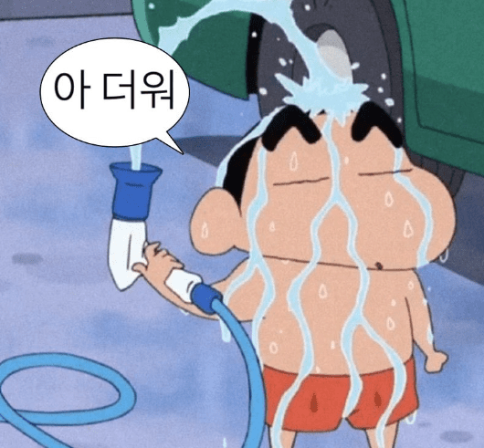

# 방학 끝

정말 무척이나 더웠다.
에어컨도 없이 최고 30도까지 치솟는 방에서 선풍기 바람에 의지하며 개발을 하기란 정말 쉽지 않았다.

방학 시작할 때만 해도 진짜 이번 여름 방학 땐 그동안 못했던 개인 공부를 열심히 해야지 다짐했었는데
돌이켜 봤을 때 다짐처럼 야무진 방학을 보내진 못한 거 같아 아쉽다.

너무 더워서 많이 퍼지기도 했었고 개발에 대한 정체기를 느껴 번아웃이 오기도 했다.
특히 SOPT 지원서를 완성한 후 좀 크게 왔었던 거 같다.

# SOPT 지원서

개발 기간은 4월 부터 있었던 거 같은데
초기 개발 방향을 잡으면서 팀원과 계속 의논을 나누다 보니 생각보다 시간이 많이 지나갔다.
더 나은 코드를 위해 서로 근거를 가지고 논의를 하는데 재밌긴 했었다.
사소해 보이는 것도 왜 이렇게 짰는지 근거를 찾고, 더 나은 방법은 없는지 고민했었다.
어떤 코드를 설명하기 위해 자료를 첨부하여 구구절절 글을 쓰고 이에 대한 다른 의견이 달리면 또 그거에 대응하기 위한 자료들을 찾고 구구절절 설명하고 이를 반복했었다. <del>[(어느정도 였는지 구경하고 싶다면,,,)](https://github.com/sopt-makers/sopt-recruiting-frontend/pull/6#discussion_r1614220900)</del>

물론 힘들긴 했다.
이때 힘을 좀 많이 뺐던 거 같다. 🫠

_둘이서 몇 십 개의 리뷰..._

물론 지금도 이런 식으로 더 나은 코드를 위해 사소해 보이는 것도 그냥 넘어가지 않는 건 좋은 거라고 생각을 한다.
하지만 돌이켜 보면 시간을 좀 더 고려하면서 어느 정도 괜찮은 부분은 그냥 넘어가는 것도 좋지 않았을까 싶긴 하다.
지금은 그 사이를 적절히 조절을 하려고 노력하는 중이다.

SOPT makers 35기 모집 한 달 전 부터는 정말 휘몰아 쳤었던 거 같다.
SOPT OB/YB 모집 때 내가 만든 지원서를 사용하기 위해선 메이커스 모집 때 먼저 지원서를 적용해야만 했다.
어떤 에러들이 발생할 지 모르니까 테스트하기 위해서 말이다.
원래는 내 개인 공부도 하면서 남는 시간에 지원서를 개발하려고 했으나 시간이 턱없이 부족했다.
나중에는 그냥 하루 종일 지원서 개발에만 몰두했다.
심지어 중간에 기업 사전 과제가 있었는데 그냥 안 하고 지원서를 개발할 정도였다. <del>사실 풀스택을 뽑는 거라 백엔드도 해야했기에 어려워서 안 한 거이기도 하다.</del>

개발 하는 것도 좀 쉽진 않았다.
지원서에는 여러가지 케이스들이 많아서 이를 모두 고려하면서 개발을 진행해야만 했다.
여러가지 에러들도 많이 발생해서 골머리를 많이 앓았었다. <del>특히 임시저장 구현은,,, 😵‍💫</del>

어찌저찌 지원서 페이지를 완성하긴 했다.
이전 지원서에 비해 엄청나게 많이 개편이 되었다.
완성하고 release 하는 순간 좀 뿌듯했다.
다행히도 makers 모집 기간 동안 큰 에러 없이 잘 마무리할 수 있었다.
정말 별의별 테스트를 다 진행하고 내가 생각하기에 가능한 모든 경우의 수를 다 고려하고
테스트를 수십번 반복을 했었기에 큰 에러가 없을 것이라 예상하긴 했지만 실제로 큰 에러 없이 잘 마무리 되어서 기뻤다.

물론 그렇게 많이 테스트를 했었지만 자잘한 에러들은 있었고 makers 모집 기간 동안 모두 수정해 주었다.
덕분에 SOPT OB 모집 동안은 에러 발생 횟수가 0건이었다.

곧 YB 모집 기간인데 별 이상없이 잘 마무리 되었으면 좋겠다.

# 러닝

러닝을 시작했다.
그냥 하루종일 방구석에서 개발만 하니까 너무 답답해서 밖을 달리고 싶어졌다.

그래도 군대에 있을 땐 3km 달리기 특급을 받을 정도로 체력은 좀 자신이 있었었는데
요즘 맨날 앉아만 있으니 체력이 많이 안 좋아진 거 같다. 조금만 달려도 바로 숨이 찼다.

이번 8월에는 총 8번을 달렸다.
장소는 집 앞 공원.
목표는 5km.

역시 꾸준히 달리고 또 중간중간 하체 운동도 하다보니 점점 체력이 좋아지는 걸 느낄 수 있었다.
처음에는 1km 뛰고 조금 쉬고 1km 달리고 조금 쉬고 그랬었는데
이제는 3km도 한 번에 뛸 수 있을 정도가 되었다.
현재는 평균 페이스 5분 후반대가 나오는데 5분 초반까지 땡겨보는 것이 목표다.  <del>뭐 언젠간 마라톤도 도전해보지 않을까? 싶다.</del>

근데 지금 러닝 뛰고 나서 발목 부상이 와서 오른쪽 다리를 쩔뚝 거리고 있다.
한창 클라이밍 할 때도, 헬스 할 때도 안 다쳤었는데
달리기 하다가 부상을 입을 줄은 몰랐다.ㅜㅜ
분명 유튜브에서 [초보자는 미드풋말고 리어풋을 하란](https://youtube.com/shorts/ML5ky04XZzM?feature=shared) 얘기를 듣고 보법을 바꾼 건데 바꾸자 마자 뒤 통증이 시작되었다.
초반 통증이 있을 때 회복을 했어야 하는데 무시하고 계속 뛰었던 것이 큰 패착이었던 거 같다.
무려 올림픽 금메달리스트가 얘기한 거라 꽤나 신빙성이 있을 줄 알았는데
사람마다 보법은 다 다른가 보다.

그래서 원래는 오늘 러닝을 뛰려고 예정 되어있었으나 취소하고 그냥 쉬기로 했다. <del>오히려 좋아?</del>

# 취업은

계속해서 인턴에 도전을 하고 있다.
생각보다 쉽지가 않다. 계속 떨어지니 말이다.
원래 계획은 이때 쯤 인턴을 하나 하면서 경력 쌓고 돈 벌고 그럴 계획이었으나
역시나 인생은 원하는대로 되지 않는다.

_아 google에서 와달라 할 때 갈 걸_

하지만 오히려 좋아! 나의 부족한 점을 더 잘 알게 되었다.
거의 뭐,,, 고1~고3 되면서 점점 대학 네임이 낮아지게 되는 그런 느낌이긴 하지만
실력적으로 아직 부족한 걸 어쩌겠냔 말이다.

요즘 드는 생각이 실력적으로 정체되고 있다는 느낌이 든다.
매번 똑같은 프로젝트에 똑같은 것만 해서 그런 거 같다.
날이 지날수록 만든 프로젝트 숫자는 늘어나는데 그 안에 깊이는 깊어지지 않는 거 같다.

그래서 요즘은 지식을 얇고 넓게 보다는 좁고 깊게 파고드려고 노력하고 있다.
더이상 새로운 프로젝트는 하지 않고 지금 하고 있는 프로젝트들을 리팩토링 하면서
더 좋은 코드, 더 좋은 성능을 위해 고민하고 공부하고 있다.
사실 실력이 빨리 안 느는 거 같아 조금 답답하긴 했었는데 좀 더 깊게 공부해보려고 노력을 하다보니 조금씩 나아지고 있다는 느낌이 들기도 하다.
물론 아직 많이 부족하지만!

이력서도 정말 많이 수정했다.
지금보면 내 첫 이력서는 정말 형편 없었다. 물론 지금도 엄청 좋다고 할 순 없지만 그래도 그건 좀 심했었다.
이력서도 써봐야 내가 부족한 부분이 어딘지 파악할 수 있는 거라고
역시 쓰고 보니 부족한 부분이 많이 보였다.
얼른 다 공부해서 채워버리고 싶다. <del>그냥 자고 일어나면 개발 천재가 되었으면... 😑</del>

원래는 인턴만 지원하고 신입 공채는 지원 안하려고 했었다. 왜냐면 나는 아직 학기가 남아있기에 졸업하고 나서 공채 지원해도 되지 않을까 싶었었기 때문이다.
근데 지금은 생각이 완전 바꼈다.
인턴을 다 떨어지고 나니 미리미리 공채도 넣어보고 준비도 해보며 나중을 대비해야겠단 생각이 들었다.
물론 합격을 기대하고 넣는 건 아니지만 지금 풀파워로 준비하고 넣어야 다음 번에 지금 경험을 바탕으로 더 좋은 자소서를 작성할 수 있지 않을까 싶다.

사서 걱정 하는 건 싫어하는 성격이라 언젠가 취업이 되겠지라는 생각은 늘 가지고 있지만
가만히 있다고 취업이 되는 건 아니기도 하고 또 물론 떨어질 걸 예상했지만 실제로 떨어지면 좀 슬프기에 안 떨어지는 걸 목표로 해서
최선을 다해 지원해 보려고 한다. 떨어진다고 해서 불안하거나 조급함이 생기진 않아서 그건 좀 다행인 거 같다. 언젠간 될 걸 아니까.

# 2024도 4개월 남았다

시간이 너무 빨리 간다.
나도 곧 30이다. <del>미친</del>

남은 4개월은 더 알차게 보내고 싶다.
코테도 준비하고 JS도 공부하고 시간 남으면 CS 지식도 슬슬 공부 시작해야 하지 않나 싶다.
지치지 않고 잘 할 수 있으면 좋겠다.

_둥근 해 미친 거 또 뜨네?_
