# Stylelint

## 설명

강력한 CSS linter.
오류를 방지하고 convention을 따르는데 도움을 준다.

## 특징

- CSS 구문 및 기능에 대한 100개 이상의 내장 규칙을 갖추고 있다.
- 사용자 정의 규칙을 작성할 수 있는 플러그인 지원.
- 가능한 경우, 문제를 자동으로 수정.
- 사용자가 생성하거나 확장할 수 있는 공유 가능한 config를 지원.
- 사용자의 정확한 요구 사항에 맞게 사용자 정의 가능.
- 안정성 검증됨.

`Prettier`와 같은 pretty printer와 같이 사용하는 것을 추천한다.
이는 일관되고 오류 없는 코드를 작성하는데 도움을 줄 것이다.

## 시작하기

이미 구현되어 있는 [standard config](https://www.npmjs.com/package/stylelint-config-standard) 를 확장하여 이용한다.

### 설치

```bash
yarn add stylelint stylelint-config-standard --dev
```

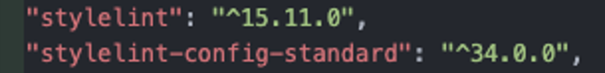

### 파일 생성

최상단 폴더에 `.stylelintrc.json` 파일 생성 후 extends 추가.

```jsx
// .stylelintrc.json

{
  "extends": [
    "stylelint-config-standard"
  ]
}
```

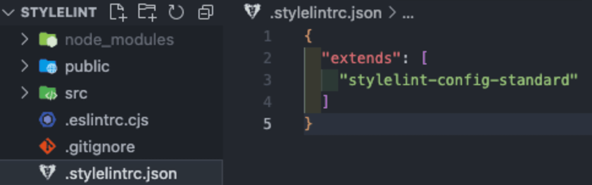

### 실행

모든 CSS 파일에 `stylelint` 검사 진행하기.

```jsx
yarn stylelint "**/*.css"
```

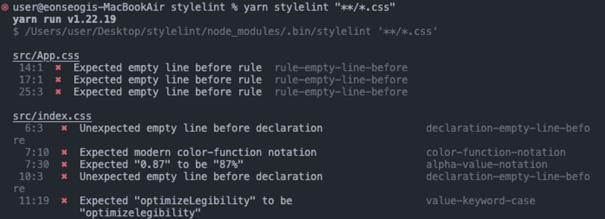

위와 같은 오류들을 확인할 수 있다.

### VSC Extension 설치

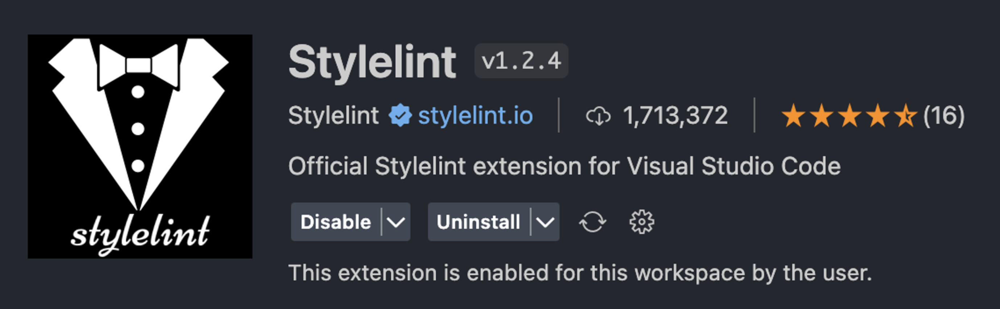

위의 `VSCode extension`을 설치하면
아래와 같이 파일에서 바로 에러 화면을 확인할 수 있다.

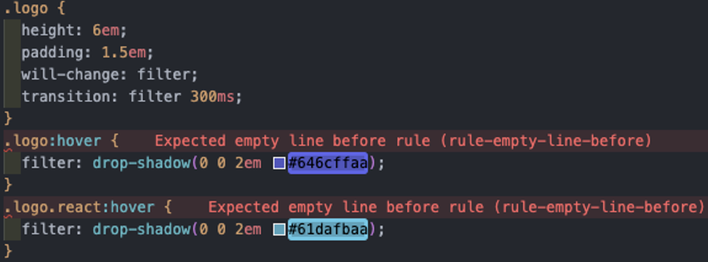

## Customizing

standard config는 built-in rules의 절반 정도만 설정이 되어있다.
`stylelint`로는 이 보다 더 많은 설정을 할 수 있다.

[standard config](https://www.npmjs.com/package/stylelint-config-standard)
[built-in rules](https://stylelint.io/user-guide/rules)

### unit 제한 두기

예를 들어,

- 일반적으론 `%`, `deg`, `px`, `rem`, `ms` 단위를 사용.
- border에는 `px` 사용.
- padding과 gap에는 `rem` 사용.
- 참고할 만 한 것
  [[CSS] - When to use ems, rems, and px in CSS](https://www.shecodes.io/athena/28078-when-to-use-ems-rems-and-px-in-css)

이렇게 규칙을 정하고 싶다면,

```jsx
// .stylelintrc.json

{
  "extends": ["stylelint-config-standard"],
  "rules": {
    // ...

    "declaration-property-unit-allowed-list": {
      "/^border/": ["px"],
      "/^padding|^gap/": ["rem"]
    },
    "unit-allowed-list": ["%", "deg", "px", "rem", "ms"],

    // ...
  }
}
```

위와 같이 `rules`를 추가하면 된다.

그렇게 수정했을 시 아래와 같은 오류를 볼 수 있다.

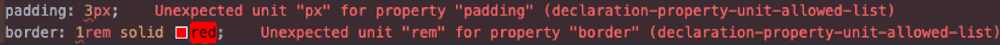

### id 선택자 사용 금지 시키기

예를 들어, CSS 설정을 주기 위해 id 선택자를 이용하는 것을 제한하고 싶을 때,
아래와 `rules`를 추가해주면 된다.

```jsx
{
  "extends": ["stylelint-config-standard"],
  "rules": {
    "selector-max-id": 0
  }
}
```

결과물.

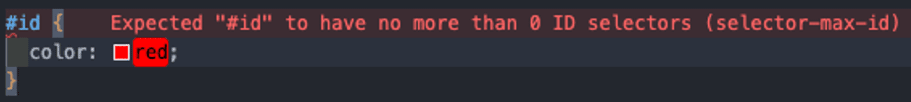

더 많은 `rules`는 [built-in rules](https://stylelint.io/user-guide/rules)에서 확인할 수 있다.

## Custom rules

[built-in rules](https://stylelint.io/user-guide/rules) 외에 추가적인 규칙을 정의하기 위해 `plugins`이 사용된다.

`rules`는 기본적인 `stylelint` 규칙을 구성하고 사용자 정의 규칙을 추가하는 데 사용되며,
`plugins`는 추가적인 사용자 정의 규칙 세트를 제공하거나 특정 규칙을 확장하기 위해 사용된다.

기본적으로 `stylelint`에는 내장 규칙이 포함되어 있으며,
`plugins`를 사용하여 플러그인의 추가 규칙을 활용할 수 있다.

그 중 가장 대표적인 것이 order plugin를 포함하고 있는 recess order config이다.

[order plugin](https://www.npmjs.com/package/stylelint-order)
[recess order config](https://www.npmjs.com/package/stylelint-config-recess-order)

### stylelint-config-clean-order

[stylelint-order](https://github.com/hudochenkov/stylelint-order) 규칙에 맞춰 style을 정렬한다.

사용법

```powershell
yarn add stylelint-config-recess-order --dev
```

위의 명령어를 입력해 준 뒤,

```jsx
// .stylelintrc.json

{
  "extends": [
    "stylelint-config-standard",
    "stylelint-config-recess-order"

    // ...
  ]
}
```

혹은,

```jsx
// .stylelintrc.json

{
  "extends": ["stylelint-config-standard"],
  "plugins": ["stylelint-order"],
  "rules": {
    "order/properties-alphabetical-order": true
  }
}
```

위와 같이 plugins를 추가해 준다.

아래와 같은 오류 화면을 볼 수 있다.

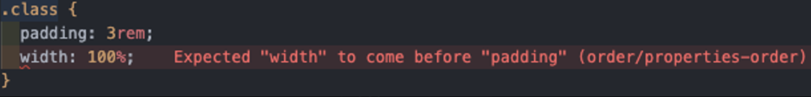

아래와 같이 수정해주면 된다.

```css
.class {
  width: 100%;
  padding: 3rem;
}
```

### stylelint-config-prettier

`Prettier`와 충돌할 수 있는 모든 규칙을 비활성화한다.

사용법

```powershell
yarn add stylelint-config-prettier --dev
```

```jsx
// .stylelintrc.json

{
  "extends": [
    "stylelint-config-standard",
    "stylelint-config-prettier"

    // ...
  ]
}
```

## 주석에도 적용

`report*` 속성을 주어 주석에 대한 lint 설정을 할 수 있다.

```jsx
// .stylelintrc.json

{
  "extends": ["stylelint-config-standard"],
  "reportDescriptionlessDisables": true,
  "reportNeedlessDisables": true,

  // ...
}
```

- reportDescriptionlessDisables : 주석에 대한 설명이 없는 경우 오류를 생성.

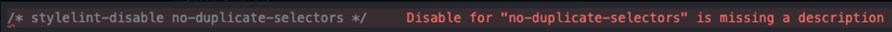

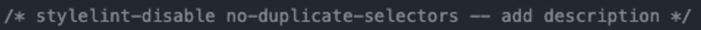

- reportNeedlessDisables : 사용 안되는 주석에 대한 오류를 생성.

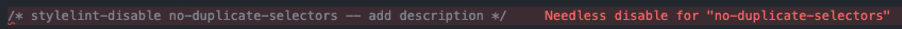

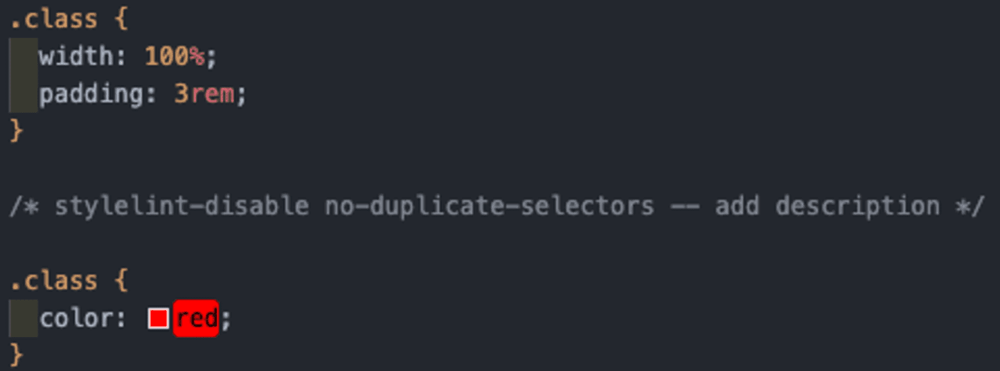

## 자동 수정

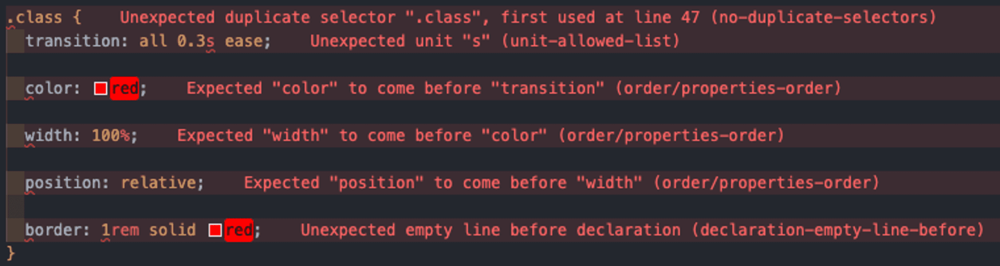

이렇게 많은 오류를 —fix option을 주어 빠르게 수정할 수 있다.

```jsx
yarn stylelint "**/*.css" --fix
```

새로 추가된 `rules`와 `report*` properties와 관련된 오류를 제외한 나머지 오류들이 자동으로 수정된 것을 확인할 수 있다.

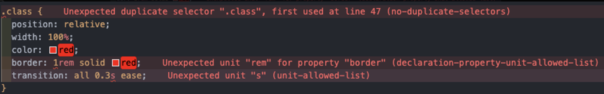

더 많은 옵션은 [여기서](https://stylelint.io/user-guide/options/) 확인이 가능하다.

## SCSS와 stylelint

[SCSS community config](https://www.npmjs.com/package/stylelint-config-standard-scss) 를 확장하여 사용한다.

### 설치

```jsx
npm install --save-dev stylelint stylelint-config-standard-scss
```

.stylelintrc.json 파일을 생성한 뒤,

```jsx
// .stylelintrc.json

{
  "extends": [
    "stylelint-config-standard-scss"
  ]
}
```

위와 같이 수정해준다.

```jsx
npx stylelint "**/*.scss"
```

모든 SCSS 파일에 stylelint 검사 진행하기.

```
{
  "extends": [
    "stylelint-config-standard"
  ]
}
```

# Husky

commit 및 기타 작업을 개선하는 데 도움을 주는 도구.
이를 사용하여 commit message를 검사하고 commit 하거나 push할 때, test를 실행하고 코드를 검사할 수 있다.

### 특징

- 의존성이 없어 가볍다.
- modern new Git feature을 활용한다.
- npm 및 yarn의 autoinstall에 관한 best practices를 준수.
- 사용자 친화적인 메세지.
- 사용 여부 선택 가능.
- 여러 OS 지원.

# 참고문서

[Home | Stylelint](https://stylelint.io/)
[Getting started | Stylelint](https://stylelint.io/user-guide/get-started/)
[Customizing | Stylelint](https://stylelint.io/user-guide/customize/)
[Configuring | Stylelint](https://stylelint.io/user-guide/configure/)
[🐶 husky | 🐶 husky](https://typicode.github.io/husky/)
[Preventing bad git commits with Husky](https://www.compositional-it.com/news-blog/preventing-bad-git-commits-with-husky/)
