# 상황

최적화를 계속 진행하면서 번들 사이즈를 더 줄일 방법이 없을까 고민을 하던 중 axios를 꼭 써야하나라는 생각이 들게 되었다. 사실 여태껏 프로젝트를 생성하면서 당연히 axios를 사용했었으니 자연스럽게 설치를 해줬었는데 이유 없이 사용하고 있었던 것이다. 따라서 이유 없는 코드를 제거 하기 위해, 번들 사이즈를 조금이라도 더 줄여보기 위해 axios 대신 fetch를 이용해서 구현해주기로 결정하였다.

# Axios와 Fetch 비교하기

일단 들어가기 앞서 axios를 사용하는 이유에 대해서 알아보기로 하였다.

1. axios는 response를 자동으로 JSON으로 바꿔준다.

   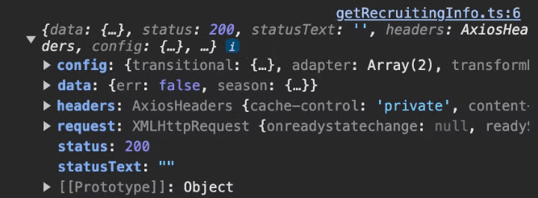

   위는 axios를 이용하여 data를 받아온 사진이다. 반면 fetch를 이용한다면 아래와 같이 Promise가 return 되는 걸 확인할 수 있다.

   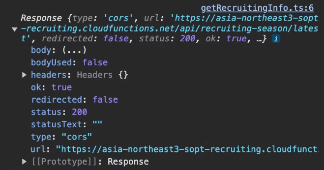

   따라서 해당 data를 사용하기 위해선 data를 json() method를 이용하여 JSON으로 바꿔줘야 한다. 즉 추가적인 작업이 한 번 더 들어가는 것이다.

   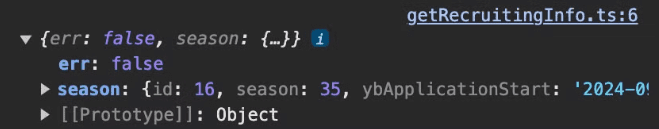
   _fetch로 받아온 Promise를 data.json() 한 모습_

2. data를 자동으로 JSON으로 만들어준다.

   axios는 이용하여 data를 parameter로 넣어줄 때 그냥 data 객체를 그대로 넣어주면 된다.

   ```tsx
   axios.post(url, { name: '', ... });
   ```

   반면 fetch를 이용할 땐 data를 json stringfy 해서 넘겨줘야 한다.

   ```tsx
   fetch(url, { ..., body: JSON.strignify({ name: '', ... }) });
   ```

3. 에러를 자동으로 예외 처리해준다.

   status가 2xx 범위를 벗어나 reject 되면 axios는 이를 err response에 status 코드와 config를 담아서 넘겨준다.
   이를 이용하여 에러 처리를 쉽게 할 수 있다.

   일부로 404 에러를 발생시킨 뒤 error를 console에 찍어보았다.

   ```tsx
   try {
     const response = await axios.post('/invalid-endpoint', {
       invalidKey: 'invalidValue',
     });

     console.log('Response:', response.data);
   } catch (error) {
     console.log(error);
   }
   ```

   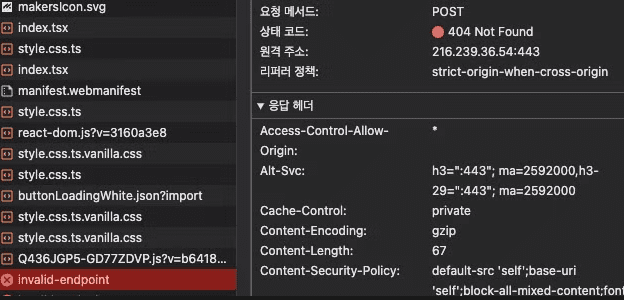

   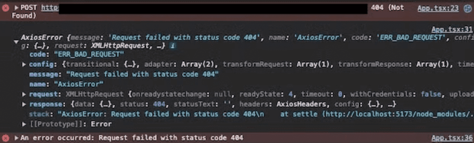

   error가 throw 되는 걸 확인할 수 있었다.

   반면 fetch는 자동으로 catch를 trigger하지 않는다.
   똑같은 요청을 fetch로도 해보았다.

   ```tsx
   try {
     const data = {
       invalidKey: 'invalidValue',
     };

     const response = await fetch('/invalid-endpoint', {
       method: 'POST',
       body: data,
     });

     console.log('Response:', response);
   } catch (error) {
     console.error('Bad Request Error:', error.message);
   }
   ```

   

   404 에러가 발생했지만 fetch는 성공으로 console을 찍고 있었다. 500 에러 또한 마찬가지였다.

   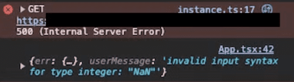

   error가 발생 시 error를 띄우기 위해선 아래와 같은 별도의 처리가 필요했다.

   ```tsx
   if (!response.ok) {
     if (response.status === 500) {
       throw new Error('network response가 도착하지 않았어요');
     }
   }
   ```

   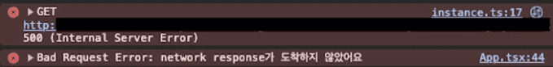
   _error로 throw 하니 error가 발생하게 되었다_

4. Timeout / Cancel Requests

   axios는 timeout을 이용하여 일정 시간이 지나면 request를 종료시킬 수 있다.

   ```tsx
   axios.get(url, { timeout: 4000 });
   ```

   4초 이상 걸릴 경우 요청을 종료하고 error를 발생시킨다. 반면 fetch는 이를 직접적으로 지원하지 않는다.

5. 호환성

   axios가 fetch보다 오래된 브라우저에서의 호환성이 더 좋다. IE11 같은 오래된 브라우저에서도 issue 없이 axios는 잘 작동한다. 반면 fetch를 사용하기 위해선 별도의 polyfill이 필요하다.
   [Fetch | Can I use...](https://caniuse.com/fetch)를 확인해보면 fetch는 IE에서 지원이 안 된다.

6. interceptors

   axios는 interceptors를 이용하여 request를 보내기 전과 response를 받기 전에 api 요청을 intercept 해와서 로직을 실행시킬 수 있다. fetch는 불가능하다.

# Axios에서 Fetch로

axios의 장점은 위에서 알아봤듯이 크게 6개가 있다.

1. axios는 response를 자동으로 JSON으로 바꿔준다.
2. data를 자동으로 JSON으로 만들어준다.
3. 에러를 자동으로 예외 처리해준다.
4. Timeout / Cancel Requests
5. 호환성
6. interceptors

이제 각각의 장점들을 fetch에서 구현해주면 axios 쓸 필요가 없어질 것이다.

## axios는 response를 자동으로 JSON으로 바꿔준다.

현재는 axios instance를 만든 후 이를 이용하여 data fetching을 해주고 있었다.

```tsx
const instance = axios.create({
  baseURL: import.meta.env.VITE_BASE_URL,
  headers: {
    'Content-Type': 'application/json',
  },
});
```

fetch 역시도 공통 instance를 만들어 준 뒤 이를 재사용 하는 편이 더 좋아 보였다.

```tsx
const baseURL = import.meta.env.VITE_BASE_URL;

type StandardHeaders =
  | 'Content-Type'
  | 'Authorization'
  | 'Accept'
  | 'Cache-Control'
  | 'User-Agent';
type RequestMethod = 'GET' | 'POST' | 'PUT' | 'PATCH' | 'DELETE';

interface FetchOptions extends RequestInit {
  method?: RequestMethod;
  headers?: Record<StandardHeaders, string>;
}

const instance = async (url: string, options: FetchOptions = {}) => {
  const { headers, ...rest } = options;

  const response = await fetch(`${baseURL}${url}`, {
    headers: {
      'Content-Type': 'application/json',
      ...headers,
    },
    ...rest,
  });

  return response.json();
};
```

일단 axios instance와 사용법을 동일하게 가져가도록 하였다. 인자로 url과 options를 받게 해주었다. baseUrl은 어차피 동일하므로 전역 변수로 만들어준 뒤 사용하는 방식을 택했다. 이때 method와 headers option들은 잘못된 값이 들어오면 안 되므로 type 제한을 해주자는 팀원의 의견을 받아들여 따로 type을 union으로 정의해주었다.

이후 response.json()을 return 해주어 매번 json으로 변환하는 과정을 생략해주었다.

```tsx
export const getData = async () => {
  const res = await instance('/url', { method: 'POST' });

  return res;
};
```

따라서 위와 같이 data를 요청하면 json data를 받을 수 있게 되었다.

## data를 자동으로 JSON으로 만들어준다.

### post등의 body data

body에 data를 넣으면 이를 자동으로 JSON.stringify 해주는 로직이 필요했다.

```tsx
interface FetchOptions extends Omit<RequestInit, 'body'> {
  // ...
  body?: Record<string, unknown>;
}

const instance = async (url: string, options: FetchOptions = {}) => {
  const { headers, body, ...rest } = options;

  const response = await fetch(`${baseURL}${url}`, {
    headers: {
      'Content-Type': 'application/json',
      ...headers,
    },
    body: JSON.stringify(body),
    ...rest,
  });

  return response.json();
};

export default instance;
```

이를 위해 options에서 body를 분리해줬다. body는 JSON.stringify가 들어가야 했으므로 객체를 넣을 수가 없었다. 그로 인해 type 에러가 발생했다. 따라서 Omit을 이용해서 body에 들어갈 내용을 새로 정의해줬다. 그런 뒤 이를 JSON.stringify()로 감싸주었다.

사용법은 아래와 같다.

```tsx
export const getData = async () => {
  const res = await instance('/url', {
    method: 'POST',
    body: {
      name: 'eon',
      age: 27,
    },
  });

  return res;
};
```

### get의 params data

get 요청을 보낼 때 담게 될 data는 params에 보내주고 있었다. 따라서 이 역시도 axios와 비슷하게 가져가기로 했다. params를 options 안에 받게 한 뒤 URLSearchParams를 이용하여 url 뒤에 붙여줬다.

```tsx
interface FetchOptions extends Omit<RequestInit, 'body'> {
  // ...
  params?: Record<string, any>;
}

const instance = async (url: string, options: FetchOptions = {}) => {
  const { headers, body, params, ...rest } = options;
  const urlWithParams = params
    ? `${url}?${new URLSearchParams(params).toString()}`
    : url;

  const response = await fetch(`${baseURL}${urlWithParams}`, {
    headers: {
      'Content-Type': 'application/json',
      ...headers,
    },
    body: JSON.stringify(body),
    ...rest,
  });

  return response.json();
};
```

사용법은 아래와 같다.

```tsx
const res = await instance('/url', {
  method: 'GET',
  params: {
    name: 'eon',
    age: 27,
  },
});
```


정상적으로 요청이 들어가고 있음을 확인할 수 있었다.

### form data 전송

한 가지 문제는 formData를 보낼 때는 application/json 타입이 아니라 JSON.strignify()로 변환을 해주면 안 되었다.
따라서 보내는 data가 formData인지 아닌지 판단하는 로직을 추가해주었다.

```tsx
interface FetchOptions extends Omit<RequestInit, 'body'> {
  // ...
  headers?: Partial<Record<StandardHeaders, string>>;
}

const instance = async (url: string, options: FetchOptions = {}) => {
  const { headers = {}, ...rest } = options;
  // ...

  if (!(body instanceof FormData)) {
    headers['Content-Type'] = 'application/json';
  }

  const response = await fetch(`${baseURL}${urlWithParams}`, {
    headers: {
      Authorization: `Bearer ${soptApplyAccessToken}`,
      ...headers,
    },
    body: body instanceof FormData ? body : JSON.stringify(body),
    ...rest,
  });
  // ...
};
```

formData일 경우 자동으로 `content-type = multipart/form-data`이 들어감으로 formData가 아닌 경우에만 application/json을 추가해주면 됐다.
이 후 body 데이터 부분 또한 formData가 아닐 때만 JSON.stringify 해주었다.

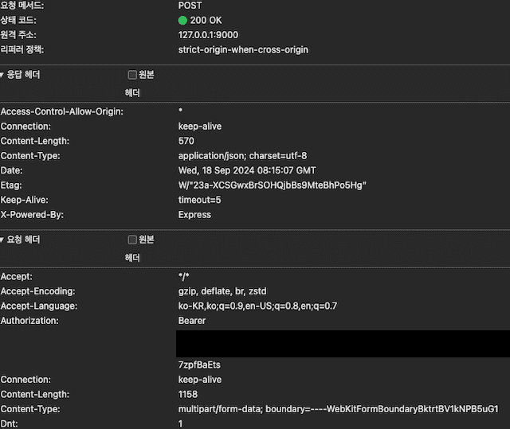

form data 요청이 정상적으로 보내진 걸 확인할 수 있었다.

## 에러를 자동으로 예외 처리해준다

api 호출에 성공하지 않았으면 error를 throw 해줘야 한다. 이때 error status 코드에 따른 로직을 달리하기 위해 status도 error에 같이 넘겨줘야 한다. 하지만 Error에는 status가 없어 CustomError를 만들어줬다. message는 super를 이용하여 Error의 생성자를 그대로 이용해 주었고 status만 추가해주었다.

```tsx
export class CustomError extends Error {
  status: number;

  constructor(message: string, status: number) {
    super(message);
    this.status = status;
  }
}
```

그런 뒤 api 호출 실패 시 CustomError를 throw 해줬다.

```tsx
const instance = async (url: string, options: FetchOptions = {}) => {
  // ...
  if (!response.ok) {
    const errMsg = await response.json();
    throw new CustomError(errMsg.userMessage, response.status);
  }
  // ...
};
```

사용법은 아래와 같다.

```tsx
try {
} catch (error) {
  const fetchError = error as CustomError;

  switch (fetchError.status) {
    case 403:
      console.log('403 에러: 알수 없는 에러가 발생했어요.');
      break;
  }
}
```

이때 401 인증 에러와 500 서버 에러는 tanstack query에서 전역적으로 관리해주고 있어서 따로 추가해주진 않았다.

```tsx
queryCache: new QueryCache({
  onError: (error) => {
    const fetchError = error as CustomError;

    if (fetchError.status === 401) {
      sessionRef.current?.showModal();
    } else if (fetchError.status === 500) {
      window.location.href = '/error';
    }
  },
}),
```

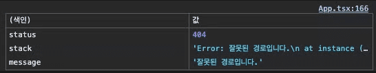
_custom error의 속성값들_

## Timeout / Cancel Requests

이는 [AbortController interface](https://developer.mozilla.org/en-US/docs/Web/API/AbortController)를 이용하여 해결할 수 있었다.

```tsx
const controller = new AbortController();
const signal = controller.signal;
setTimeout(() => controller.abort(), 1); // 1ms로 설정

try {
  const response = await instance('/invalid-endpoint', {
    method: 'POST',
    signal,
  });
} catch (error) {
  const fetchError = error as CustomError;
  switch (fetchError.status) {
    default:
      console.log(`알 수 없는 에러: ${fetchError.message}`);
  }
// ...
```


_api 요청이 (취소됨)_


_api 요청 취소에 따른 error 발생_

요청이 취소됨을 확인할 수 있었다.

## 호환성

[Can I Use?](https://caniuse.com/?search=fetch)를 보면 96%의 브라우저에서 fetch를 지원하는 것을 확인할 수 있었다.

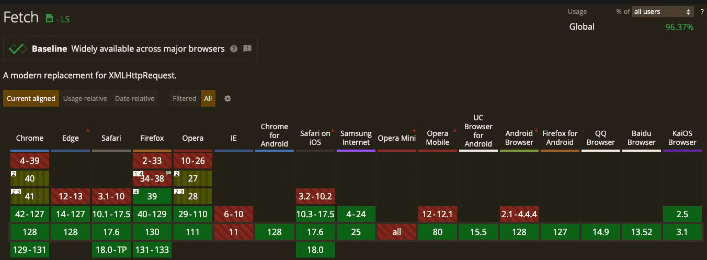

사실상 옛 IE를 빼곤 거의 지원을 하고 있었다. 심지어 IE도 종료된지 2년이 지난 터라 이에 대한 polyfill 처리하는 것이 오히려 더 리소스 낭비일 수도 있겠다는 생각을 들었지만 그래도 공부한다는 차원에서 한 번 구현해보기로 했다.


_IE 이제 종료되었는데 어디서 테스트 하지,,_

해당 polyfill은 [whatwg-fetch](https://github.com/JakeChampion/fetch?tab=readme-ov-file)라는 라이브러리로 이미 구현되어 있어서 이를 바로 적용해주면 됐다. 심지어 weekly downloads 수가 천 만이 넘는 굉장히 인기있는 라이브러리였다.

사용법은 아주 간단했다. fetch를 사용하는 곳에 `import 'whatwg-fetch';`만 넣어주면 자동으로 크로스 브라우징을 지원해준다.

build를 돌린 뒤 해당 라이브러리가 어느 정도의 사이즈를 잡아먹는지 체크해보았다. 17.81KB로 axios를 사용하는 것보다 훨씬 낮은 수준이었다.

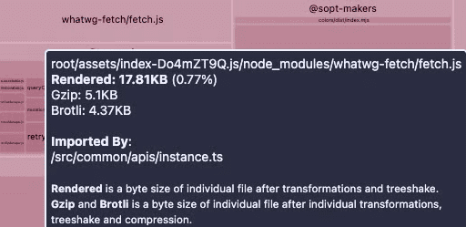

사실 Promise 역시 IE 등에선 지원을 안 하고 있어 이에 대한 polyfill 설정도 필요했다.

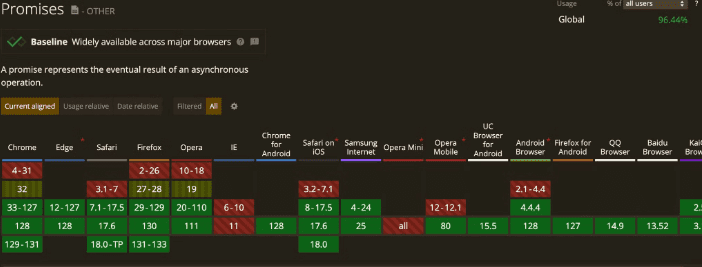

whatwg-fetch 공식문서에서 [taylorhakes/promise-polyfill](https://github.com/taylorhakes/promise-polyfill)을 추천해주었다. 이 역시도 사용법은 아주 간단했다. whatwg-fetch와 마찬가지로 그저 `import 'promise-polyfill/src/polyfill';`를 추가해주면 됐다. 이는 9.52KB의 번들 사이즈를 가지고 있었다.


슬프게도 URLSearchParams 또한 IE에서 지원이 되지 않았다.
이 역시도 [polyfill 라이브러리](https://www.npmjs.com/package/url-search-params-polyfill)가 존재했고 사용법도 간단했다. 그저 `import 'url-search-params-polyfill';`를 추가해주면 됐다.
다만 body에 URLSearchParams를 이용하여 data를 넣어줄 경우 header에 수동으로 `headers.set('Content-Type', 'application/x-www-form-urlencoded; charset=UTF-8');`를 해줘야 했다.
그래도 내 코드에선 이를 사용할 일이 없었다.

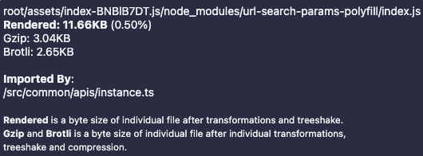
_이 친구는 11.66KB를 차지했다._

참고자료
[url-search-params-polyfill: known issue](https://www.npmjs.com/package/url-search-params-polyfill#known-issues)
[Can I Use | URLSearchParams](https://caniuse.com/?search=urlsearchparams)

## interceptors

현재 axios를 이용하여 request에 대한 interceptors를 이용하고 있었다. response는 query client에서 전역적으로 처리하고 있어서 불필요했다. fetch 같은 기능을 사용할 수 있도록 구현했다. 이미 만들어 놓은 instance 안에 해당 로직을 추가해주면 됐다.

```tsx
const instance = async (url: string, options: FetchOptions = {}) => {
  const { headers = {}, ...rest } = options;

  const soptApplyAccessToken = localStorage.getItem('soptApplyAccessToken');
  const soptApplyAccessTokenExpiredTime = new Date(localStorage.getItem('soptApplyAccessTokenExpiredTime') || '');
  const isValidDate = soptApplyAccessTokenExpiredTime.toDateString() !== 'Invalid Date';
  const afterRecruiting = isBefore(soptApplyAccessTokenExpiredTime, new Date());

  if (!soptApplyAccessToken || !isValidDate || !soptApplyAccessTokenExpiredTime || afterRecruiting) {
    localStorage.removeItem('soptApplyAccessToken');
    localStorage.removeItem('soptApplyAccessTokenExpiredTime');

    window.location.href = '/';

    return;
  }

  headers.Authorization = soptApplyAccessToken ? `Bearer ${soptApplyAccessToken}` : '';

  const response = await fetch(`${baseURL}${urlWithParams}`, {
    headers: {
      ...headers,
      // ...
```

access token이 있을 때만 authorization에 추가해준 뒤 headers에 넣어주었다.

하지만 해당 instance를 공통으로 사용하고 있었는데 회원가입과 같이 token이 필요없는 api 요청 시에도 위의 로직으로 인해 계속 로그인 페이지로 자동 이동되었다.
따라서 token이 필요한 경우와 아닌 경우를 구분해 주어야 했다. skipAuth란 속성을 하나 만든 뒤 skipAuth가 false 일 때만 access token 로직이 실행되게 하였다.

```tsx
interface FetchOptions extends Omit<RequestInit, 'body'> {
  // ...
  skipAuth?: boolean;
}

const instance = async (url: string, options: FetchOptions = {}) => {
  const { headers = {}, skipAuth = false, ...rest } = options;
  // ...

  if (!skipAuth) {
    // access token 로직

    headers['Authorization'] = `Bearer ${soptApplyAccessToken}`;
  }

  const response = await fetch(`${baseURL}${urlWithParams}`, {
    headers,
    ...rest,
  });
```

요청을 보내니 token이 필요한 api는 headers에 Authorization이 잘 들어간 것을 확인할 수 있었다.

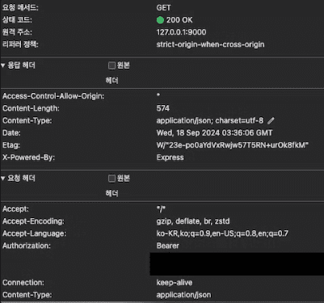
_token이 필요한 api 요청_

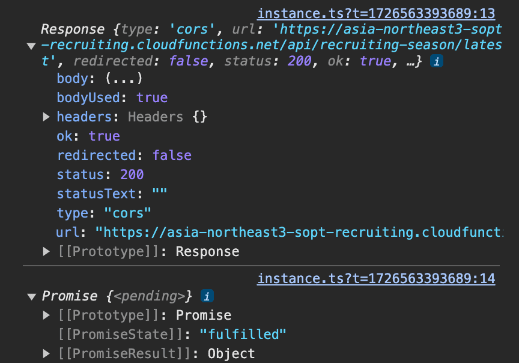
_token이 필요 없는 api 요청_

# 최종 코드

```tsx
import 'whatwg-fetch';
import 'promise-polyfill/src/polyfill';
import 'url-search-params-polyfill';
import { isBefore } from 'date-fns/isBefore';

const baseURL = import.meta.env.VITE_BASE_URL;

type StandardHeaders =
  | 'Content-Type'
  | 'Authorization'
  | 'Accept'
  | 'Cache-Control'
  | 'User-Agent';
type RequestMethod = 'GET' | 'POST' | 'PUT' | 'PATCH' | 'DELETE';

export class CustomError extends Error {
  status: number;

  constructor(message: string, status: number) {
    super(message);
    this.status = status;
  }
}

interface FetchOptions extends Omit<RequestInit, 'body'> {
  method?: RequestMethod;
  headers?: Partial<Record<StandardHeaders, string>>;
  body?: Record<string, unknown> | FormData;
  params?: Record<string, any>;
  skipAuth?: boolean;
}

const instance = async (url: string, options: FetchOptions = {}) => {
  const { body, params, headers = {}, skipAuth = false, ...rest } = options;
  const urlWithParams = params
    ? `${url}?${new URLSearchParams(params).toString()}`
    : url;

  if (!skipAuth) {
    const soptApplyAccessToken = localStorage.getItem('soptApplyAccessToken');
    const soptApplyAccessTokenExpiredTime = new Date(
      localStorage.getItem('soptApplyAccessTokenExpiredTime') || '',
    );
    const isValidDate =
      soptApplyAccessTokenExpiredTime.toDateString() !== 'Invalid Date';
    const afterRecruiting = isBefore(
      soptApplyAccessTokenExpiredTime,
      new Date(),
    );

    if (
      !soptApplyAccessToken ||
      !isValidDate ||
      !soptApplyAccessTokenExpiredTime ||
      afterRecruiting
    ) {
      localStorage.removeItem('soptApplyAccessToken');
      localStorage.removeItem('soptApplyAccessTokenExpiredTime');

      window.location.href = '/';

      return;
    }

    headers['Authorization'] = `Bearer ${soptApplyAccessToken}`;
  }

  if (!(body instanceof FormData)) {
    headers['Content-Type'] = 'application/json';
  }

  const response = await fetch(`${baseURL}${urlWithParams}`, {
    headers,
    body: body instanceof FormData ? body : JSON.stringify(body),
    ...rest,
  });

  if (!response.ok) {
    const errMsg = await response.json();
    throw new CustomError(errMsg.userMessage, response.status);
  }

  return response.json();
};

export default instance;
```

# 얼마나 개선이 되었는가?

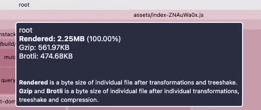
_axios를 사용할 때 번들 사이즈_

axios를 사용할 때는 총 2.25M의 번들 사이즈를 가지고 있었다.

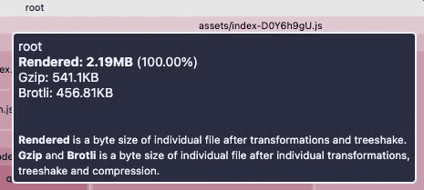
_axios를 fetch로 migration 후 번들 사이즈_

개선 후 2.21MB의 번들 사이즈로 총 약 40KB 줄일 수 있었다. 만약 polyfill을 사용하지 않는다면 약 30KB 더 줄일 수가 있다.

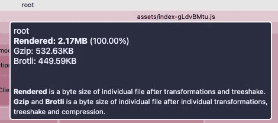
_polyfill 제거했을 때 번들 사이즈_

# 참고 자료

[You Don't Need Axios](https://dev.to/ngfizzy/you-dont-need-axios-34j9)
[Axios vs. fetch(): Which is best for making HTTP requests?](https://blog.logrocket.com/axios-vs-fetch-best-http-requests/)
[Axios vs Fetch | Which is Best for Beginners?](https://www.meticulous.ai/blog/fetch-vs-axios)
[Intercepting JavaScript Fetch API requests and responses](https://blog.logrocket.com/intercepting-javascript-fetch-api-requests-responses/#node)
