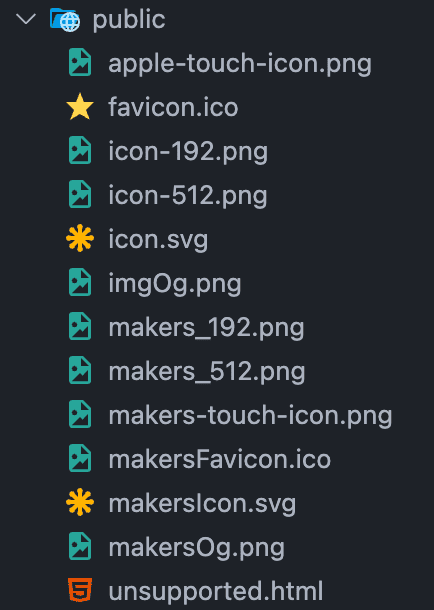
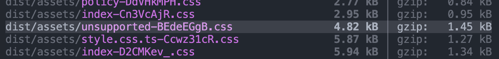
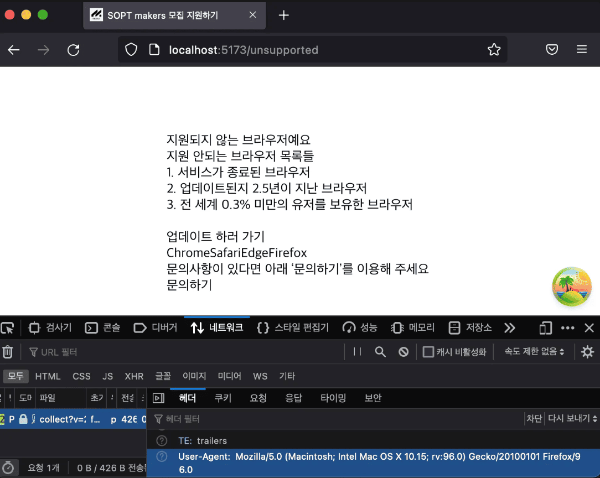

# 상황

axios에서 fetch로 migration 하는 중 fetch의 호환성 때문에 polyfill 라이브러리를 설치해줬었다. 근데 30KB나 차지하는 라이브러리가 꼭 필요한 건지 의문이 들었고, 그렇다면 어디 브라우저까지 대응을 해줘야 하는지 궁금해졌다. 따라서 이에 대해 공부를 한 뒤 적용을 해보기로 하였다.

# browserslist

## browserslist란?

browserslist는 project의 target browsers를 지정할 수 있는 도구이다. 이를 설정해줌으로써 다른 개발자가 “어떤 브라우저를 support 하는지?” 물어보지 않아도 된다.

## 왜 필요한가?

ES6(ES2015)를 기점으로 JS에는 async/await, Array.prototype.at() 등 개발하는 데 있어 더 편하게 해주는 최신 기능들이 여럿 추가되었다. 하지만 모든 브라우저가 ES6+를 지원하는 것은 아니다. 오래된 브라우저는 ES5까지만 지원할 수도 있다. 이럴 경우 해당 브라우저에서는 ES6 코드(async 등)이 작동하지 않게 된다. 이러한 브라우저에서도 해당 코드들이 동작하기 위해선 polyfill을 설정해줘야 한다. (크로스 브라우징.) 하지만 polyfill이 추가될 수록 그만큼 불러와야 할 JS 코드가 많아지게 된다. 다시 말해 실행해야 하는 polyfill이 많아져 성능이 떨어질 수 있는 것이다. 이때 browserslist를 지정하면 polyfill을 처리하는 transpiler, bundler가 지원하고자 하는 브라우저를 알 수 있게 되어 필요한 JS 코드만 불러올 수 있게 되어 최적화가 진행되는 것이다.

## browserslist 설정

Browserslist의 default browsers는 `> 0.5%, last 2 versions, Firefox ESR, not dead`이다.
defaults로 설정한 뒤 `npx browserslist`를 실행하면 아래와 같이 지원 가능한 브라우저 목록이 뜬다.

```tsx
and_chr 124
and_ff 125
and_qq 14.9
and_uc 15.5
android 124
chrome 125
chrome 124
chrome 123
chrome 122
chrome 109
edge 124
edge 123
firefox 126
firefox 125
firefox 124
firefox 115
ios_saf 17.5
ios_saf 17.4
ios_saf 17.3
ios_saf 16.6-16.7
ios_saf 15.6-15.8
kaios 3.0-3.1
kaios 2.5
op_mini all
op_mob 80
opera 109
opera 108
opera 107
safari 17.5
safari 17.4
samsung 24
samsung 23
```

조금 부족한 거 같아서 더 추가해보기로 했다. 기준은 google이 설정한 Baseline의 폭넓게 사용 가능을 지원하는 브라우저로 잡았다. 실제로 browserslist에서도 [Baseline을 지원하는 query를 설정하는 작업을 시작](https://github.com/browserslist/browserslist/issues/771#issuecomment-2150349411)하고 있었다.

> **폭넓게 사용 가능:** 새로 상호 운용 가능한 날짜로부터 30개월이 지났습니다. 이 기능은 지원에 대한 걱정 없이 대부분의 사이트에서 사용할 수 있습니다.
>
> 원문: [web.dev | Baseline](https://web.dev/baseline?hl=ko)

Baseline에 대한 query는 [browserslist issue](https://github.com/browserslist/browserslist/issues/771#issuecomment-2340223942)에서 찾을 수 있었다. 심지어 불과 일주일 전의 comment 였다.

```tsx
browserslist: [
  'chrome >0 and last 2.5 years',
  'edge >0 and last 2.5 years',
  'safari >0 and last 2.5 years',
  'firefox >0 and last 2.5 years',
  'and_chr >0 and last 2.5 years',
  'and_ff >0 and last 2.5 years',
  'ios >0 and last 2.5 years',
];
```

browserslist를 보면 defulats가 아닌 custom으로 browsers를 설정할 경우 `last 2 versions, not dead, > 0.2%`를 추가하는 걸 [권장하고 있었다.](https://github.com/browserslist/browserslist?tab=readme-ov-file#best-practices) `last 2 versions` 만 넣는 건 인기 있는 옛 브라우저를 포함하지 않고, `> 0.2%`만 넣는 건 인기 있는 브라우저만 더 인기있게 만들기 때문에 둘을 같이 넣으라는 얘기였다. 이때 이미 2.5years로 체크를 해주고 있었기에 `last 2 versions`는 넣을 필요가 없었고 그 외 나머지 `not dead`와 `% 비율`을 추가해주었다. 이때 퍼센트 비율은 제한을 더 줘도 괜찮을 거 같아서 0.3으로 올렸다.

```tsx
browserslist: [
  '> 0.3%',
  'chrome >0 and last 2.5 years',
  'edge >0 and last 2.5 years',
  'safari >0 and last 2.5 years',
  'firefox >0 and last 2.5 years',
  'and_chr >0 and last 2.5 years',
  'and_ff >0 and last 2.5 years',
  'ios >0 and last 2.5 years',
  'not dead',
];
```

### 각각의 의미

- `> 0.3%` 전 세계 사용자의 0.3% 이상이 사용하는 브라우저를 의미한다.
- `'chrome > 0 and last 2.5 years'` Chrome 브라우저의 모든 버전을 타겟으로 하되, 마지막 2.5년 동안 출시된 버전만을 포함한다.
- `and_chr`는 Android용 Chrome이다. 마찬가지로 `and_ff`는 Android Firefox에 해당한다.
- `ios`는 iOS용 Safari를 의미한다.
- `not dead` [더 이상 공식적으로 지원되지 않거나 2년 이상 업데이트가 중단](https://github.com/browserslist/browserslist/issues/412)된 브라우저는 제외한다.

### 지원하는 브라우저 목록

저렇게 설정해준 뒤 `npx browserslist`를 실행해주었다. 지원되는 브라우저 목록은 아래와 같았다.

```tsx
and_chr 124
and_ff 125
and_uc 15.5
android 124
chrome 125~100
edge 124~100
firefox 126~99
ios_saf 17.5~17.0
ios_saf 16.6-16.7
ios_saf 16.5~16.0
ios_saf 15.6-15.8
ios_saf 15.5
op_mob 80
opera 107
safari 17.5~17.5
safari 16.6~16.0
safari 15.6~15.5
samsung 24
```

# fetch에 대한 polyfill

사실 browserslist를 정한 이유는 fecth와 promise, URLSerachParams에 대한 polyfill을 설정해야 하는가 결정하기 위해서였다. 이때 fetch에 대한 Can I Use?를 보면 browserslist에 있는 브라우저들은 모두 지원을 하는 것을 확인할 수 있었다. promise, URLSerachParams도 마찬가지였다. 따라서 각각에 대한 polyfill을 설정해줄 필요가 없어졌다. 결과적으로 38.99KB의([각각 17.81KB, 9.52KB, 11.66KB](https://www.eonseok.site/TIL/Fetch%EB%A5%BC%20%EC%9D%B4%EC%9A%A9%ED%95%98%EC%97%AC%20Axios%20%EB%8C%80%EC%B2%B4%ED%95%98%EA%B8%B0/#%ED%98%B8%ED%99%98%EC%84%B1)) 번들 사이즈를 세이브할 수 있게 되었다. :)

# 최소 브라우저 안내 가이드

browserslist를 설정한다 해서 해당 list에 존재하지 않는 브라우저에 접속이 불가능한 것은 아니다. browserslist는 단지 transpiler에게 지원하는 브라우저 종류를 알려줄 뿐 접속을 막아주진 않기 때문이다.
따라서 미지원 브라우저에 접속 시 지원이 안된다는 안내 가이드를 만들어서 띄워줘야 한다.

현재 접속한 브라우저가 지원되는 브라우저인지 안 되는 브라우저인지 알기 위해 [browserslist-useragent-regexp](https://github.com/browserslist/browserslist-useragent-regexp?tab=readme-ov-file)를 이용해줬다. 해당 라이브러리를 설치한 후 script를 추가해준다.

```tsx
"supportedBrowsers": "echo \"export default $(browserslist-useragent-regexp --allowHigherVersions);\" > supportedBrowsers.ts"
```

`yarn supportedBrowsers`를 실행해주면 자동으로 supportedBrowsers.ts가 생성된다.

```tsx
// supportedBrowsers.ts

export default /Edge?\/([1-9]\d{2}|\d{4,})\.\d+(\.\d+|)|Firefox\/(9{2}|\d{3,})\.\d+(\.\d+|)|Chrom(ium|e)\/([1-9]\d{2}|\d{4,})\.\d+(\.\d+|)|(Maci|X1{2}).+ Version\/(15\.([5-9]|\d{2,})|(1[6-9]|[2-9]\d|\d{3,})\.\d+)([,.]\d+|)( \(\w+\)|)( Mobile\/\w+|) Safari\/|Chrome.+OPR\/(10[7-9]|1[1-9]\d|[2-9]\d{2}|\d{4,})\.\d+\.\d+|(CPU[ +]OS|iPhone[ +]OS|CPU[ +]iPhone|CPU IPhone OS|CPU iPad OS)[ +]+(15[._]([5-9]|\d{2,})|(1[6-9]|[2-9]\d|\d{3,})[._]\d+)([._]\d+|)|Android:?[ /-](12[4-9]|1[3-9]\d|[2-9]\d{2}|\d{4,})(\.\d+|)(\.\d+|)|Mobile Safari.+OPR\/([89]\d|\d{3,})\.\d+\.\d+|Android.+Firefox\/(12[5-9]|1[3-9]\d|[2-9]\d{2}|\d{4,})\.\d+(\.\d+|)|Android.+Chrom(ium|e)\/(12[4-9]|1[3-9]\d|[2-9]\d{2}|\d{4,})\.\d+(\.\d+|)|Android.+(UC? ?Browser|UCWEB|U3)[ /]?(15\.([5-9]|\d{2,})|(1[6-9]|[2-9]\d|\d{3,})\.\d+)\.\d+|SamsungBrowser\/(2[4-9]|[3-9]\d|\d{3,})\.\d+/;
```

해당 regex를 이용하여 브라우저 지원 여부를 파악해준다. 그 후 /unsupported 페이지로 이동시켜 안내 문구를 보여주게 한다.

```tsx
// checkBrowser.ts

import supportedBrowsers from './supportedBrowsers';

if (!supportedBrowsers.test(navigator.userAgent)) {
  if (window.location.pathname !== '/unsupported')
    window.location.href = '/unsupported';
}
```

이때 해당 로직은 index.html에 script로 추가해주었다. Vite에서 번들링 과정에 포함되지 않고 브라우저 지원 여부 체크를 빠르게 이루어지게 하기 위해서였다. 이는 브라우저가 앱을 로드하기 전에 체크할 수 있기 때문에 성능 면에서도 유리하다.
이때 script를 head 안에 위치시켜놨는데 async를 두어 비동기 처리를 진행시켜주었다.

```html
// index.html

<head>
  <!-- ... -->
  <script
    async
    type="module"
    src="./src/views/UnsupportedPage/utils/checkBrowser.ts"
  ></script>
</head>
```

## React에서 pre render 적용

다만 문제가 되는 것은 script는 따로 빼주었지만 이동되는 페이지는 번들 과정을 거치는 컴포넌트였다.
특히 useNavigate도 아닌 window.location을 사용해주고 있어 페이지 이동 시 리소스를 다시 다운 받아야 하여 시간적으로 오래 걸렸다.
그럼 React component 말고 index.html과 style.css를 이용해서 페이지를 제작해주면 되지 않나 싶었지만
안내 페이지에 사용되고 있는 디자인 시스템이 있어 이를 이용해주어야 했었다.
그렇기에 index.html과 style.css로 빼주기엔 코드가 중복되었고 또한 원본 코드가 변경될 시 매번 수정해줘야 한다는 단점이 있었다.

이를 해결하고자 React component를 생성한 뒤 pre-render를 통해 index.html 파일을 추출해주기로 하였다.
나는 React와 Vite를 사용하고 있었다. 다행히도 [Vite는 ssr을 지원해주고 있었다.](https://ko.vitejs.dev/guide/ssr)
예제 코드들도 있어 참고하기 좋았다.

### HTML 파일 추출하기

코드는 아래와 같이 작성해주었다. 안내 페이지에는 interact 할 요소가 없기에 renderToStaticMarkup을 이용하여 component를 html 요소로 변환을 시켜주었고,
해당 파일을 public에 unsupported.html로 저장해줬다.
검색 엔진 최적화가 필요없기에 meta tag는 넣어주지 않았다.

```tsx
// pre-render.tsx

import ReactDOM from 'react-dom/server';
import fs from 'node:fs';
import path from 'node:path';
import UnsupportedPage from './index';

const str = ReactDOM.renderToStaticMarkup(<UnsupportedPage />);

const html = `
  <html lang="ko">
    <head>
      <meta charset="UTF-8" />
      <meta name="viewport" content="width=device-width, initial-scale=1.0" />
      <title>SOPT - 지원하지 않는 브라우저 입니다</title>
      <link rel="stylesheet" href="./unsupported.css" />
    </head>
    <body>
      ${str}
    </body>
  </html>
`;

fs.writeFileSync(path.resolve('./public/unsupported.html'), html, 'utf-8');
```

이후 build 명령어를 설정해주었다. 위에서 작성한 pre-render.tsx를 실행시켜주면 js 파일이 생성된다.
해당 js 파일을 실행시켜야 html 파일이 만들어지게 된다.
따라서 build 명령어를 아래와 같이 설정해주었다.

```json
"build:ssg": "tsc && vite build --ssr src/views/UnsupportedPage/pre-render.tsx && node dist/pre-render.js",
```

위의 명령어를 실행시키니 unsupported.html이 생성되는 것을 확인할 수 있었다.



### CSS 파일 추출하기

현재 css library로 vanilla-extract를 사용하고 있었다.
vanilla-extract는 build시 css 파일을 생성해주고 있었다.
하지만 나는 필요한 css 요소만 얻기 위해 vite build 설정을 수정해주었다.
이를 위해 manualChunks를 이용해줬다.

```ts
build: {
  rollupOptions: {
    output: {
      manualChunks: (id) => {
        if (
          !id.includes('ApplyHeader') &&
          (id.includes('reset') ||
            id.includes('Callout/style.css') ||
            id.includes('Header/style.css') ||
            id.includes('Layout/style.css') ||
            id.includes('Unsupported/style.css'))
        )
          return 'unsupported';
        // ...
      },
    },
  },
```


_필요한 css 파일만 추출된 모습_

이후 css 값들을 복사하여 public에 넣어주었다.

## 테스트

Chromium의 옛 버전을 다운 받으려 하였으나 개발자를 확인할 수 없기에 바이러스가 있을 수 있어 앱을 열 수 없다는 Mac의 경고로 인해 설치에 실패했다. 따라서 이미 설치된 브라우저를 downgrade 해야 했는데, Chrome은 자주 사용하는 브라우저이기에 안 쓰는 브라우저인 [Firefox를 downgrade](https://support.mozilla.org/en-US/kb/install-older-version-firefox) 하기로 하였다. 이때 Firefox는 자동으로 업데이트가 되기 때문에 자동 업데이트를 꺼줘야 한다.

downgrade를 완료하고 실행해 보았다.



Firefox는 126~99 사이에서만 지원을 허용하고 있었기에 96버전에서는 unsupported 안내 문구가 정상적으로 뜨는 걸 확인할 수 있었다.

# 참고자료

[The State of ES5 on the Web](https://philipwalton.com/articles/the-state-of-es5-on-the-web/#dont-transpile-node-modules-recommendations)
[browserslist - GitHub](https://github.com/browserslist/browserslist?tab=readme-ov-file)
[browserslist 쾌속 가이드](https://blog.shiren.dev/2020-12-01/)
[똑똑하게 브라우저 Polyfill 관리하기](https://toss.tech/article/smart-polyfills)
[What is the significance of browserslist in package.json created by create-react-app](https://stackoverflow.com/questions/55510405/what-is-the-significance-of-browserslist-in-package-json-created-by-create-react)
[Baseline query · Issue #771](https://github.com/browserslist/browserslist/issues/771)
[Vite로 구버전 브라우저 지원하기 | 우아한형제들 기술블로그](https://techblog.woowahan.com/17710/)
[사용자 에이전트를 사용한 브라우저 감지 - HTTP | MDN](https://developer.mozilla.org/en-US/docs/Web/HTTP/Browser_detection_using_the_user_agent)
