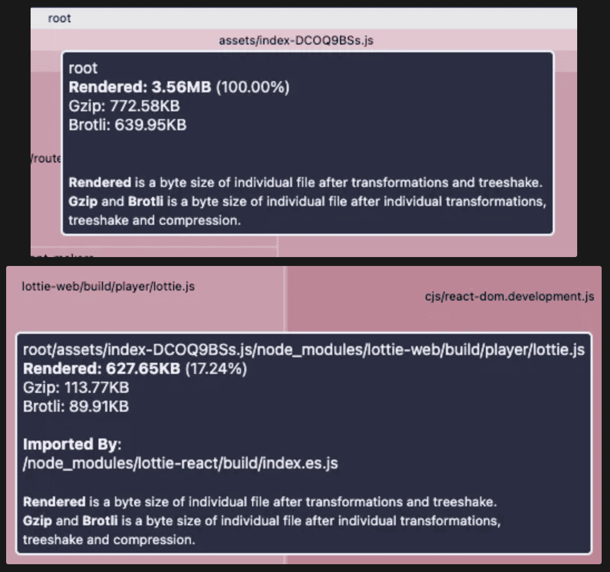
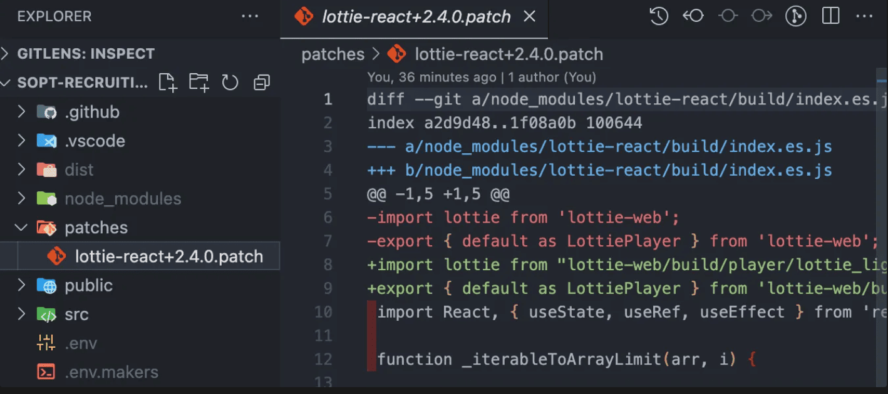
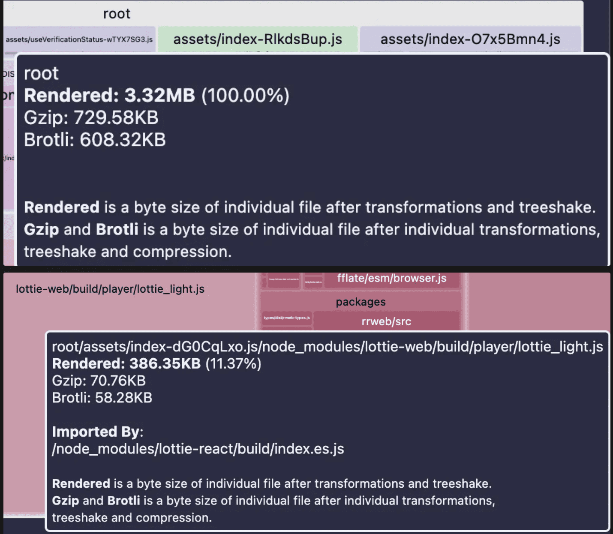

# 상황

번들 사이즈를 줄여주기 위해서 [lottie-react에서 lottie-web으로 migration](https://www.eonseok.site/troubleshooting/%EB%B9%8C%EB%93%9C%20%EC%B5%9C%EC%A0%81%ED%99%94%20%EC%A0%84%EB%9E%B5:%20Lottie-react%EC%99%80%20Chunk%20%EB%B6%84%EB%A6%AC/#%EB%B6%84%EC%84%9D)을 진행해주었다. 이유는 lottie-react가 lottie-web을 의존성으로 갖고 있는데 그렇다면 lottie-react가 구현한 것처럼 lottie-web을 이용하여 똑같이 구현하되, lottie-web의 light 버전을 이용한다면 원하는 기능은 그대로 사용하면서 또 번들 사이즈를 줄일 수 있지 않을까 싶어서였다.

하지만 이때는 patch라는 개념을 통해 library를 수정할 수 있다는 사실을 깨닫게 되었고 다시 lottie-react로 변경하되, 해당 js 파일을 patch로 수정하여 번들 사이즈를 줄여봐야겠다고 생각했다.

# lottie-react로 rollback

기존 lottie-web으로 구현한 부분을 lottie-react로 돌려놨다. light 버전이 아닌 lottie-web을 이용해서 구현했을 때와 lottie-react를 이용해서 이용해서 구현했을 때 번들 크기의 차이가 없었기에 react에 더 친화적인 lottie-react를 이용해주는 것이 더 이득이었기 때문이다. 번들 사이즈야 어차피 patch로 줄여줄 것이니 상관없었다.


_rollback 후 번들 사이즈_

# patch 진행

[patch-package](https://www.npmjs.com/package/patch-package)라는 라이브러리를 사용했다. yarn을 사용하곤 있었지만 yarn v2 이상부터 patch를 지원해줬기에 yarn 1.22.19를 사용하는 나는 patch를 이용할 수가 없었기 때문이다.

무튼 node_modules에 잠들어 있는 lottie-react를 찾아주었다. index.js를 보면

```jsx
import lottie from 'lottie-web';
export { default as LottiePlayer } from 'lottie-web';
import React, { useState, useRef, useEffect } from 'react';
```

위와 같이 lottie를 lottie-web에서 import 해오는 것을 확인할 수 있었다. 이 부분을 변경해 줄 생각이었다. 해당 아이디어는 [lottie-react pr](https://github.com/Gamote/lottie-react/pull/86)에서 가져올 수 있었다. lottie-react 자체가 업데이트 된지 2년이나 지났기에 해당 pr이 머지될 확률이 적었기에 내가 수정하는 방법을 택했다.

```jsx
import lottie from 'lottie-web/build/player/lottie_light';
export { default as LottiePlayer } from 'lottie-web/build/player/lottie_light';
import React, { useState, useRef, useEffect } from 'react';
```

위와 같이 수정을 해준 뒤, `yarn patch-package lottie-react` 를 실행해주었다. 그러자 아래와 같이 patches 폴더가 생긴 것을 확인할 수 있었다.


_patches 폴더에 새로운 파일이 생성된 것을 확인할 수 있다._

# 결과



이전에 했던 것과 마찬가지로 300KB 정도 번들 크기를 줄일 수 있었다.
