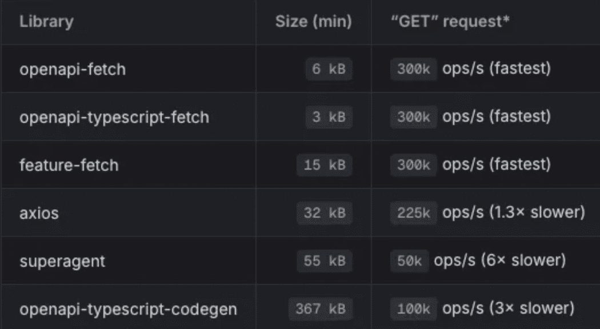

# 시작

매번 새 프로젝트를 시작할 때 마다 api req, res에 대한 type을 정의해주고 또 서버에서의 변경이 일어날 때마다 type을 다시 수정해야 하는 일이 번거롭다고 느껴졌다. 이를 개선할 수 있는 방법이 없을까 하다 OpenAPI를 이용하여 type을 자동으로 추출할 수 있는 방법이 있다는 것을 알게 되었다.

# OpenAPI란?

OpenAPI라고 해서 처음에는 공공으로 열려있는 API를 말하는 줄 알았다. 하지만 그것은 Open API 였고, 내가 찾고 있는 건 띄어쓰기를 하지 않은 OpenAPI 였다.

OpenAPI란 OpenAPI Specification(OAS)로 불리기도 하는데, Restful API가 정의된 규칙에 맞게 API spec을 json이나 yaml으로 표현하는 방식을 의미한다. 프로그래밍 언어에 구애받지 않기 때문에 서비스 기능을 빠르게 식별하고 이해할 수 있다 . 다시 말해, JS로 코드를 짜는 FE 개발자든 Swift로 코드를 짜는 IOS 개발자든 동일한 API spec을 갖게 되어 누구나 쉽게 API의 작동 방식을 파악할 수 있다는 것이다.

이러한 OpenAPI Spec을 가지고 보기 쉽게 UI로 나타내준 것이 Swagger와 같은 서비스이다.

# Swagger에서 OpenAPI Spec 얻기

OpenAPI Spec를 UI로 보여주는 것이 Swagger 였기에 Swagger에는 OpenAPI Spec 기본적으로 내제되어 있었다. 이는 개발자 도구의 network 탭에서 쉽게 확인할 수 있었다.

api-docs라는 요청의 응답으로 OpenAPI Spec이 들어있음을 확인할 수 있었다.


# Postman에서 OpenAPI Spec 얻기

postman에서 원하는 Collection을 Export 해준다.


그럼 하나의 json 파일이 생성된다. 이를 [Postman to OpenAPI](https://p2o.defcon007.com/) 에 업로드한 뒤 변환하기를 누르면 OpenAPI yml 파일이 생성된다.

또 다른 방법으로는 post-man-openapi 라이브러리를 이용하는 것인데 이는 [How to Convert Postman Collections to OpenAPI 3.0: A Step-by-Step Guide](https://apidog.com/blog/postman-to-openapi/) 여기에 잘 설명이 되어 있다. 나는 1번 방법이 더 편리하여 해당 방법을 선택하였다. 이 방법을 통해서도 동일한 OpenAPI yml 파일을 얻을 수 있었다.


# OpenAPI to TypeScript

이제 위에서 얻은 OpenAPI Spec에서 TypeScript interface를 추출하면 된다. 이를 해주는 라이브러리가 존재했다. [openapi-typescript CLI](https://openapi-ts.dev/cli)

사용법도 아주 간단했다.

```jsx
yarn add -D openapi-typescript
```

런타임에 실행되는 것이 아니므로 dev에 설치한 뒤, tsconfig.json의 compilerOptions를 아래와 같이 설정한다.

```jsx
{
  "compilerOptions": {
+    "module": "ESNext", // or "NodeNext"
+    "moduleResolution": "Bundler" // or "NodeNext"
+    "noUncheckedIndexedAccess": true // 이를 설정하길 추천하고 있다.
  }
}
```

그런 뒤 아래의 명령어를 실행시켜주면 interface가 생성된다.

```jsx
npx openapi-typescript ./path/to/my/schema.yaml -o ./path/to/my/schema.d.ts
```

yaml 혹은 json 파일의 위치를 입력 후 -o (output)으로 원하는 path에 파일을 생성하는 것이다. 그러면 아래와 같이 파일이 생성되는 것을 확인할 수 있다.


# interface와 fetch 연결하기

해당 interface를 fetch에 넣어줘야 한다. 이 역시도 이미 라이브러리가 구현되어 있어 이를 이용해주기로 하였다. 여러 라이브러리가 있었는데 이 중 번들 사이즈도 작으면서 빠르고 weekly 다운 수도 많은 openapi-fetch를 이용해주기로 하였다. openapi-typescript-fetch와 openapi-react-query는 사용법이 다소 직관적이지 않아 추가로 해당 라이브러리의 사용법을 익혀야 했기에 제외 시켰다.



minumum 6KB 밖에 안 하고 axios 보다 빠를 뿐 아니라 사실상 거의 zero runtime에 가깝다고 하기에 이를 사용하지 않을 이유가 없었다.


사용법도 간단하다.

```jsx
yarn add openapi-fetch
```

설치를 해준 뒤,

```jsx
import createClient from "openapi-fetch";
import type { paths } from "./my-openapi-3-schema"; // generated by openapi-typescript

const client = createClient<paths>({ baseUrl: "https://myapi.dev/v1/" });
```

위와 같이 생성해준 interface paths를 불러와줘서 넣어주면 된다. 이렇게 하면 아래와 같이 type이 자동으로 정의된 것을 확인할 수가 있게 된다.


# 참고자료

[What is OpenAPI? - OpenAPI Initiative](https://www.openapis.org/what-is-openapi)
[OpenAPI 란? (feat. Swagger) - 호롤리한 하루](https://gruuuuu.github.io/programming/openapi/)
[What's the Difference Between Swagger and OpenAPI? | Nordic APIs |](https://nordicapis.com/whats-the-difference-between-swagger-and-openapi/)
[openapi-fetch | OpenAPI TypeScript](https://openapi-ts.dev/openapi-fetch/)
[OpenApi 스펙을 활용해서 type-safe하게 react-query 사용하기](https://gist.github.com/seonghyeonkimm/977b58387f9f4e11afeee8c7685c2e89)
[OpenAPI Specification으로 타입-세이프하게 API 개발하기: 희망편 VS 절망편](https://www.youtube.com/watch?v=J4JHLESAiFk)
