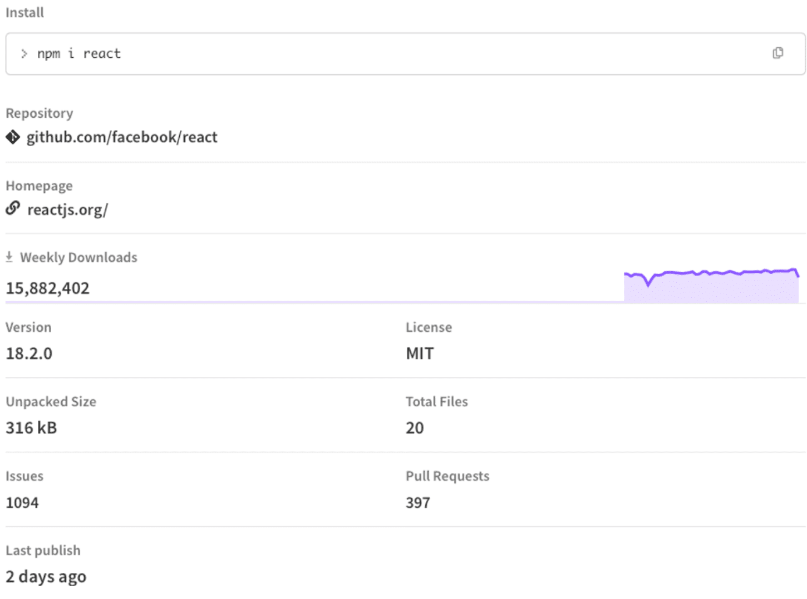
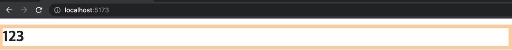
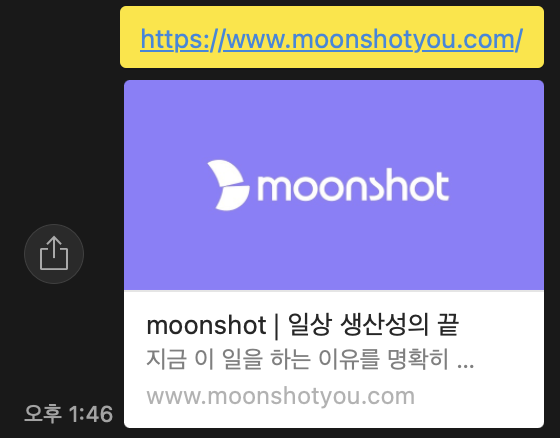
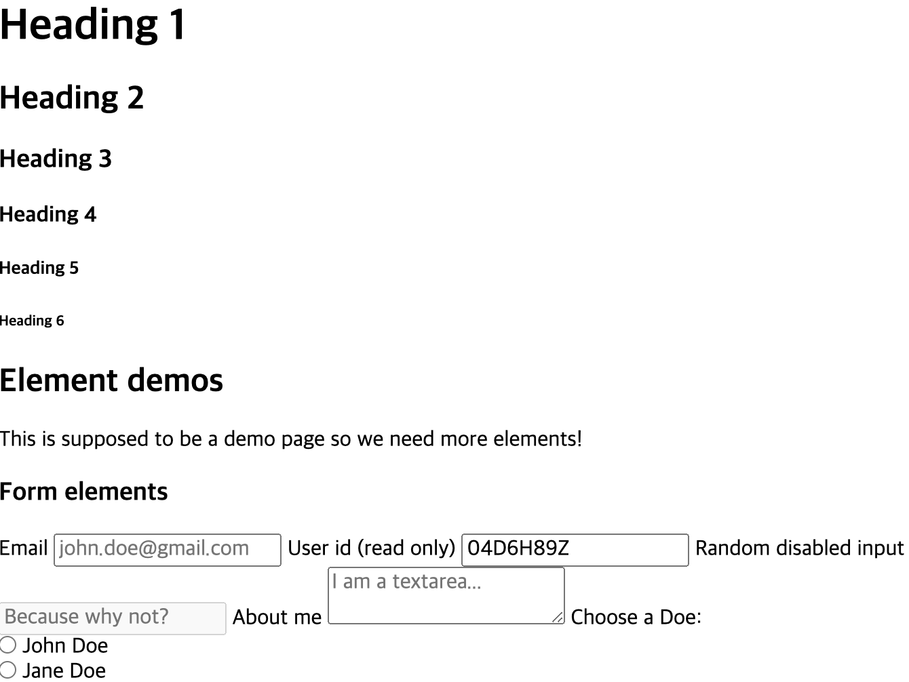

<br />

> 아래 내용은 **React vite(with JavaScript)** 을 기준으로 설명.

### 패키지 매니저 선택하기

##### (참고) 의존성이란?

"의존성(Dependency)"은 주로 다른 사람이 작성한 것으로, 일반적으로 단일 문제를 해결하는 소프트웨어이다. 웹 프로젝트에는 수많은 의존성이 포함될 수 있다.
물론 이것을 직접 코딩할 수 있지만, 의존성을 사용하는 이유는
다른 사람이 이미 이 문제를 해결했을 가능성이 높고, 이미 발명된 것을 다시 만드는 데 시간을 낭비할 필요가 없기 때문이다. 더구나 신뢰할 수 있는 타사 의존성은 다양한 상황에서 테스트되었을 가능성이 높아 자체 솔루션보다 견고하고 여러 브라우저에서 호환성이 더 높을 수 있다.

#### 패키지 매니저란?

패키지의 매니저란 프로젝트의 의존성(종속성, dependencies)을 관리하는 시스템.
쉽게 말해, 아래의 dependencies를 쉽게 설치 및 수정, 제거, 배포 할 수 있도록 도와주는 것.

```jsx
// package.json

// ...

"dependencies": {
    "react": "^18.2.0",
    "react-dom": "^18.2.0"
  },
  "devDependencies": {
    "@types/react": "^18.2.15",
    "@types/react-dom": "^18.2.7",
    "@vitejs/plugin-react": "^4.0.3",
    "eslint": "^8.45.0",
    "eslint-plugin-react": "^7.32.2",
    "eslint-plugin-react-hooks": "^4.6.0",
    "eslint-plugin-react-refresh": "^0.4.3",
    "vite": "^4.4.5"
  }

// ...
```

#### 왜 사용해야 하는가?

없어도 된다.
아래의 과정을 일일이 다 할 수 있다면.

1. 올바른 패키지 JavaScript 파일을 찾는다.
2. 알려진 취약점이 있는지 확인한다.
3. 이러한 파일을 다운로드하고 프로젝트의 올바른 위치에 넣는다.
4. 패키지를 응용 프로그램에 포함하는 코드를 작성한다.
5. 패키지의 하위 종속성도 모두 동일한 작업을 수행한다. 이 중에는 수십 개 또는 수백 개가 있을 수 있다.
6. 패키지를 제거하려면 모든 파일을 다시 제거한다.

#### 어떤 걸 사용해야 하죠?

> 💡 코드를 짤 때 어떤 라이브러리, 어떤 시스템을 사용할 지는 모두 개발자에게 달려있다.

##### 참고

가영님과 수빈님이 정리해주신 패키지 매니저와 각각의 장단점들.
[일잘하는 매니저 찾습니다(feat. 패키지 매니저)](https://velog.io/@imeureka/일잘하는-매니저-찾습니다feat.-패키지-매니저)

#### 참고자료

[Package management basics - Learn web development | MDN](https://developer.mozilla.org/en-US/docs/Learn/Tools_and_testing/Understanding_client-side_tools/Package_management)

### 라이브러리 / 프레임워크 선택하기

#### 어떤 걸 사용해야 할까요?

마찬가지로 모든 선택은 본인에게 달려있다.

##### 참고자료

[10 Best Front end Frameworks for Web Development in 2023](https://www.knowledgehut.com/blog/web-development/front-end-development-frameworks)

[NextJS vs React: 2023년도 프론트엔드 개발을 위해 무엇을 선택해야 하는가?](https://velog.io/@limelimejiwon/NextJS-vs-React-2023년도-프론트엔드-개발을-위해-무엇을-선택해야-하는가)

#### (참고) 작성자의 라이브러리 사용법 (언피셜 주의!!)

##### 라이브러리 선택 기준

1.  이 라이브러리가 지금 상황에서 꼭 필요한가?
2.  활발히 사용이 되고 있는 라이브러리인가?
3.  지속적으로 업데이트가 되고 있는가?

아래는 활발히 사용되면서 지속적으로 업데이트 되고 있는 라이브러리 예시.


아래는 그 반대 예시.


그 외. 공식문서가 잘 되어있는지, 다른 기능이랑 호환이 잘 되는지 등등.

##### 무분별한 라이브러리의 사용은 지양해야 한다. 왜죠?

- 성능 이슈: 너무 많은 라이브러리를 사용하면 애플리케이션의 성능에 부정적인 영향을 미칠 수 있다. 라이브러리가 무거워서 애플리케이션의 실행 시간이 늘어나고 메모리 사용량이 증가할 수 있다.
- 보안 문제: 라이브러리를 업데이트하지 않거나 안전하지 않은 라이브러리를 사용하면 보안 취약점이 발생할 수 있다.
- 유지보수 어려움: 너무 많은 라이브러리를 사용하면 코드의 복잡성이 증가하고 가독성이 떨어지며, 유지보수가 어려워질 수 있다. 특히 라이브러리 간의 충돌을 해결하고 버전을 관리하는 작업이 번거로울 수 있다.
- 의존성 관리 문제: 라이브러리를 사용할 때, 해당 라이브러리의 개발자가 업데이트를 중단하거나 라이브러리의 인터페이스를 변경할 수 있다. 이로 인해 애플리케이션이 손상될 수 있습니다.
- 프로젝트 크기와 목적에 부합하지 않음: 무분별한 라이브러리 사용은 프로젝트의 크기와 목적에 맞지 않을 수 있습니다. 라이브러리를 사용할 때 항상 프로젝트의 요구 사항과 목표를 고려해야 합니다.
- 라이선스 문제: 라이브러리의 라이선스 조건을 준수해야 한다. 너무 많은 라이브러리를 사용하면 라이선스 관련 문제가 발생할 수 있으며, 이는 법적 문제로 이어질 수 있다.

##### 라이브러리 잘 활용하기

1.  공식 문서를 잘 읽어본다.
    ex) [React-hook-form](https://react-hook-form.com/get-started)
    
2.  라이브러리의 기능을 최대한 활용한다.

### 기본 설치 시 생긴 불필요한 파일들 삭제

React-vite를 이용하여 만들어진 scaffolding.


각 파일과 폴더들이 어떤 역할을 하는지 파악해야 하며,
프로젝트와 관련이 없다고 판단이 되는 경우 제거하는 것이 좋다.


### 메타 정보 등 초기 코드 수정

초기 index.html 코드는 아래와 같다.

```html
<!-- index.html -->

<!doctype html>
<html lang="en">
  <head>
    <meta charset="UTF-8" />
    <link rel="icon" type="image/svg+xml" href="/vite.svg" />
    <meta name="viewport" content="width=device-width, initial-scale=1.0" />
    <title>Vite + React</title>
  </head>
  <body>
    <div id="root"></div>
    <script type="module" src="/src/main.jsx"></script>
  </body>
</html>
```

- **html lang="en"**

문서의 기본 언어.

- **meta charset="UTF-8"**

문서에서 허용하는 문자 집합(charcter set)을 UTF-8로 지정한다.
UTF-8은 전세계적인 character 집합으로 많은 언어들과 문자들을 포함한다.

- **link rel="icon" type="image/svg+xml" href="/vite.svg"**

favicon 지정.


##### 참고

여러 기기들에 대응되는 favicon을 설정해주면 좋다. (최적화)

```html
<!-- third-generation iPad with high-resolution Retina display: -->
<link
  rel="apple-touch-icon-precomposed"
  sizes="144x144"
  href="https://developer.mozilla.org/static/img/favicon144.png"
/>
<!-- iPhone with high-resolution Retina display: -->
<link
  rel="apple-touch-icon-precomposed"
  sizes="114x114"
  href="https://developer.mozilla.org/static/img/favicon114.png"
/>
<!-- first- and second-generation iPad: -->
<link
  rel="apple-touch-icon-precomposed"
  sizes="72x72"
  href="https://developer.mozilla.org/static/img/favicon72.png"
/>
<!-- non-Retina iPhone, iPod Touch, and Android 2.1+ devices: -->
<link
  rel="apple-touch-icon-precomposed"
  href="https://developer.mozilla.org/static/img/favicon57.png"
/>
<!-- basic favicon -->
<link
  rel="shortcut icon"
  href="https://developer.mozilla.org/static/img/favicon32.png"
/>
```

- **meta name="viewport" content="width=device-width, initial-scale=1.0"**

name : 메타 요소가 어떤 정보의 형태를 갖고 있는지. ex) author, description, viewport.
content : 실제 meta date의 컨텐츠.

또 다른 예시들.

```html
<meta name="author" content="Chris Mills" />
<meta
  name="description"
  content="The MDN Learning Area aims to provide
complete beginners to the Web with all they need to know to get
started with developing web sites and applications."
/>
```

- **title Vite + React title**
  

참고자료

[head 태그에는 무엇이 있을까? HTML의 메타데이터 - Web 개발 학습하기 | MDN](https://developer.mozilla.org/ko/docs/Learn/HTML/Introduction_to_HTML/The_head_metadata_in_HTML)

### lint 설정

### .gitignore 설정

npm create vite@latest, CRA, creat-next-app 등의 scaffolding을 이용하면,
알아서 .gitignore 파일을 생성해준다.

```bash
# Logs
logs
*.log
npm-debug.log*
yarn-debug.log*
yarn-error.log*
pnpm-debug.log*
lerna-debug.log*

node_modules
dist
dist-ssr
*.local

# Editor directories and files
.vscode/*
!.vscode/extensions.json
.idea
.DS_Store
*.suo
*.ntvs*
*.njsproj
*.sln
*.sw?
```

환경변수란?

##### 참고

사용하는 언어나 OS, editor 등을 입력하면 .gitignore를 자동으로 생성해주는 사이트.
[gitignore.io](https://www.toptal.com/developers/gitignore)

### 폴더 구조 설정

### CSS 초기화 및 Global CSS 작성

#### 왜 써야 하는가?

브라우저에 기본적으로 설정되어 있는 CSS 속성들이 있다.





노란색 부분이 margin이 적용되어 있는 부분.

이런 기본 속성들은 어떤 브라우저를 사용하느냐에 따라 달라질 수 있다.
이로 인해, 각 사이트 마다 다른 결과가 나타날 수 있으며,
내가 원하는 결과와 다른 결과가 초래될 수 있다.

### Alias 및 Path 설정

#### 왜 해야 하는 걸까?

```jsx
import Buriburizaemon from '../../../../../../assets/images/Buriburizaemon.png';

export default function MainImage() {
  return ;
}
```

코드가 복잡해지고 여러 폴더들이 생기다 보면 위와 같이 import를 하기 위해 많은 이동이 필요하다.
이를 아래와 같이 보다 깔끔하게 정리하기 위해 alias와 path를 설정해준다.

```jsx
import Buriburizaemon from '@assets/images/Buriburizaemon.png';

export default function MainImage() {
  return ;
}
```

#### 어떻게 설정하는가?

vite.config.js 파일에 alias 설정.

```jsx
// vite.config.js

import path from 'path';
// ...

export default defineConfig({
  plugins: [react()],
  resolve: {
    alias: [
      { find: '@', replacement: path.resolve(__dirname, 'src') },
      { find: '@assets', replacement: path.resolve(__dirname, 'src/assets') },
      {
        find: '@components',
        replacement: path.resolve(__dirname, 'src/components'),
      },
      { find: '@hooks', replacement: path.resolve(__dirname, 'src/hooks') },
      { find: '@utils', replacement: path.resolve(__dirname, 'src/utils') },
      // ...
    ],
  },
});
```

typescript를 사용하면 tsconfig.json 파일에 추가로 설정이 필요하는 등
사용하는 언어에 따라 설정이 달라지므로 본인의 상황에 맞게, 찾아서 설정을 해주면 된다.

### 코딩 컨벤션 정리

naming convention
JS convention
commit convention
PR convention

### GitHub repo 생성 및 연결
