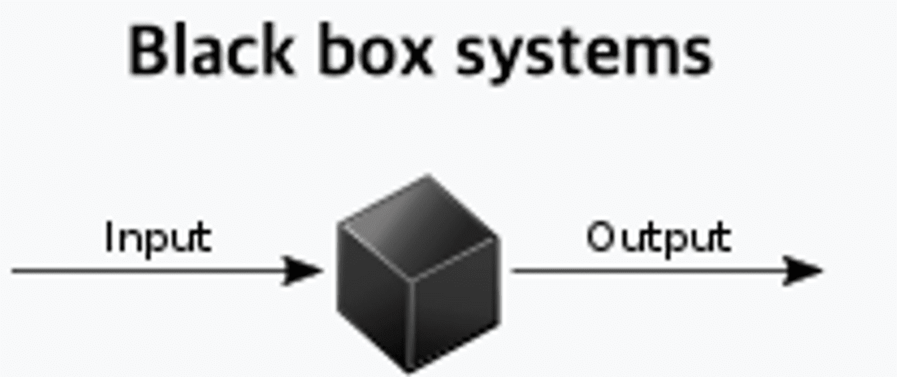

# 1. 헝가리 표기법의 시대는 지났다.

헝가리 표기법을 사용함으로써 직관적으로 이것이 무엇을 의미하는 건지 알 수 있다는 장점이 있다.
하지만 이를 상쇄하는 단점들이 있어 현대 프레임워크에선 사용되지 않는다.

# 2. I prefix는 encapsulation 하는 것을 막는다.

어떠한 black-box를 가졌다고 했을 때, 그 안의 코드가 interface인지 class인지는 상관하면 안 된다. 그냥 interface의 한 부분으로 사용을 해야 한다.
이때, interface를 I-xx로 명명하게 된다면 encapsulation을 침해하는 것이다.

## encapsulation이란

객체의 속성과 행위를 하나로 묶고, 실제 구현 내용 일부를 내부어 감추어 은닉하는 것.
객체의 컴포넌트(data)에 직접적인 접근을 제한한다.
본질적으로, 외부 코드가 내부 object의 작동 원리에 대해 걱정하지 않도록 한다.

### 참고자료

[Encapsulation (computer programming)](<https://en.wikipedia.org/wiki/Encapsulation_(computer_programming)>)
[캡슐화](https://ko.wikipedia.org/wiki/캡슐화)

## black-box란



내부의 작동 원리에 대한 지식 없이 input과 output 관점에서 보여지는 시스템.

### 참고자료

[Black box](https://en.wikipedia.org/wiki/Black_box)

# 3. 나쁜 naming으로 부터 보호한다.

I prefix를 붙이게 되면 interface인지 아닌지 구분이 바로 되므로 그 뒤의 naming에 대해 고민을 하지 않게 된다.
따라서 I prefix 사용을 막음으로써 적절한 이름을 선택하게 하기 위해 노력하게 만든다.
명확하고 설명적인 이름을 가져야 한다.

```tsx
// good
WpfeServerAutosuggestManager implements AutosuggestManager,
FileBasedAutosuggestManager implements AutosuggestManager

// bad
AutosuggestManager implements IAutosuggestManager
```

### TypeScript handbook still says:

In general, do not prefix interfaces with I (e.g. IColor). Because the concept of an interface in TypeScript is much more broad than in C# or Java, the IFoo naming convention is not broadly useful.
