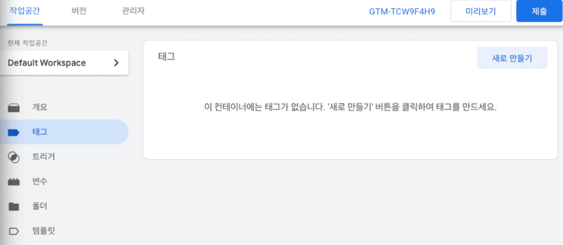
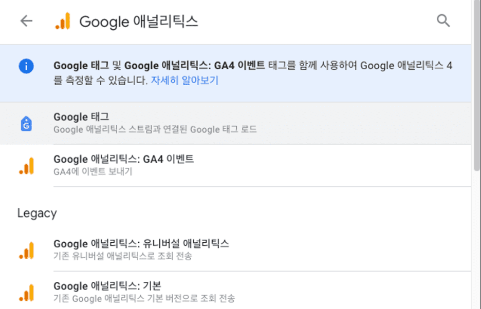
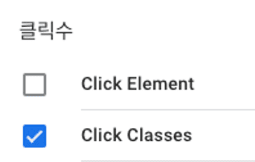
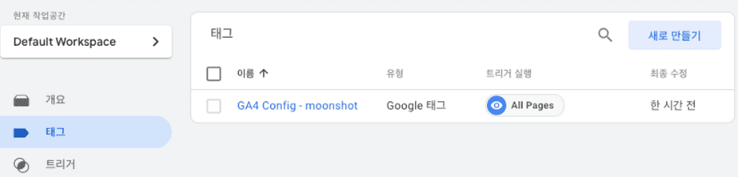
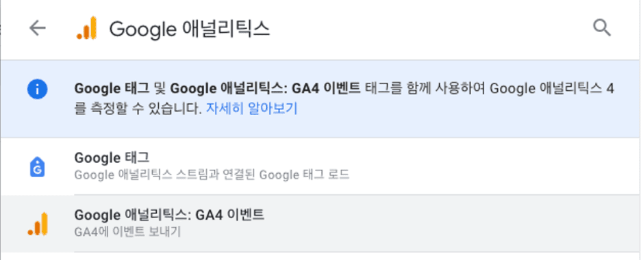
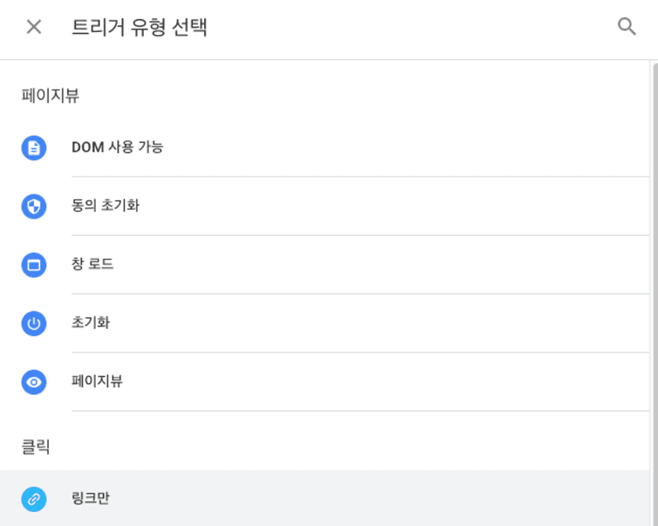

### 태그 설정


`시작하기` 버튼을 눌러 값을 입력하면 코드 2개가 나오는데 이를 아래와 같이 붙여준다.

```tsx
<!-- Google Tag Manager -->
    <script>
      (function (w, d, s, l, i) {
        w[l] = w[l] || [];
        w[l].push({ 'gtm.start': new Date().getTime(), event: 'gtm.js' });
        var f = d.getElementsByTagName(s)[0],
          j = d.createElement(s),
          dl = l != 'dataLayer' ? '&l=' + l : '';
        j.async = true;
        j.src = 'https://www.googletagmanager.com/gtm.js?id=' + i + dl;
        f.parentNode.insertBefore(j, f);
      })(window, document, 'script', 'dataLayer', 'GTM-TCW9F4H9');
    </script>
    <!-- End Google Tag Manager -->
  </head>
```

```tsx
<!-- Google Tag Manager (noscript) -->
    <noscript
      ><iframe
        src="https://www.googletagmanager.com/ns.html?id=GTM-TCW9F4H9"
        height="0"
        width="0"
        style="display: none; visibility: hidden"
      ></iframe
    ></noscript>
    <!-- End Google Tag Manager (noscript) -->
  </body>
```

`태그`창으로 이동 후 `새로 만들기`



오른쪽 위의 수정 버튼 클릭




`Google 태그` 선택


`All Pages` 선택


이름 바꿔준 뒤 `저장`

`제출` 버튼 누른 뒤 `게시` 클릭


팝업창 뜨면 `계속` 누르면 됨.


완료


네트워크 들어가 보면 요청이 온 것을 확인할 수 있다.

### 버튼 클릭에 대한 이벤트 수집


`변수`의 `구성` 클릭



`Click Classes` 선택

```tsx
<CtaLink to="/dashboard" className="go-to-service-form">
  서비스 시작하기
</CtaLink>
```

원하는 버튼에 class 추가



`태그`에 `새로 만들기` 버튼 클릭



`태그` `새로 만들기` `Google 애널리틱스: GA4 이벤트`


`이벤트 이름`

generate_lead로 수정


`트리거 선택`


`+` 버튼 클릭



`링크만` 클릭


`일부 링크 클릭` `Click Classes` 후에 className으로 설정.


`미리보기`로 테스트


`제출` > `게시` > `건너뛰기`

### 참고자료

[Measure user activity with recommended events in Google Analytics](https://www.youtube.com/watch?v=PEPb3uaVILk)

[Google Analytics와 Discord 연동해서 알람받기](https://velog.io/@binllionaire/Google-Analytics와-Discord-연동해서-알람받기)

```tsx
{
  "errorType": "Runtime.ImportModuleError",
  "errorMessage": "Error: Cannot find module 'index'\nRequire stack:\n- /var/runtime/index.mjs",
  "trace": [
    "Runtime.ImportModuleError: Error: Cannot find module 'index'",
    "Require stack:",
    "- /var/runtime/index.mjs",
    "    at _loadUserApp (file:///var/runtime/index.mjs:1087:17)",
    "    at async UserFunction.js.module.exports.load (file:///var/runtime/index.mjs:1119:21)",
    "    at async start (file:///var/runtime/index.mjs:1282:23)",
    "    at async file:///var/runtime/index.mjs:1288:1"
  ]
}
```

폴더를 압축 해서 위와 같은 오류 뜸.

ID 값이 잘못 되었다고 한다.

[숙소 ID  |  Google 애널리틱스  |  Google for Developers](https://developers.google.com/analytics/devguides/reporting/data/v1/property-id?hl=ko)

```tsx
{
  "errorType": "Error",
  "errorMessage": "Cannot find package 'axios' imported from /var/task/index.mjs",
  "trace": [
    "Error [ERR_MODULE_NOT_FOUND]: Cannot find package 'axios' imported from /var/task/index.mjs",
    "    at packageResolve (node:internal/modules/esm/resolve:849:9)",
    "    at moduleResolve (node:internal/modules/esm/resolve:906:20)",
    "    at moduleResolveWithNodePath (node:internal/modules/esm/resolve:1126:12)",
    "    at defaultResolve (node:internal/modules/esm/resolve:1169:79)",
    "    at ModuleLoader.defaultResolve (node:internal/modules/esm/loader:396:12)",
    "    at ModuleLoader.resolve (node:internal/modules/esm/loader:365:25)",
    "    at ModuleLoader.getModuleJob (node:internal/modules/esm/loader:240:38)",
    "    at ModuleWrap.<anonymous> (node:internal/modules/esm/module_job:85:39)",
    "    at link (node:internal/modules/esm/module_job:84:36)"
  ]
}
```

```tsx
{
  "errorType": "Error",
  "errorMessage": "ENOENT: no such file or directory, copyfile '/var/task/credentials.json' -> '/tmp/credentials.json'",
  "trace": [
    "Error: ENOENT: no such file or directory, copyfile '/var/task/credentials.json' -> '/tmp/credentials.json'",
    "    at Object.copyFileSync (node:fs:3003:11)",
    "    at copyCredentialsFile (file:///var/task/index.mjs:22:6)",
    "    at Runtime.handler (file:///var/task/index.mjs:38:3)",
    "    at Runtime.handleOnceNonStreaming (file:///var/runtime/index.mjs:1173:29)"
  ]
}
```
