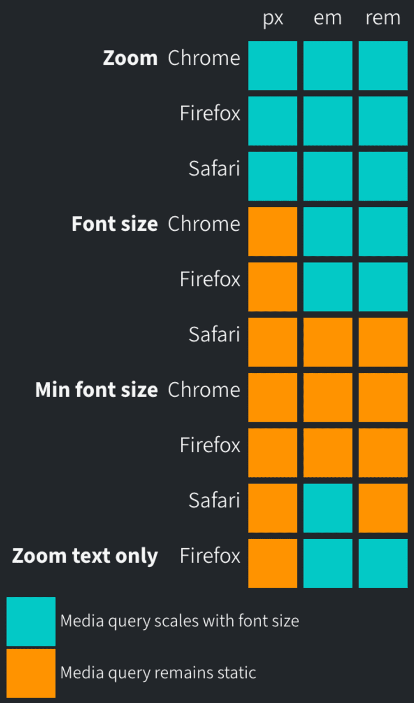

# px vs rem vs em

[웹 디자이너가 PX대신 REM을 사용해야 하는 이유 | 요즘IT](https://yozm.wishket.com/magazine/detail/1410/)
[PX or REM in CSS? Just Use REM](https://austingil.com/px-or-rem-in-css/)
[CSS 상대 단위 - em과 rem](https://www.daleseo.com/css-em-rem/)

모든 브라우저는 root font size 설정이 있다. By default, 16px.

// font size 조절은 브라우저의 확대/축소 설정과는 다르다.

## px

px은 절댓값을 사용하는 단위
화면 해상도에 따라 다를 수 있지만, 1px은 고정된 물리적 크기

이때, px은 사용자 설정값을 덮어쓴다.
root font size를 24px로 변경을 했다고 해도, `<p>`의 텍스트 크기를 16px로 설정했다면 16px로 출력이 된다.

## rem

rem은 root font size에 비례하여 상대적으로 바뀐다.
root font size가 24px이라 하면 1rem === 24px.

## em

해당 단위가 사용되고 있는 요소의 font size를 기준으로 한다.
만약 font size 속성이 정의되지 않은 경우 부모의 값을 그대로 상속 받는다.

하지만 부모, 자식들이 여러 개 중첩되는 경우 em은 계산하기 힘들어진다.
만약 부모의 font size 가 2rem이고 자식의 font size가 10em 이라고 한다면?
,,,,,,,,,,,,어렵다.

그러니 웬만하면 rem을 사용하자!

```css
html {
  font-size: 16px;
}

div {
  font-size: 20px;
  width: 10em; /* 200px */
  width: 10rem; /* 160px */
}
```

# All the ways users can change the font size in the browser.

[Re-evaluating px vs em in Media Queries](https://keithjgrant.com/posts/2023/05/px-vs-em-in-media-queries/)

## zoom in and out.

`cmd + ‘+’` or `cmd + ‘-’` 를 이용해서 확대, 축소 가능.
이는 페이지의 px, em, rem 모두 확대, 축소 한다.

## change root font size.

em, rem 모두 확대, 축소하지만 px은 변함 없다.
Safari에선 이러한 설정을 찾기 다소 어렵다. (없는 건 아님.)

## setting a minimum font size.

사용자가 지정한 font size가 minimum font size 보다 작을 시 rendering 하지 않는다.

## zoom text size only in Firefox

font size만 증가, 감소 시킨다. (Firefox 한정.)

# How about in Media query?

> It basically concluded by saying that EM units and REM units are going to be better for media queries than pixel units and because EM units are based on their parent element, but media queries affect the root styles, both EM and REM are pretty much the same.
> The only difference was due to a bug in Safari with REM units, therefore EM was a little bit more consistent than, but I think that bug has been fixed. So I would just stick to using REM.

media query는 root style에 영향을 받으므로, em과 rem은 사실상 동일하다.
한 가지 차이점은 rem을 사용 시 Safari에서 오류가 있다는 것인데,
현재는 해결된 것으로 파악이 되어, rem을 사용해도 된다. (Nov 30, 2022 기준.)

## Test.

```css
div {
  padding: 2rem;
  margin-block: 1rem;
  background-color: hsl(211deg 40% 80%);
}

@media (min-width: 800px) {
  .px {
    background-color: hsl(179deg 40% 80%);
  }
}
@media (min-width: 50em) {
  .em {
    background-color: hsl(179deg 40% 80%);
  }
}
@media (min-width: 50rem) {
  .rem {
    background-color: hsl(179deg 40% 80%);
  }
}
```

위와 같이 코드를 짠 후, 위의 4개의 경우에서 어떻게 변하는지 지켜보는 실험을 진행했다.

## The Results.



Safari는 아직 media query에서 root font size에 대한 조절을 하지 못하는 것으로 파악 되었다. (May 31, 2023 기준.)

# The Conclusion

정답은 없다.
사용자의 font size에 맞게 breakpoint가 같이 조절되게 하고 싶다면 em이나 rem을 사용하면 된다. (Safari 제외.)
과거에는 rem을 사용했을 때, 에러가 있었지만 현재는 개선이 된 것으로 파악이 된다.
(Safari에서의 minimum font size 경우 제외.)

물론 화면이 너무 작은 경우, rem을 사용했을 때, 제한된 공간으로 인해 더 안 좋은 상황을 초래할 수 있다. 이런 경우 px을 사용하는 것이 더 좋을 수도 있다.
또는 모든 상황에서 일관된 결과를 원한다면 px을 이용해야 한다.
하지만 이럴 경우, 사용자가 root font size를 변경 하였을 때, 원하는 동작을 얻지 못하게 될 수 있다.

# + Chrome’s minimum font size

[What is the default value of Chrome's minimum font size? – Kenrick's Notes](https://blog.kenrick95.org/2020/03/what-is-the-default-value-of-chromes-minimum-font-size/)

최소 글꼴 크기의 기본값이 언어에 따라 다르며, 일본어 (ja), 태국어 (th), 페르시아어 (fa), 아랍어 (ar) 및 한국어 (ko)의 경우 기본값이 10px이며, 중국어 간체 (zh-CN) 및 중국어 번체 (zh-TW)의 경우 12px이고, 그 외의 언어는 0이다. (March 22, 2020 기준.)
