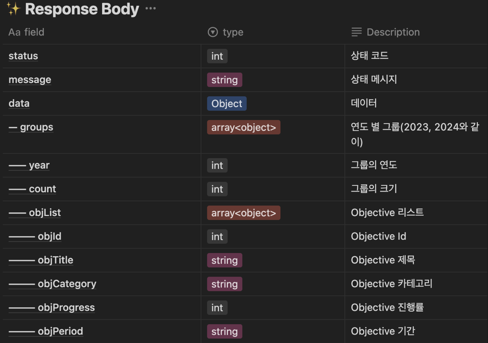

# 시작



객체 배열 안의 객체 배열 안의 string 값을 이용해서 객체 배열을 정렬하고 정렬된 객체 배열끼리 한 번 더 정렬을 해야 하는
살짝 복잡한 정렬을 구현해야 한다.

서버에서 정렬을 하면 서버 리소스가 들기에 FE에서 처리하는 것이 좋다는 얘기를 들은 기억이 있어서 이를 FE에서 처리하려고 하였었다.

```tsx
const handleFilterSelection = (selectedFilter: filterOptionTypes) => {
  setSelectedFilter(selectedFilter);

  const getFullDateFormat = (stringDate: string) => {
    const [yearA, monthA, dayA] = stringDate.split(' - ')[0].split('. ');

    return `20${yearA}-${monthA}-${dayA}`;
  };

  let newHistoryGroup: Group[] = [];

  if (selectedFilter === '최신순') {
    newHistoryGroup = [...historyGroup].sort((a, b) => b.year - a.year);
    newHistoryGroup.forEach(({ objList }: { objList: IObjective[] }) => {
      return objList.sort((a, b) => {
        const fullDateA = getFullDateFormat(a.objPeriod);
        const fullDateB = getFullDateFormat(b.objPeriod);

        return new Date(fullDateB).getTime() - new Date(fullDateA).getTime();
      });
    });
  } else if (selectedFilter === '오래된 순') {
    const newHistoryData = [...historyOriginGroup]
      .map(({ year, objList }) => {
        const filteredObjList = objList.filter(
          ({ objCategory }: { objCategory: string }) =>
            objCategory === selectedTheme,
        );

        return { year, objList: filteredObjList };
      })
      .filter(({ objList }) => objList.length !== 0);

    historyGroup = [...newHistoryData];

    newHistoryGroup = [...historyGroup].sort((a, b) => a.year - b.year);
    newHistoryGroup.forEach(({ objList }: { objList: IObjective[] }) =>
      objList.sort((a, b) => {
        const fullDateA = getFullDateFormat(a.objPeriod);
        const fullDateB = getFullDateFormat(b.objPeriod);

        return new Date(fullDateA).getTime() - new Date(fullDateB).getTime();
      }),
    );
  } else if (selectedFilter === '달성률 순') {
    newHistoryGroup = [...historyGroup].sort((a, b) => b.year - a.year);
    newHistoryGroup.forEach(({ objList }: { objList: IObjective[] }) => {
      return objList.sort((a, b) => b.progress - a.progress);
    });
  }

  historyGroup = [...newHistoryGroup];
};
```

조금 길고 복잡해 보이지만 chat GPT가 있었기에 위의 코드를 작성하는데 그리 오래 걸리지는 않았다.

정렬 로직을 다 구현했기에 서버에서 정렬하는 건 필요 없어져서 이를 제거해도 된다고 얘기했더니 연서가 BE에서 하는 것이 더 좋을 거 같다고 interrupt를 걸어왔다.

그래서 이에 대해 공부를 좀 더 해보기로 하였다.

# FE vs BE

이와 관련된 정보들을 조사하였고 이를 아래에 정리해 보았다.

## BE에서 해야 한다.

> I think in general it is a good principle to avoid doing excessive computation on the client. You don't know if your user is on a top of the range enthusiast PC or a netbook from 10 years ago. Obviously sorting 100 items in an array on its own is probably not going to be noticeable on either computer but...this could end being the first of many things that end up on the front end and before you know it users are complaining and you have a load of little things like this to unpick!
> Not sure either why you would need two API calls to sort things, could you not just request your list of items be sorted on the initial request?

일반적으로 클라이언트에서 과도한 계산을 피하는 것이 좋은 원칙이라고 생각한다. 사용자가 정말 안 좋은 성능의 컴퓨터를 사용할 지도 모르니.

> Oftentimes is less about how fast the "language" does the sorts so much as hinging on the processing power of a machine the user is running. Javascript might sort an array of a billion items faster on a Ryzen 9 than C# can on an i3. That's variability on user hardware is one of the biggest reasons people would opt for server -- to ensure consistent performance.
> That said where is the data coming from? My first priority on a sort would be on the database level, which is usually preferable to a server sort. If you're using SQL it would be using "ORDER BY" or something equivalent in another DB. Offload that work to your DB which is designed specifically to do that work efficiently, and take the burden off both your server and client.

언어보다는 사용하는 컴퓨터의 성능에 따라 정렬 속도가 결정된다. 그렇기에 서버에서 정렬하는 걸 선호한다. 하지만 서버의 부담을 줄이기 위해 DB에서 정렬하는 방법을 선호하기는 하다.

> If you want speed, the best way is to sort in the database and retrieve with a limit (pagination) then send to the front-end together with the count of all results.
> Iterating over large volumes of data will slow down or even lock your backend, on the other hand, the database has built-in mechanisms for sorting. Also, make sure to add indexes to make it even faster.

속도를 위한다면 DB에서 정렬을 하고, 페이지네이션 같은 제한을 둔 뒤 이를 FE에 제공하는 것이 좋다.
하지만 대용량의 데이터를 반복해서 받아오게 하는 것은 속도를 늦출 것이다.

> Depends on from where data come, how much of it do you have, and what goals you want to achieve.
> Frontend based solution is cost less server CPU but could become terrible user experience. Imagine an array of 100000 features sorted in IE installed on old PC? It could hang the browser.
> So if you have hot much data to process or CPU economy on server is important for you use frontend, otherwise backend.

data 양이 큰 array라면 또 이걸 성능 안 좋은 컴퓨터에서 돌린다면 분명 사용자 경험의 질이 떨어질 것이다.
그러니 서버의 CPU 환경 등이 중요하다면 FE에서, 그러지 않다면 BE에서 돌려라.

> A RESTful API is built for the purpose of a developer using it. The values it returns, the errors it presents, even the headers are all part of the "user experience" a developer has when using your API.
> Now you need to weigh that against performance concerns. Is it potentially lots of data? Can you limit that data through paging, etc.? Doing a long sort operation on your server can, in unchecked situations, provide a severely degraded experience for not only that user but also others.
> That said, a server typically has a lot more power for sorting and even (using the right language/algorithm) could provide a multithreaded approach to the problem. So if you're not worried about performance impacts server side, in almost all cases I would do it on the server.

일반적으로 서버는 정렬 및 (적절한 언어/알고리즘을 사용하여) 문제에 대한 다중 스레드 접근 방식을 제공할 수 있는 더 많은 파워를 가지고 있다. 따라서 서버 측에서 성능에 대한 우려가 없다면 거의 모든 경우에 서버에서 수행하는 것이 좋다.

## FE에서 해야 한다.

> Q. But if I wanted 10 different sort methods for that list of data. That would be 10 different API calls to get the data from the server.
> The lists won't ever really be past 100 objects. So I guess my question is. Even a shoddy computer would handle that fine I take it?

하지만 데이터의 양이 작고, 여러 개의 방법으로 정렬을 하고 싶다면?

> A. Yeah for sure if something is that small it should be no problem to offload to client. Particularly if you're giving the option of multiple different types of sort and don't want to have to wait for a server roundtrip with each click.
> The main thing to be congnizant of in situations like that I guess is just how often "it only ever needs to be X" suddenly changes. That depends on who is controlling the business requirements.
> In the end if the size of the array does end up increasing and you do begin to notice performance issue with client side sorts, using *web workers* is a good solution to keep sorts client side without locking the UI.

데이터 양이 작다면 그렇게 해도 된다. 특히 매 번의 정렬마다 데이터를 기다리는 것이 싫다면 말이다.
하지만 언젠간 요구 사항이 변화할 것이다. 그렇다면 이에 맞게 대응을 해야할 것이다. web worker를 사용하는 것도 좋은 방법이다.

> Your API will be used by *n* clients. Performance-wise it would make sense to have each client do the sorting on their own instead of having the server do it for all the *n* clients. Simply, less CPU work for the server.
> Furthermore, whether the result needs to be sorted or not depends on the nature of the application using the data. Let the application decide that. Some interfaces allow the user to decide what to sort by, thereby convenient to do it locally (without waiting for a background HTTP call).
> However I would not overthink the performance part before you actually have a performance problem. It could also be that the data sorting is not really costly or the sorting has already been done depending on how information is kept internally (in DBMS-s, for example).
> With up to 20 rows without sorting, it really makes no important difference - make the API implementing developers' life easier and do the small sorting on the frontend side.

n개의 client가 API를 요청할 것이다. 그때마다 정렬해서 주는 것은 server CPU의 낭비가 될 수 있다.
데이터가 정렬될 지 말지는 application 딴에서 결정되는 것이므로 거기서 정렬이 발생되게 해라.
하지만 성능적으로 문제가 발생하는 것이 아니라면 그냥 해라.

## 정리

FE보다는 BE에서 하는 것이 낫다라는 답변을 더 많이 찾을 수 있었다.

그에 대한 이유로는 아래와 같다.

1. 사용자의 컴퓨터 성능이 안 좋을 수도 있다. 이런 경우 FE에서 처리하게 되면 심각한 사용자 경험을 초래할 것이다.
2. 일반적으로 서버가 정렬 문제에 대한 다중 스레드 접근 방식을 제공할 수 있는 더 많은 파워를 가지고 있기에, 서버 성능에 대한 우려가 없다면 서버에서 하는 것이 좋다.

그 반대 의견으로는

1. 서버의 부담을 줄여준다.
2. 매 정렬 때마다 데이터 요청을 기다릴 필요 없다.
3. 데이터의 양이 작다면 어디서 처리를 해도 별 상관이 없다.

가 있었다.

그 외 추가적으로 얻은 정보로는 아래와 같다.

1. DB에서 정렬을 하는 것이 FE, BE 둘 다 리소스를 줄여줄 것이다.
2. FE에서 Web Worker를 이용해서 처리하면 비동기적으로 처리할 수 있다.

# 결론

위의 학습한 내용들을 토대로 아래와 같은 결론을 내리게 되었다.

**DB에서 정렬을 하고 필요하다면 서버 쪽에서 추가 정렬을 한 후 이를 pagination 등의 제한을 걸어서 FE에 넘겨준다.**

내가 생각한 결론이 괜찮은지 선배 개발자들에게 여쭤보았다.
이에 대해 아래와 같은 답변을 받았다.

> 💡 pagination 등이 들어가면 FE에선 정렬을 할 수가 없기에 서버 리소스 없이 빠르게 테스트하는 경우를 제외하고는 기본적으론 서버에서 작업을 한다.
> 또한 여러 플랫폼을 지원하는 프로덕트의 경우, 각 플랫폼에 맞게 로직을 두어 동작을 통일하는 것은 꽤나 어려운 일이다. 그렇기에 확장성을 위해서라도 서버에서 처리하는 것이 좋다고 생각한다.

추가로 연서가 이런 얘기도 들었다고 한다.

> 💡 서버에서 정렬에 리소스가 드는게 맞긴 하지만 그거 때문에 성능에 이슈가 생길 정도라면 정렬 로직에 문제가 있는게 맞다.

그래서 그냥 서버에서 처리하는 것이 좋을 거 같다.

정렬 로직 자체는 완성했지만 테마나 연도를 선택한 후 정렬을 시키는 것이 굉장히 어려워서 며칠 째 끙끙 앓고 있었는데 이걸 서버에게 넘길 수 있게 되어 기쁘다. 끙,,
끙,, 핵꿀마~
아싸뵹

# 참고자료

[sorting small to medium sized data, front-end vs back-end for speed.](https://www.reddit.com/r/softwaredevelopment/comments/r80mng/sorting_small_to_medium_sized_data_frontend_vs/)
[Array sorting in Front-end or Back-end](https://stackoverflow.com/questions/43414603/array-sorting-in-front-end-or-back-end)
[Choosing the best JavaScript sorting algorithm for your project - LogRocket Blog](https://blog.logrocket.com/choosing-javascript-sorting-algorithm/#sorting-algorithms-frontend-vs-backend-systems)
