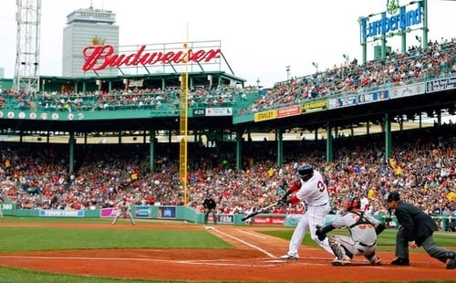

# Alt Text란?

(aka alt tag, alt description.)

이미지가 사용자 화면에 로드되지 않을 때 웹페이지에 표시되는 텍스트.

# 왜 중요한가?

## 접근성

청각 및 시각 콘텐츠에 대한 서술적인 텍스트 대체자는 모든 사람이 공유하는 콘텐츠를 이용할 수 있도록 보장한다. 특히 screen reader를 사용하여 웹 페이지의 콘텐츠를 흡수하는 시각 장애인들에게 그 내용을 제공하는 데 도움 된다.

## 사용자 경험

어떠한 까닭으로 이미지가 로드되지 않을 수 있다. 링크 아이콘만 보는 대신에, 이미지의 내용을 유추할 수 있는 alt 텍스트를 보여주는 것은 사용자 경험을 향상시킬 수 있다.

## 이미지 트래픽

Google 이미지 등으로 표시되는 검색 결과에 노출될 수 있다.

# 좋은 Alt Text 작성하기.

## 1. Keyword vs. Detail


```
alt="HubSpot office wall Singapore inbound marketing workplace murals orange walls ship it"
alt="HubSpot 사무실 벽 싱가포르 인바운드 마케팅 직장 벽화 주황색 벽 배달"
```

키워드만을 이용해서 단편적인 문장을 만드는 것은 충분한 문맥을 제공하지 않는다. Google이 이미지가 웹 페이지나 게시된 기사와 어떻게 관련되는지 이해하는 데 어려움을 준다. 또, Google이 키워드 채우기에 대한 penalty를 부여할 수도 있다. [참고 자료](https://blog.hubspot.com/marketing/diagnose-fix-google-penalty?hubs_content=blog.hubspot.com/marketing/image-alt-text&hubs_content-cta=Google%20penalty)

더 나은 alt text.

```
alt="Orange mural that says 'ship it' on a wall at HubSpot's Singapore office”
alt="'ship it'이라고 쓰여 있는 허브스팟 싱가포르 사무실의 주황색 벽화"
```

## **2. Detail vs. Specificity**



```
alt="Baseball player hitting a ball at a baseball field"
alt="야구 선수가 야구장에서 공을 치고 있다."
```

위의 alt text는 올바른 방식으로 설명하고 있지 않다. 위의 이미지는 야구장과 야구 선수가 공을 치는 것을 보여주지만 또한 Fenway Park의 사진이기도 하며, Red Sox의 34번 타자 데이비드 오르티즈가 우익 수비 위치에 공을 쳐 넘기고 있는 장면이기도 하기 때문이다. 이는 구글이 이미지를 올바르게 인덱싱하기 위해 필요한 구체적인 정보이다.

```
alt="David Ortiz of the Boston Red Sox batting from home plate at Fenway Park"
alt="보스턴 레드삭스의 데이비드 오르티즈가 펜웨이 파크의 홈플레이트에서 타격을 하는 모습"
```

## **3. Specificity vs. Context**


만약 위의 이미지 처럼 이를 설명할 어떠한 상황이나 문맥(예: 장소)이 없다면?
이럴 경우엔 이미지를 게시하는 기사나 웹 페이지의 주제를 사용해야 한다.

### 비지니스 스쿨 참석에 관한 기사용 이라면?

```
alt="Woman pointing to a person's computer screen"
alt="여성이 다른 사람의 컴퓨터 화면을 가리키고 있다."
```

비즈니스 스쿨에 관한 기사와 함께 이 이미지를 게시하는데, 기사와 관련된 이미지를 Google이 연관시키는 데 도움이 되는 일부 중요한 키워드 선택을 놓치고 있다.

```
alt="Business school professor pointing to a student's computer screen"
alt="비즈니스 스쿨 교수가 학생의 컴퓨터 화면을 가리키고 있다."
```

### 비즈니스 스쿨 교사를 위한 교육 소프트웨어에 관한 웹 페이지용 이라면?

```
alt="Teacher pointing to a student's computer screen"
alt="교사가 학생의 컴퓨터 화면을 가리키고 있다."
```

해당 웹 페이지는 비즈니스 스쿨에 대한 주제를 더욱 심층적으로 다루며, 이 웹 페이지의 이상적인 대상이 교사임을 명시한다. 따라서 이미지의 alt text는 이를 반영해야 한다.

```
alt="Professor using education software to instruct a business school student"
alt="교수가 비즈니스 스쿨 학생에게 교육 소프트웨어를 사용하여 지도하고 있다."
```

# 총정리

1. 이미지를 설명하고, 구체적으로 작성해야 한다.
2. 페이지의 주제와 관련된 내용을 추가한다.
3. alt text의 길이를 125자 미만으로 한다. 길고 지루한 alt text는 역효과를 불러 일으킬 수 있다.
4. ‘~~이미지’, ‘~~그림’ 이란 단어를 포함하지 않는다. screen reader 및 구글은 이를 이미 이미지로 식별하기 때문이다.
5. 키워드를 사용하되, 너무 많은 사용은 삼가해야 한다.
6. 모든 이미지에 대표 키워드를 삽입하지 말아야 한다. 일련의 이미지가 포함된 경우, 그 중 대표 이미지에만 키워드를 할당하고, 그 외에는 aesthetic한 설명을 넣는다.
7. 맞춤법을 검사해야 한다.
8. 단순 장식적인 이미지나 인근 텍스트로 설명이 되는 이미지는 빈 alt 속성을 가져야 한다.

# 장식용 이미지?

장식용 이미지는 페이지의 콘텐츠에 정보를 추가하지 않는다. 이미지의 정보는 인접한 텍스트에서 제공될 수 있거나, 이미지의 목적이 페이지를 시각적으로 더 매력적으로 만드는 것일 수도 있다.

이러한 경우, 이미지를 무시하도록 지시해야 하며, 이를 위해 빈 alt 텍스트를 제공해야 한다. 이러한 이미지에 텍스트 값을 추가하면 screen reader 출력에 청각적인 방해 요소가 추가되거나 인접한 텍스트와 주제가 다를 경우 사용자의 주의를 분산시킬 수 있다.

# 언제 빈 alt text를 사용해야 하는가.

## image에 텍스트가 있는가?

### 해당 텍스트가 이미지 근처에 실제 텍스트로 나타나는가?

→ 빈 alt text 사용.

### 텍스트가 시각적 효과를 위해서만 표시되는가?

→ 빈 alt text 사용.

### 텍스트 링크의 일부로서만 사용이 되는가?

→ 빈 alt text 사용

### 예시

```html
<a href="hmc-no1-engineering.html">
  
  <strong>
    Harvey Mudd’s Undergraduate Engineering Program Ranked No. 1 in U.S.</strong
  >
</a>
```

### 텍스트가 아이콘과 같이 특정 기능을 하는가?

→ alt text에 기능을 전달.

### 예시

```html
<a href="https://www.hmc.edu/">
  
</a>
```

이미지가 곧 링크 버튼.

이때, 만약 텍스트(Harvey Mudd College home.)가 밖에 있다면?

```html
<a href="https://www.hmc.edu/">
  Harvey Mudd College Home
</a>
```

빈 alt 사용.

### 텍스트가 주변 다른 곳에 없는가?

→ alt text에 이미지 텍스트 포함.

## 이미지가 링크나 버튼에 사용되고 이미지가 없으면 해당 작업을 이해하기 어려운가?

→ alt text에 해당 기능 내용 전달.

## 이미지가 현재 페이지나 문맥의 내용을 제공하는가?

### 간단한 그래픽 또는 사진인가?

→ alt text에 이미지를 간략히 설명하는 내용 추가.

### 예시

만약 조각품의 역사를 설명하는 페이지에서,


이러한 이미지를 삽입했다면, 시각적으로 표시되는 정보를 설명하는데 충분한 간단한 텍스트 대체문은 텍스트에 설명되지 않은 정보를 설명할 수 있을 것이다.

```
alt="Venus sculpture standing on pedestal in the middle of a fish pond.”
alt="물고기 연못 가운데 받침대에 서 있는 비너스 조각"
```

만약 텍스트가 분수 자체에 대한 설명을 포함한다면 이는 중복이 된다. 이러한 경우엔 빈 alt text를 이용한다.

### 그래프나 복잡한 정보인가?

→ 이미지에 포함된 정보를 페이지의 다른 위치에 포함시킨다.

### 예시

```html
<p>
  
</p>
<h4>Bagel Sales Full Text Visitors Full Text</h4>
<p>
  The chart shows average bagel sales by type for the first quarter in the Café.
  While sales are fairly consistent each month for plain, wheat and blueberry
  bagels, there is a significant increase in Jalapeno due to [...]
</p>
```

해당 내용을 h4, p tag로 분리. alt에는 해당 내용이 어디에 위치하는지 표시.

### 이미지가 근처 실제 텍스트와 중복되는 내용을 보여주는가?

→ 빈 alt text 사용.

## 이미지가 순전히 장식용인가?

→ 빈 alt text 사용.

# 참고자료

[Image Alt Text: What It Is, How to Write It, and Why It Matters to SEO](https://blog.hubspot.com/marketing/image-alt-text)
[Alt Decision Tree and Alternative Text Guide](https://www.hmc.edu/communications/accessibility-resources/alt-decision-tree-alternative-text-guide/#functional)
