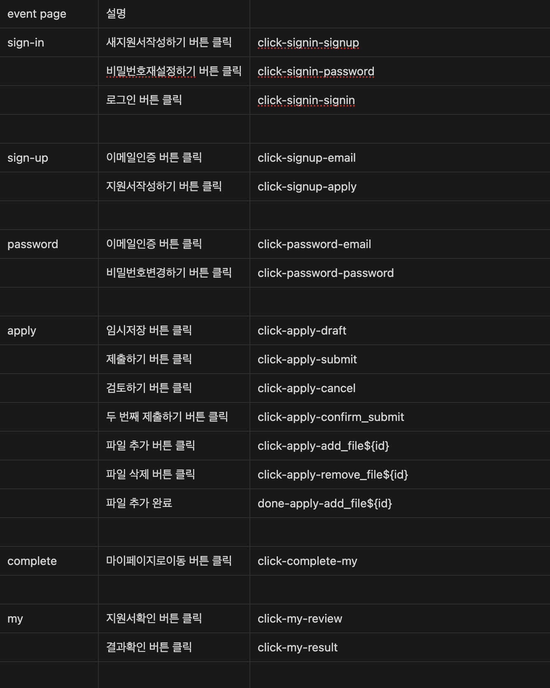
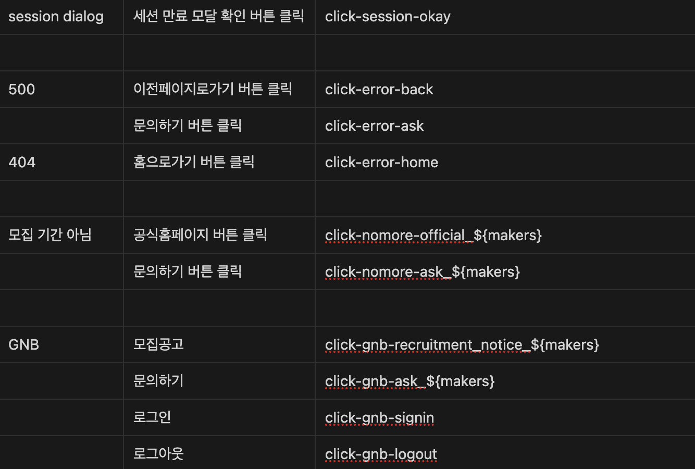
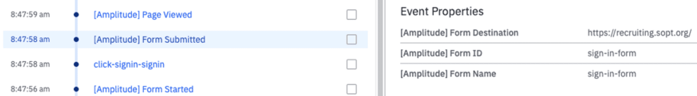
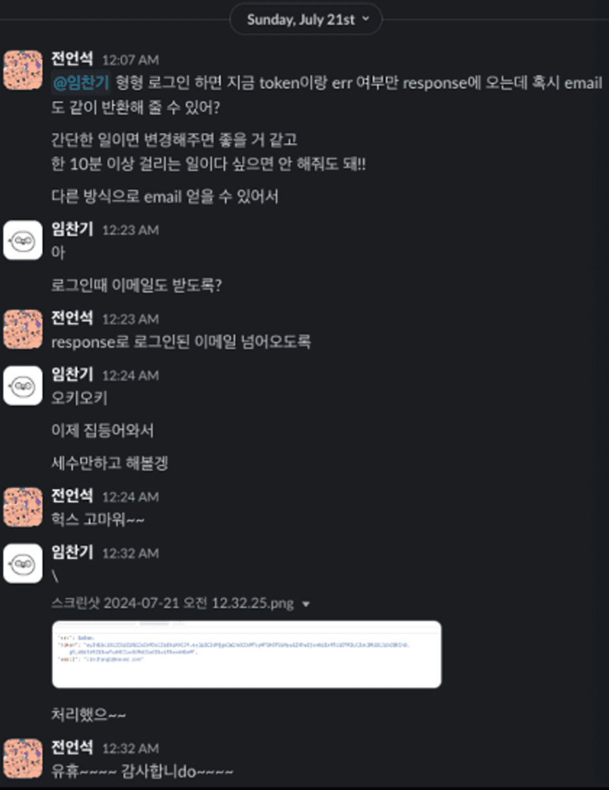
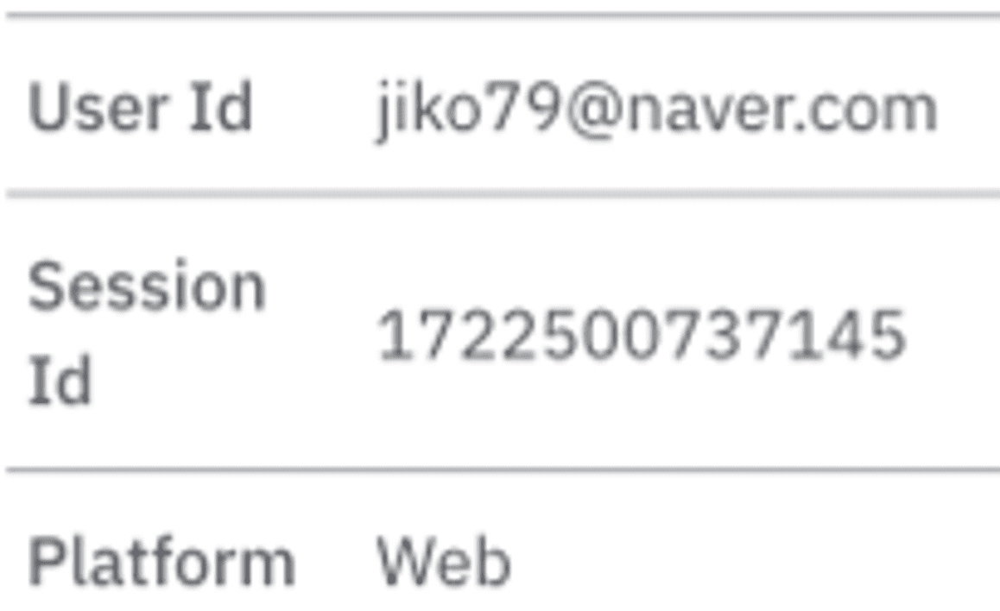
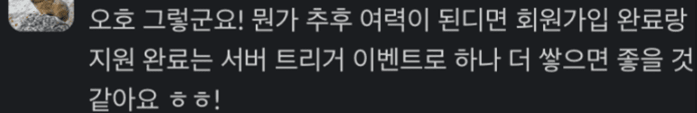
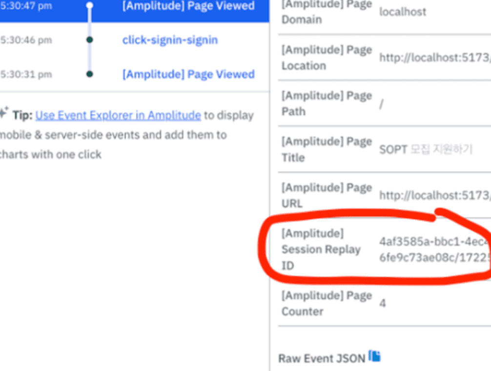

# 상황

지원서 페이지를 구현하고 있는데 사용자가 제출 하지도 않았는데 서버 에러 나서 데이터가 전송되지 않았다고 주장할 경우를 대비하여 증거 남기기 위해 사용자 개인별 tracking이 가능한 amplitude를 도입하기로 결정하였다.

# amplitude 속성 정의

일단 tracking할 이벤트를 정리해 주었다.
변수명은 action-page-feature 순으로 작성했다.
각각은 snake_case를 이용하였고, 이를 -으로 연결해줬다.
예) click-apply-confirm_submit




파일을 제출 했는지 안했는지에 대해서도 이벤트를 부착해줬다.
파일 제출 완료 했는데 서버 에러 나서 안 갔어요,,, 같은 얘기를 절대 듣고 싶지 않았기 때문이다.

# 설치

SDK를 설치해주었다.

```tsx
yarn add @amplitude/analytics-browser
```

사용법은 간단했다.

```tsx
amplitude.init(AMPLITUDE_API_KEY);
```

위의 한 줄만 추가하면 됐다.

하지만 재렌더링 때 매번 init 되는 것을 방지하기 위해 useEffect를 사용해줬다.

```tsx
import { init } from '@amplitude/analytics-browser';

const App = () => {
  const [isAmplitudeInitialized, setIsAmplitudeInitialized] = useState(false);

  useEffect(() => {
    if (!isAmplitudeInitialized) {
      init(import.meta.env.VITE_AMPLITUDE_API_KEY);
      setIsAmplitudeInitialized(true);
    }
  }, [isAmplitudeInitialized]);

  // ...
};
```

# 자동 트래킹

별도의 설정을 안해도 기본적으로 form 입력, 제출 및 페이지 진입, 나가기 등 amplitude에서 자동으로 트래킹을 추적하는 것들이 몇 개 있었다.

form 입력도 그 중 하나였는데 이때 어떤 form을 입력했는지 알아보기 위해 form에 id와 name을 추가했다.

```tsx
<form id="sign-up-form" name="sign-up-form" ... >{/* ... */}</form>
```

덕분에 어떤 form인지 추적이 가능해졌다.


_Form ID와 Name이 생겼다._

# 사용자 추적

GA가 아닌 amplitude를 선택한 이유는 사용자 개인별 추적이 가능하다는 것이었다.
이를 위해 사용자 ID를 달아줬어야 했다.

다행히 우리는 로그인 기능이 있기에 로그인 성공 시 사용자의 ID, 즉 이메일을 userID로 붙이면 됐다.
하지만 아쉽게도 로그인 성공 시 이메일이 반환되고 있지 않아 서버에게 이를 요청했다.



덕분에 로그인 성공 시(onSuccess) amplitude에 userId를 붙일 수가 있게 되었다.

```tsx
import { setUserId } from '@amplitude/analytics-browser';

const { mutate: signInMutate, isPending: signInIsPending } =
  useMutation</*...*/>({
    // ...
    onSuccess: ({ data: { token } }) => {
      setUserId(email);
      // ...
    },
  });
```

<br />



물론 로그아웃 할 때는 해제시켜주었다.

```tsx
import { reset } from '@amplitude/analytics-browser';

const handleLogout = () => {
  reset();
  // ...
};
```

# 버튼 트래킹

위에서 정의한 이벤트들을 달아주었다.

이 역시 매우 간단했다. 버튼이 클릭 되었을 때 `track`이 실행되도록 설정해줬다.

```tsx
import { track } from '@amplitude/analytics-browser';

onClick={() => track('click-apply-confirm_submit')}
```

원래는 최종 제출 버튼에만 달려고 했지만 amplitude 다는 김에 모든 버튼에 다 달아보기로 했다.
정말 사소한 부분까지 신경을 썼습니다.
위에서도 얘기했지만 ’진짜 난 파일 제출 눌렀는데 데이터가 안 갔다~~ 뭐라~~’ 이런 소리 절대 안 듣고 싶었어요.

# 허수 제거

현재는 버튼 클릭 시 이벤트가 발생되도록 구현이 되어있었다.
그러다보니 버튼은 클릭했는데 빈칸이 안 채워져있어 회원가입이 안 되는 경우가 발생해
실제 회원가입 유저 수와 이벤트 발생 수 간의 격차가 발생했다.
그래서 허수를 구분해 달라는 요청이 들어왔다.



구현은 간단했다.
tanstack query로 요청을 보내고 있었는데 해당 요청이 성공하면 event를 tracking 하도록 처리하면 됐다.

```tsx
onSuccess: () => {
  track('done-signup-apply');
  navigate('/');
},
```

이런 식으로.
이때 네이밍은 done으로 했다!
완료 action라서.

# Session Replay

amplitude에는 session replay라는 재밌는 기능이 있었다.
사용자가 어떻게 페이지를 이용하는지 session을 녹화해서 보여주는 기능이었다.
아쉽게도 개인정보 관련 이슈가 있어서 지원서에는 부착할 수 없었지만 한 번 어떻게 적용하는지는 공부해보고 싶어 자료를 찾아봤다.

일단 우리는 amplitude 사용을 위한 SDK(`@amplitude/analytics-browser`)를 사용하고 있어서
session replay 또한 SDK(`@amplitude/plugin-session-replay-browser`)를 사용하는 방향으로 가면 됐다.
공식문서에서 그렇게 하는 걸 추천하였다.

> This article covers the installation of Session Replay using the Browser SDK plugin. If your site is already instrumented with Amplitude, use this option.
> [참고자료](https://amplitude.com/docs/session-replay/session-replay-plugin#)

session replay를 위한 코드는 굉장히 간단했다.

```tsx
const sessionReplayTracking = sessionReplayPlugin({
  sampleRate: 0.7,
});

add(sessionReplayTracking);
```

`sampleRate`는 세션의 저장 비율인데,
100개의 세션이 발생된다면 그 중 70개만 랜덤으로 저장시킨다는 얘기다.

현재 사용 중인 버전이 무료 버전이라 1,000개의 session replay를 할 수 있는데,
그래서 약 1,428개 정도의 세션만 감당이 가능하다. (1,428 \* 0.7 === 1,000)

공식문서에선 0.01로 설정한 후 상황을 지켜보며 천천히 올리라고 하는 걸 권장하고 있다.

> 최적의 샘플링 비율을 찾기 위해 Amplitude는 .01로 낮게 시작할 것을 권장합니다. 이 값이 충분한 재생을 캡처하지 못하는 경우 며칠 동안 비율을 높이십시오.
> [참고자료](https://amplitude.com/docs/session-replay/session-replay-plugin#sampling-rate)



덕분에 Session Replay ID가 생성 되었고 session을 replay 할 수 있게 되었다.

# masking 처리

사용자의 개인정보가 들어있다보니 개인정보보호를 위해 마스킹 처리도 가능했다.

### input 필드

Session Replay는 기본적으로 모든 텍스트 입력 필드를 마스킹한다. 사용자가 입력 필드에 텍스트를 입력하면 Session Replay는 텍스트 대신 별표를 캡처한다. 텍스트 입력을 마스킹 해제하려면 클래스 .amp-unmask를 추가하면된다.<br />
`<input class="amp-unmask">`

### 텍스트

입력 요소가 아닌 요소 내의 텍스트를 마스킹하려면 클래스 .amp-mask를 추가하면된다.
(예: `<p class="amp-mask">Text</p>`)<br />
마스킹된 경우, Session Replay는 마스킹된 텍스트를 일련의 별표로 캡처한다.

### 비텍스트 요소

비텍스트 요소를 차단하려면 클래스 .amp-block을 추가하면된다.<br />
(예: `<div class="amp-block"></div>`)<br />
Session Replay는 차단된 요소를 동일한 크기의 플레이스홀더로 대체한다.

# 참고자료

[고객의 구매 여정 데이터 분석하기(feat. Amplitude)](https://blog.wiselycompany.com/wisely-amplitude)
[Browser SDK 2](https://amplitude.com/docs/sdks/analytics/browser/browser-sdk-2)
[Session Replay Plugin](https://amplitude.com/docs/session-replay/session-replay-plugin)
[Session Replay Plugin - mask-on-screen-data](https://amplitude.com/docs/session-replay/session-replay-plugin#mask-on-screen-data)
