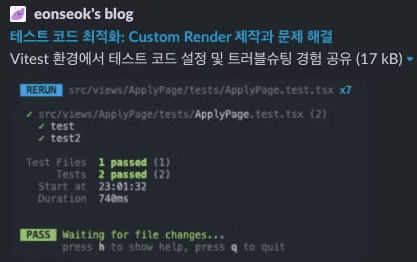

# 상황


블로그 사이트를 만들었는데 검색 엔진에 노출이 전혀 안 되고 있다.


_lighthouse 점수 기준 82점_

# Google SEO 기본 가이드

구글 검색창에 `site:본인-url` 입력했을 때 콘텐츠가 뜬다면 다른 조치를 할 필요가 없다.


_😓_

하지만 슬프게도 내 건 아무것도 뜨지 않아 다른 조치가 필요했다.

search console에 들어가니 domian DNS에 record를 복사해 붙여넣으라 알려줬다.


domain을 사서 붙인 뒤 record를 넣어줬다. 그런 뒤 시간이 좀 지나고 다시 검색을 해보았다.


다행히 블로그가 검색되는 걸 확인할 수 있었다. 하지만 문제는 메인 페이지만 검색되고 그 외의 실제 포스트들은 검색이 되지 않고 있었다. 이를 해결해주기 위해 Google의 검색 작동 방식에 대해 공부해보았다.

# Google 검색 작동 방식

Google의 검색 작동 방식을 보면 아래와 같은 순서로 적용된다.

> [**크롤링**](https://developers.google.com/search/docs/fundamentals/how-search-works?hl=ko#crawling): Google은 크롤러라는 자동화된 프로그램을 사용하여 인터넷에서 찾은 페이지로부터 텍스트, 이미지, 동영상을 다운로드합니다.
>
> [**색인 생성**](https://developers.google.com/search/docs/fundamentals/how-search-works?hl=ko#indexing): Google은 페이지의 텍스트, 이미지, 동영상 파일을 분석하고 대규모 데이터베이스인 Google 색인에 이 정보를 저장합니다.
>
> [**검색결과 게재**](https://developers.google.com/search/docs/fundamentals/how-search-works?hl=ko#serving): 사용자가 Google에서 검색하면 Google에서는 사용자의 검색어와 관련된 정보를 반환합니다.

구글 SEO 기본 가이드를 보면 다음과 같은 말이 나온다.

> **검색 Essentials를 준수하는 사이트는 Google 검색결과에 표시될 가능성이 높습니다**.

그렇다면 검색 Essentials가 무엇일까?

## Google 검색 Essentials

Google 검색 Essentials란 웹 기반 콘텐츠가 Google 검색에서 표시되고 좋은 실적을 내도록 하는 핵심 요소이다. 이는 3가지로 구성된다.

### 기술 요구사항

Google을 기술 요구사항을 아래와 같이 정의한다.

> [기술 요구사항](https://developers.google.com/search/docs/essentials/technical?hl=ko)은 검색결과에 웹페이지를 표시하기 위해 Google 검색이 웹페이지에 요구하는 최소한의 기본 요건입니다. 사실 웹페이지에 대해 기술적으로 해야 할 일은 거의 없으며 대부분의 사이트는 신경 쓰지 않고도 기술 요구사항을 갖추게 됩니다.

기술 요구사항은 아래와 같다.

1. 페이지 검색 및 액세스가 가능해야 함

일반 사용자가 페이지에 액세스 할 수 있어야 하며, Googlebot 크롤러가 페이지를 크롤링하지 못하도록 차단하지 않아야 한다. 예를 들어 로그인을 해야 볼 수 있는 페이지인 경우 Googlebot은 페이지를 크롤링하지 않는다.
내 블로그는 모두가 액세스 가능하며 Googlebot을 차단하지도 않고, 로그인이 필요하지도 않아서 해당 부분은 통과했다.

2. 페이지가 작동함해야 함

Google은 [HTTP 200 (success) 상태 코드](https://developers.google.com/search/docs/crawling-indexing/http-network-errors?hl=ko#2xx-success)로 게재되는 페이지만 색인을 생성한다.

3. 페이지에 색인 생성 가능한 콘텐츠가 있어야 함

내 블로그는 200이 뜨며 색인 생성 가능한 콘텐츠가 있어서 이 부분도 통과였다.

### 스팸 정책과 주요 권장사항

스팸 정책과 주요 권장사항도 다 만족하고 있었기에 이 부분에선 더이상 해줄 것이 없었다. 그럼에도 불구하고 내 컨텐츠는 구글에 검색이 되지 않았다.

# 각 페이지별 메타 데이터 추가

일단 내 블로그의 문제점 중 하나는 meta data가 모든 페이지에서 동일하다는 것이었다. 다행히 Gatsby는 [Head API](https://www.gatsbyjs.com/docs/reference/built-in-components/gatsby-head/)를 통해 각 페이지 별로 meta data를 설정해 줄 수가 있었다. 따라서 Head에 들어갈 SEO component를 생성해주었다.

Props로 title, description, pathname, og image를 받아오게 한 뒤 이를 meta tag에 넣어주는 방식으로 진행했다. 만약 해당 값들이 없을 경우 GraphQL로 받아온 site meta data를 default로 넣어주었다.

```tsx
import React from 'react';
import { graphql, useStaticQuery } from 'gatsby';
import { getSrc } from 'gatsby-plugin-image';

/** SEO */
export default function SEO({
  title,
  description,
  pathname,
  ogImage,
  children,
}) {
  const data = useStaticQuery(graphql`
    query {
      site {
        siteMetadata {
          title
          description
          siteUrl
        }
      }
      ogDefaultImage: file(relativePath: { eq: "imgOg.png" }) {
        childImageSharp {
          gatsbyImageData(width: 800, height: 400, quality: 80)
        }
      }
    }
  `);

  const defaultTitle = data.site.siteMetadata.title;
  const defaultDescription = data.site.siteMetadata.description;
  const siteUrl = data.site.siteMetadata.siteUrl;
  const defaultOgImage = getSrc(data.ogDefaultImage);

  const seo = {
    title: title || defaultTitle,
    description: description || defaultDescription,
    url: `${siteUrl}${pathname || ``}`,
    ogImage: getSrc(ogImage) || defaultOgImage,
  };

  return (
    <>
      <meta property="og:type" content="website" />
      <meta property="og:url" content={seo.url} />
      <meta property="og:title" content={seo.title} />
      <meta property="og:image" content={seo.ogImage} />
      <meta property="og:description" content={seo.description} />
      <meta property="og:site_name" content="eonseok's blog" />
      <meta property="og:locale" content="ko_KR" />
      <meta property="og:image:width" content="800" />
      <meta property="og:image:height" content="400" />
      <title>{seo.title}</title>
      <meta name="description" content={seo.description} />
      <meta name="author" content="Eonseok Jeon" />
      {children}
    </>
  );
}
```


_메인 페이지의 메타 데이터_


_개별 포스트 페이지의 메타 데이터_

# 링크에 설명 텍스트 추가


블로그 post 페이지에서 lighthouse 돌려보면 링크에 설명 텍스트가 없다는 경고가 뜬다.
[링크에 설명 텍스트가 없음 | Lighthouse | Chrome for Developers](https://developer.chrome.com/docs/lighthouse/seo/link-text?hl=ko) 를 보면 설명적인 링크 텍스트를 추가하는 방법에 설명해주고 있다.

지금 나는 아래와 같이 링크를 달아놨다.

```tsx
더 많은 옵션은 [여기서](https://stylelint.io/user-guide/options/) 확인이 가능하다.
```

구글에서는 ‘여기’, ‘자세히 보기’와 같은 문장은 링크를 설명해주지 않기 때문에 사용을 금지하고 있다.

```tsx
더 많은 옵션은 [Options | Stylelint](https://stylelint.io/user-guide/options/) 확인이 가능하다.
```

위와 같이 [구체적인 정보를 적어 해당 페이지로 연결한다는 사실을 명확하게 전달할 것을 권장](https://developers.google.com/search/docs/crawling-indexing/links-crawlable?hl=ko#write-good-anchor-text)하고 있다.
추가로 링크 자체를 넣는 건 추천하지 않으며, 긴 문장보단 짧은 문구로 적는 것을 추천하고 있다.

```tsx
// bad
https://stylelint.io/user-guide/options/

// bad
[Stylelint 공식 문서의 user-guide 중 options애 대한 설명을 담은 페이지입니다.](https://stylelint.io/user-guide/options/)

// good
[Stylelint options에 대한 설명 페이지](https://stylelint.io/user-guide/options/)
```

모든 link에 대해 앵커 텍스트를 수정한 후 다시 lighthouse 돌리니 100점이 된 걸 확인할 수 있었다.


# URL 수정

## URL에 설명 추가하기

[SEO 기본 가이드: 기본사항](https://developers.google.com/search/docs/fundamentals/seo-starter-guide?hl=ko#use-descriptive-urls) 를 보면 아래와 같이 되어있다.

> URL의 일부가 검색결과에 탐색경로로 표시될 수 있으므로 사용자는 URL을 사용하여 검색결과가 자신에게 유용한지 파악할 수도 있습니다.

실제로 velog 게시글 url을 보면

```tsx
https://velog.io/@skb0516/%EA%B0%9C%EB%B0%9C%EC%9E%90%EA%B0%80-%EA%B0%80%EC%A0%B8%EC%95%BC-%ED%95%A0-%EC%9E%90%EC%84%B8
```

<del>당시 velog 인기글</del>

https://velog.io/닉네임/Title과 같이 title이 들어간 것을 확인할 수가 있다.
뒤에 외계어 같은 건 게시글 제목을 인코딩한 것이다.

현재는 url을 `tag-몇번째글` (e.g. react-3, til-5) 이런 식으로 설정해주고 있었다.


이를 `tag-title`로 변경해 줬다.

변경 방법은 간단했다. 현재 gatsby-node.js에서 createPages를 이용하여 동적으로 게시글 페이지를 생성해주고 있었는데 아래와 같이 path를 설정해줄 수 있었다. 이 path를 tag와 title 조합으로 수정해줬다.
이때 url에 `=, ?, &` 는 들어가면 안 되므로 해당 문자는 제거하는 로직도 추가해줬다.

```ts13
// =, ?, & 제거 함수
const sanitizeTitle = (title) => {
  return title.replace(/[?&=]/g, '');
};

exports.createPages = async ({ graphql, actions, reporter }) => {
  const { createPage } = actions;

14const result = await graphql(`
    query {
      allMdx {
        nodes {
          id
          frontmatter {
            title
            tag
            ...
          }
          internal {
            contentFilePath
          }
        }
      }
    }
  `);

  const posts = result.data.allMdx.nodes;

  posts.forEach((node) => {
    const sanitizedTitle = sanitizeTitle(node.frontmatter.title);

    createPage({
      path: `${node.frontmatter.tag}-${sanitizedTitle}`,
      // ...
    });
  });
};
```

## URL 그룹화하기

구글 SEO 가이드를 보면 다음과 같이 되어 있다.

> 디렉터리(또는 폴더)를 사용하여 비슷한 주제를 그룹화하면 Google에서 개별 디렉터리의 URL이 변경되는 빈도를 파악하는 데 도움이 됩니다.

예를 들어

```tsx
https://eonseok.site/review/~~
https://eonseok.site/troubleshooting/~~
```

이런 식으로 시작되는 url 들이 있다고 하면 review 디렉토리와 troubleshooting 디렉토리의 변경 빈도를 파악하여 더 자주 변경되는 url 디렉토리를 더 자주 크롤링하게 변경한다는 것이다. 다시 말해, review와 관련된 게시글을 많이 올리면 review 디렉토리가 더 자주 변하게 되어 review 디렉토리를 troubleshooting 디렉토리 보다 더 자주 크롤링 하게 된다는 것이다.

위에서는 url을 tag-title로 설정해주었는데 여기서 tag를 분리하여 디렉토리를 그룹화 해주기로 하였다.

```tsx
exports.createPages = async ({ graphql, actions, reporter }) => {
  //...

  posts.forEach((node) => {
    // ...
    createPage({
      path: `${node.frontmatter.tag}/${sanitizedTitle}`,
      // ...
    });
  });
};
```

위와 같이 수정해줬다.


_최종 결과_

# 서치 콘솔 분석

하지만 그럼에도 불구하고 구글창에 검색이 되지 않았다. 이유를 알기 위해 Google Search Console에 내 사이트를 등록해 보았다. 그런 뒤 url 검사를 진행해주었다. 내 URL이 Google에 등록되어 있지 않다고 되어 있었다. 따라서 색인 생성을 요청하였다.


_색인 생성 가능한지 테스트 중_


_색인 생성 요청 완료_

색인이 생성되기 까지 시간이 다소 걸린다고하니 기다려 보기로 하였다.

# 사이트맵 생성

며칠 기다려 보니 google에서 이메일이 왔다.


사이트맵을 제출할 것을 추천해주었다. 사실 [사이트맵에 대한 구글의 설명](https://developers.google.com/search/docs/crawling-indexing/sitemaps/overview?hl=ko)을 보면 필요한 경우와 필요하지 않은 경우를 구분해 주었지만 사실 대부분의 경우 도움이 된다고 하여 사이트맵을 제작해 제출하기로 하였다.

Gatsby는 역시 너무나도 편한하게 해당 plugin을 제공해주고 있었다. [gatsby-plugin-sitemap](https://www.gatsbyjs.com/plugins/gatsby-plugin-sitemap/)만 설치해서 plugin에 넣어주면 끝났다. 물론 option을 통해 custom 해줄 수 있었지만 내 블로그에선 기본 제공되는 sitemap 으로도 충분했다.

그런 뒤 build를 해주니 public 폴더에 sitemap-index.xml과 sitemap-0.xml이 생긴 걸 확인할 수 있었다.


이를 Google Search Console에 등록해 주었다.


_사이트맵 제출 화면_


_사이트맵 제출 완료_

시간이 지난 뒤 다시 들어가 보니 정상적으로 page를 발견한 걸 확인할 수 있었다.


# 발견됨 - 현재 색인이 생성되지 않음

그렇게 또 시간이 지나 색인이 생성되기를 기다리고 있었다. 이때 또 google로 부터 이메일이 왔다. 새로운 이유로 페이지 색인이 생성되지 않았으니 확인해보란 메일이었다.

Google Search Console에 들어가 보니 아래와 같은 이유로 30개의 페이지의 색인이 생성되지 않고 있었다.


[페이지 색인 생성 보고서](https://support.google.com/webmasters/answer/7440203#discovered__unclear_status)에서 이유를 찾아보니 아래와 같았다.

> **발견됨 - 현재 색인이 생성되지 않음**
>
> Google에서 페이지를 발견했지만 페이지가 아직 크롤링되지 않았습니다. 일반적으로 Google에서 URL을 크롤링하려고 했지만 이로 인해 사이트가 과부하 상태가 될 수 있기 때문에 Google에서 크롤링 일정을 변경한 경우입니다. 그렇기 때문에 보고서에 마지막 크롤링 날짜가 비어 있는 것입니다.

실제로 페이지는 발견되었지만 다른 거 크롤링 한다고 내 건 안 했다는 얘기였다. 다른 블로그 글을 참고했을 때 며칠 지나면 알아서 크롤링 할 것이라고는 했는데 이미 기다린 시간이 오래되었기에 또 기다리기는 싫었다.

좀 더 빠르게 크롤링 될 수 있는 방법을 찾다가 [직접 모든 url들의 색인 요청을 하면 된다](https://m.blog.naver.com/boradio/223068379371)는 글을 보게 되었다.
따라서 색인이 생성되지 않은 url 모두 url 검사를 돌린 후 색인 생성 요청을 눌러주었다.


_모든 사이트들에 일일이 눌러 색인 생성 요청을 눌러준다_

완전 생 노가다였다. 하지만 내 블로그가 구글창에 뜰 수만 있다면 얼마든지 할 수 있었다.

근데 이것도 1일 할당량이 있어서 10개 정도 하니까 내일 다시 시도하라는 메시지가 떴다.
내일 다시 하고 며칠 뒤 결과를 또 지켜봐야겠다.

# 참고자료

[SEO 기본 가이드: 기본사항 | Google 검색 센터  |  문서  |  Google for Developers](https://developers.google.com/search/docs/fundamentals/seo-starter-guide?hl=ko)
[Google 검색 Essentials(이전 명칭: 웹마스터 가이드라인) | Google 검색 센터  |  문서  |  Google for Developers](https://developers.google.com/search/docs/essentials?hl=ko)
[Google 검색 기술 요구사항 | Google 검색 센터  |  문서  |  Google for Developers](https://developers.google.com/search/docs/essentials/technical?hl=ko)
[Adding an SEO Component | Gatsby](https://www.gatsbyjs.com/docs/how-to/adding-common-features/adding-seo-component/)
[Google 검색의 작동 방식의 상세 가이드 | Google 검색 센터  |  문서  |  Google for Developers](https://developers.google.com/search/docs/fundamentals/how-search-works?hl=ko)
[링크에 설명 텍스트가 없음  |  Lighthouse  |  Chrome for Developers](https://developer.chrome.com/docs/lighthouse/seo/link-text?hl=ko)
[사이트맵이란 무엇인가요? | Google 검색 센터  |  문서  |  Google for Developers](https://developers.google.com/search/docs/crawling-indexing/sitemaps/overview?hl=ko)
[Creating a Sitemap | Gatsby](https://www.gatsbyjs.com/docs/how-to/adding-common-features/creating-a-sitemap/)
[페이지 색인 생성 보고서 - Search Console 고객센터](https://support.google.com/webmasters/answer/7440203#discovered__unclear_status)
[구글 서치콘솔 등록 후 현재 색인이 생성되지 않음 해결방법 : 네이버 블로그](https://m.blog.naver.com/boradio/223068379371)
