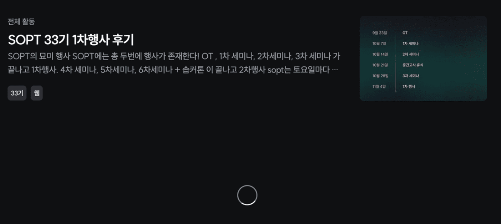

# 문제사항



[sopt.org/blog](http://sopt.org/blog) 에 있는 데이터들을 무한 스크롤을 이용하여 fetching 하고 있는데,
스크롤을 제일 아래까지 내려도 loading spinner 만 돌고 있고
실제로 data fetching은 일어나지 않는다.

```tsx
export default function BlogPostList({
  selected,
  setMajorCategory,
  setSubCategory,
}: BlogPostListProps) {
  const { selectedTab, selectedMajorCategory, selectedSubCategory } = selected;

  const { response, hasNextPage, fetchNextPage, isFetching } = useGetResponse(
    selectedTab,
    selectedMajorCategory,
    selectedSubCategory,
  );

  const { ref } = useInfiniteScroll(fetchNextPage);

  return (
    <>
      ...
      {(hasNextPage || isFetching) && (
        <S.SpinnerWrapper ref={hasNextPage ? ref : undefined}>
          <OvalSpinner />
        </S.SpinnerWrapper>
      )}
    </>
  );
}
```

useInifiniteQuery를 통해 받아온 hasNextPage와 isFetching을 통해 spinner를 보여주는 방식을 사용하고 있는데, hasNextPage는 잘 받아오는 반면, useInfiniteScroll hook을 이용한 fetchNextPage가 잘 작동을 하지 않는 것으로 파악되었다.

왜냐면

```tsx
{
  isFetching && (
    <S.SpinnerWrapper ref={hasNextPage ? ref : undefined}>
      <OvalSpinner />
    </S.SpinnerWrapper>
  );
}
```

이렇게만 했을 때, loading spinner가 보여지지 않는 것으로 보아, fetching이 이뤄지고 있지 않고 있다는 것이기 때문이다. (+ network tab에서도 통신이 가지 않는 것으로 확인된다.)

useInfiniteScroll은 그 전 개발자가 만들어 놓은 custom hook으로

```tsx
import {
  FetchNextPageOptions,
  InfiniteQueryObserverResult,
} from '@tanstack/react-query';
import { useEffect, useState } from 'react';
import useIntersectionObserver from '@src/hooks/useIntersectionObserver';
import { BlogResponse } from '@src/lib/types/blog';

export default function useInfiniteScroll(fetchNextPage: {
  (
    options?: FetchNextPageOptions,
  ): Promise<InfiniteQueryObserverResult<BlogResponse>>;
  (): void;
}) {
  const [hasObserved, setHasObserved] = useState(false);

  const ref = useIntersectionObserver(
    async (entry, observer) => {
      if (!hasObserved && entry.isIntersecting) {
        fetchNextPage();
        setHasObserved(true);
      }

      observer.unobserve(entry.target);
      setHasObserved(false);
    },
    { rootMargin: '80px' },
  );

  useEffect(() => {
    setHasObserved(false);
  }, []);

  return { ref };
}
```

이와 같이 생겼다.

이때 또 useIntersectionObserver hook을 사용하는데, 이 또한 custom hook으로

```tsx
import { useCallback, useEffect, useRef } from 'react';

type IntersectHandler = (
  entry: IntersectionObserverEntry,
  observer: IntersectionObserver,
) => void;

const useIntersectionObserver = (
  onIntersect: IntersectHandler,
  options?: IntersectionObserverInit,
) => {
  const ref = useRef<HTMLDivElement>(null);
  const callback = useCallback(
    (entries: IntersectionObserverEntry[], observer: IntersectionObserver) => {
      entries.forEach((entry) => {
        onIntersect(entry, observer);
      });
    },
    [onIntersect],
  );

  useEffect(() => {
    if (!ref.current) return;

    const observer = new IntersectionObserver(callback, options);
    observer.observe(ref.current);

    return () => observer.disconnect();
  }, [ref, options, callback]);

  return ref;
};

export default useIntersectionObserver;
```

이와 같이 생겼다.

# IntersectionObserver 란?

[IntersectionObserver - Web API | MDN](https://developer.mozilla.org/ko/docs/Web/API/IntersectionObserver)
[Intersection Observer API - Web API | MDN](https://developer.mozilla.org/ko/docs/Web/API/Intersection_Observer_API)

Intersction Observer API는 상위 요소의 viewport와 대상 요소 사이의 변화를 비동기적으로 관찰할 수 있는 수단을 제공한다.

## 사용법

```jsx
let options = {
  root: document.querySelector('#scrollArea'),
  rootMargin: '0px',
  threshold: 1.0,
};

let callback = (entries, observer) => {
  entries.forEach((entry) => {
    // 각 엔트리는 관찰된 하나의 교차 변화을 설명합니다.
    // 대상 요소:
    //   entry.boundingClientRect
    //   entry.intersectionRatio
    //   entry.intersectionRect
    //   entry.isIntersecting
    //   entry.rootBounds
    //   entry.target
    //   entry.time
  });
};

let observer = new IntersectionObserver(callback, options);
```

### callback

- 특정 요소가 다른 요소와의 교차점에 들어가거나 나갈 때 또는 두 요소 간의 교차점이 지정된 양만큼 변화될 때 실행되는 함수.
- **[IntersectionObserverEntry](https://developer.mozilla.org/en-US/docs/Web/API/IntersectionObserverEntry)** 객체와 관찰자 목록을 받는다.
- **`entries`** 는 IntersectionObserver가 관찰하는 각 요소에 대한 정보를 포함하는 배열. 이 배열은 **`IntersectionObserver`** 의 **`observe()`** 메서드를 사용하여 관찰되는 각 대상 요소에 대해 새로운 감시 항목이 생성될 때마다 업데이트된다.
- IntersectionObserver가 여러 요소를 관찰할 수 있으며, **`intersectionCallback`** 함수가 호출될 때마다 이러한 요소들의 정보가 **`entries`** 배열에 전달.
- **`forEach()`** 메서드를 사용하여 배열의 각 항목을 반복하면서 해당 요소가 교차되었는지 확인하고, 교차된 경우에 대해 처리할 수 있다.

### options

- root: 대상 가시성을 체크하기 위한 뷰포트로 사용되는 요소. 반드시 타겟의 상위 요소여야 한다. 뷰포트를 지정하지 않거나 null 인 경우 브라우저 뷰포트가 기본으로 설정된다.
- rootMargin: 루트 주위의 여백으로, 교차 지점을 계산하기 전에 루트 요소 경계 박스의 각 사이드 값을 늘리거나 줄일 수 있다. By default 0.
  (ex. maring: “10px 20px 30px 40px”)
- threshold: callback이 실행되어야 하는 대상의 가시성 백분율을 나타내는 숫자 또는 숫자 배열.
  0.5이면 root option으로 지정된 요소 내에서 target 요소가 50% 보이면 callback 호출된다는 뜻.
  매 25% 넘어갈 때마다 callback을 실행시키고 싶다면 [0, 0.25, 0.5, 0.75, 1] 과 같이 설정할 수 있다.
  관찰자를 생성했기에, 관찰할 타겟 요소를 전달해야 한다.

```tsx
let target = document.querySelector('#listItem');
observer.observe(target);

// observer를 위해 설정한 콜백은 바로 지금 최초로 실행됩니다
// 대상을 관찰자에 할당할 때까지 기다립니다. (타겟이 현재 보이지 않더라도)
```

# 뭐 어찌댔든 그래서 뭐가 문제였는데?

문제는 useInfiniteScroll hook에서 발생했다.

```jsx
export default function useInfiniteScroll(fetchNextPage: {
  (options?: FetchNextPageOptions): Promise<InfiniteQueryObserverResult<BlogResponse>>;
  (): void;
}) {
  const [hasObserved, setHasObserved] = useState(false);

  const ref = useIntersectionObserver(
    async (entry, observer) => {
      if (!hasObserved && entry.isIntersecting) {
        fetchNextPage();
        setHasObserved(true);
      }

      observer.unobserve(entry.target); // 이것이 문제!!
      setHasObserved(false);
    },
    { rootMargin: '80px' },
  );

  useEffect(() => {
    setHasObserved(false);
  }, []);

  return { ref };
}
```

fetchNextPage() 를 해서 다음 페이지를 받아와야 하는데 unobserve를 하여, target을 없애버렸다.
target을 이용하여 해당 target이 보여졌을 때 데이터를 불러오는 건데, target이 없어져 버리니 데이터를 받아오지 못하게 되는 것이다.

<del>왜 이렇게 했을까,,?</del>

어찌댔든

```jsx
const ref = useIntersectionObserver(
  async (entry) => {
    if (!hasObserved && entry.isIntersecting) {
      fetchNextPage();
      setHasObserved(true);
    }
    setHasObserved(false);
  },
  { rootMargin: '80px' },
);
```

위와 같이 변경해 주었다.

이렇게만 하면 되는가?

```jsx
{
  (hasNextPage || isFetching) && (
    <S.SpinnerWrapper ref={hasNextPage ? ref : undefined}>
      <OvalSpinner />
    </S.SpinnerWrapper>
  );
}
```

hasNextPage 또는 IsFetching이 true이면 spinner가 돌아가게 되어있다.
hasNextPage가 true이면 isFetching이 자동으로 되는 것이니, 따라서 둘 중 하나만 있으면 된다.

```jsx
{
  hasNextPage && (
    <S.SpinnerWrapper ref={hasNextPage ? ref : undefined}>
      <OvalSpinner />
    </S.SpinnerWrapper>
  );
}
```

그런데 이렇게 했는데 모든 데이터를 다 받아왔음에도 불구하고 계속 데이터를 받아오려는 에러가 발생했다.


분명 저게 마지막 아티클이고, data로 넘어온 hasNextPage 또한 false인데 보는 것과 같이 dataUpdateCount 계속 증가하며 data를 fetching 하고 있었다.

```tsx
const { data } = await client.get(`/reviews?${parameter}`);

return {
  hasNextPage: data.hasNextPage,
  response: data.data,
  currentPage: data.currentPage,
};
```

원인은 아래와 같았다.

```tsx
const queryKey = [selectedTab, generation, part];

const { data, fetchNextPage, hasNextPage, isFetching } = useInfiniteQuery({
  queryKey,
  queryFn: ({ pageParam = 1 }: { pageParam: number }) =>
    getTabResponse(selectedTab, generation, part, pageParam),
  getNextPageParam: (lastPage) => {
    return lastPage.currentPage + 1 || undefined;
  },
  suspense: true,
});
```

현재 나는 이런 식으로 infinite query를 사용하고 있었다.
이때 getNextPageParam을 보면 currentPage의 + 1을 해주고 있는데 이것이 문제였다.
pageParam이 false가 되는 설정이 없는 것이다.

마지막 페이지의 currentPage 값은 19였고, 이때 다음 페이지가 없지만 getNextPageParam에 의해 pageParam이 20으로 증가된다.
20의 boolean 값은 true이므로 hasNextPage 역시도 true가 되어 계속해서 data fatching이 일어나게 됐던 것이었다.

```tsx
const queryKey = [selectedTab, generation, part];

const { data, fetchNextPage, hasNextPage, isFetching } = useInfiniteQuery({
  queryKey,
  queryFn: ({ pageParam = 1 }: { pageParam: number }) =>
    getTabResponse(selectedTab, generation, part, pageParam),
  getNextPageParam: (lastPage) =>
    lastPage.hasNextPage ? lastPage.currentPage + 1 : undefined,
  suspense: true,
});
```

따라서 위와 같이 수정을 해주면 된다.
무한 스크롤이 잘 작동하는 것을 확인할 수 있었다.
