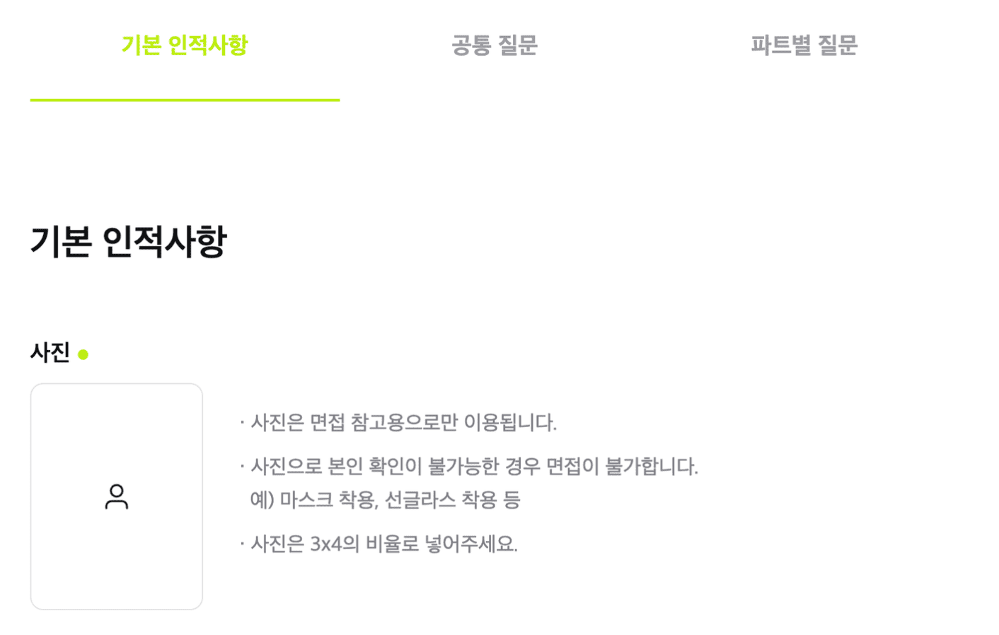
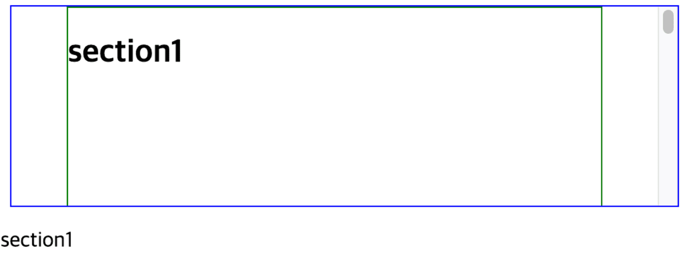
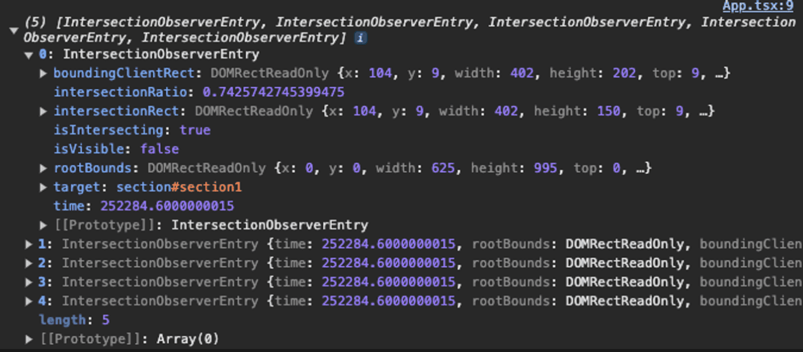
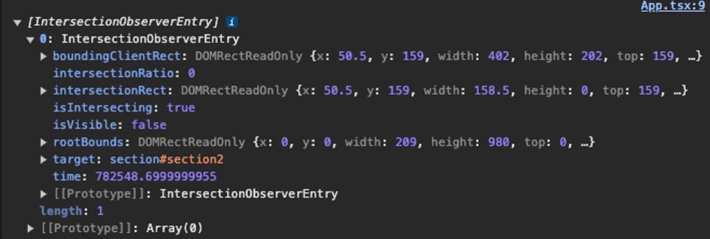
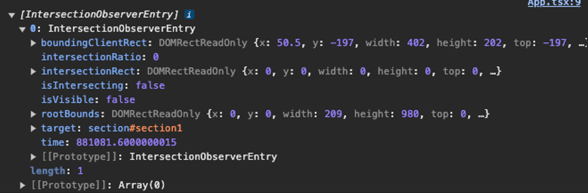
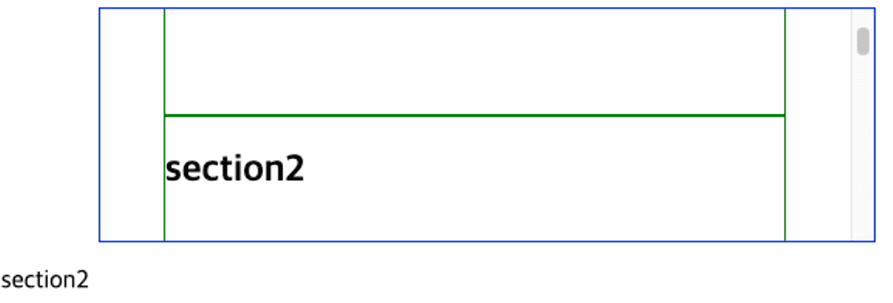
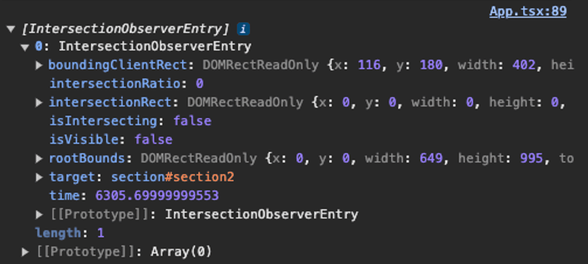
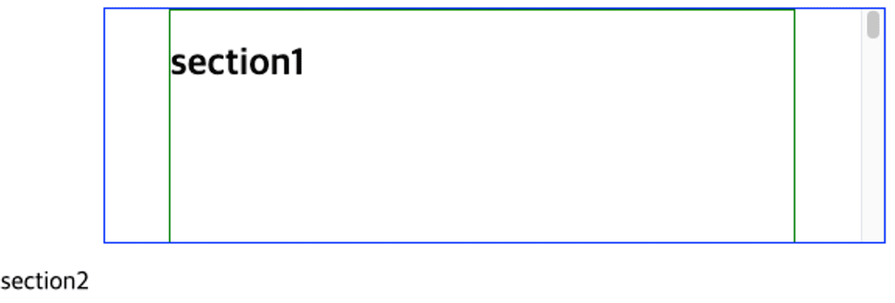

# 상황 설명



지원서 페이지에는 category bar가 있다.
category의 각 항목을 누르면 그 섹션이 있는 곳으로 자동 스크롤 되며
그냥 스크롤을 통해 섹션에 도달해도 자동으로 category의 active 상태가 변경이 되어야 한다.

클릭 시 자동 스크롤은 useLocation과 useRef를 이용해서 잘 구현을 했는데 문제는 스크롤이었다.
스크롤을 하면 자기 멋대로 active 상태가 변하는 것이었다.

해당 기능은 intersection observer를 이용해 구현이 되어 있어서 이의 작동 방식을 좀 더 알아보기로 하였다.

# Intersection Observer란

## Intersection Observer?

공식문서와 여러 블로그 글을 참고하여 Intersection Observer에 대해 조사하였다.

> Intersection Observer API는 타겟 요소와 상위 요소 또는 최상위 document의 뷰포트와의 교차점 변화를 비동기적으로 관찰할 수 있게 해준다.

다시 말해 타겟 요소가 다른 요소(혹은 뷰포트)와 특정 수치만큼 교차할 때 등록된 콜백 함수를 실행시키는 것이다.
어떤 요소를 기준으로 감시를 할 지는 아래와 같다.

1. 타겟 요소가 포함된 document 내에서 스크롤이 가능한 가장 가까운 상위 요소가 있다면 이 상위 요소를 기준으로 타겟 요소가 보이는지 여부를 감시한다.
   아래 예시를 보면 id=”targetItem”를 가지는 div가 타겟 요소이고 id=”container”를 가지는 div가 기준 요소가 된다.

```tsx
<div id="container" style={{ width: 300px, height: 200px, overflow: scroll }}>
  <div class="item">Item 1</div>
  <div class="item">Item 2</div>
  <div class="item" id="targetItem">Target Item</div>
  <div class="item">Item 4</div>
  <div class="item">Item 5</div>
</div>
```

2. 만약 타겟 요소가 스크롤 가능한 상위 요소를 가지고 있지 않다면, 브라우저의 뷰포트를 기준으로 타겟 요소가 보이는지 여부를 감시한다.
   이를 위해선 observer option에서 root를 null로 설정해야 한다.

하지만 이때, 겹치는 정도를 정확한 픽셀값을 이용할 순 없고 보통 퍼센트를 계산한다.

## Options

### root

타겟의 가시성을 확인하기 위해 기준으로 사용되는 요소.
지정되지 않거나 null인 경우 브라우저 뷰포트를 기본값으로 한다.

### rootMargin

root 주위에 margin을 설정한다.
루트 요소(뷰포트)가 상하좌우로 확장/축소 된다고 생각하면 된다.
만약 -30px로 설정된 경우 루트 요소(뷰포트)의 경계가 상하좌우로 30px씩 내부로 수축된다.
단위를 꼭 입력해야 하며 기본값은 0이다.

### threshold

타겟의 가시성이 observer의 콜백을 실행해야 하는 비율을 나타내는 숫자 또는 숫자 배열이다.
만약 값이 0.5이면 타겟 요소가 기준 요소에서 50% 보였을 때 콜백을 실행한다.
25%가 추가로 더 보일 때마다 콜백을 실행시키고 싶다면 [0, 0.25, 0.5, 0.75, 1]와 같이 숫자 배열을 이용하면 된다.
기본값은 0이다.

## mehods

### IntersectionObserver.disconnect()

모든 타겟의 관찰을 멈춘다.

### IntersectionObserver.observe()

관찰할 타겟 요소를 지정한다.

### IntersectionObserver.takeRecords()

관찰된 모든 타겟에 대한 IntersectionObserverEntry 객체 배열을 반환한다.

### IntersectionObserver.unobserve()

특정 타겟의 관찰을 멈춘다.

# 사용법 (JS)

```tsx
let options = {
  root: document.querySelector('#기준요소'),
  rootMargin: '0px',
  threshold: 1.0,
};

let observer = new IntersectionObserver(callback, options);

let target = document.querySelector('#타겟요소');
observer.observe(target);

let callback = (entries, observer) => {
  entries.forEach((entry) => {
    // 각 엔트리는 하나의 감시된 타겟 요소에 대한 교차 변화를 설명한다:
    //   entry.boundingClientRect
    //   entry.intersectionRatio
    //   entry.intersectionRect
    //   entry.isIntersecting
    //   entry.rootBounds
    //   entry.target
    //   entry.time
  });
};
```

콜백 함수는 [IntersectionObserverEntry](https://developer.mozilla.org/en-US/docs/Web/API/IntersectionObserverEntry) 객체의 목록과 observer를 전달받는다.
이중 entry 객체의 isIntersecting 속성 값을 확인하여 기준 요소와 교차하는지 확인할 수 있다.
이때, 콜백은 메인 스레드에서 실행되므로 가능한 빠르게 작동해야 하며,
시간이 많이 걸리는 작업이 필요한 경우 Window.requestIdleCallback()을 사용해야 한다.

## + Window.requestIdleCallback()이란?

window.requestIdleCallback() 메서드는 브라우저의 유휴 기간 동안 호출될 함수를 대기열에 추가한다.
이는 백그라운드 작업이나 우선순위가 낮은 작업을 애니메이션, 입력 응답 같은 지연에 민감한 이벤트에 영향을 주지 않고 메인 이벤트 루프에서 수행할 수 있게 한다.
함수들은 일반적으로 먼저 추가된 순서대로 호출되지만, 타임아웃이 지정된 경우 타임아웃이 경과하기 전에 호출될 수 있다.

### 매개변수

- callback

이벤트 루프가 유휴 상태일 때 미래 어느 시점에 호출될 함수에 대한 참조. 콜백 함수는 타임아웃 기간이 만료되어 콜백이 실행되었는지 여부와 사용 가능한 시간을 설명하는 IdleDeadline 객체를 전달받는다.

- options (optional)

현재 하나의 속성(timeout)만 정의되어 있다.

- timeout

해당 밀리초 수만큼 경과되었는데도 콜백이 호출되지 않았다면,
콜백을 실행하는 작업이 이벤트 루프에 대기열에 추가된다. (이로 인해 성능이 떨어질 수 있다.)
timeout은 양수 값이어야 하며, 그렇지 않으면 무시된다.

### 반환값

콜백을 취소하기 위해 window.cancelIdleCallback() 메서드에 전달할 수 있는 ID를 반환한다.

### entry 요소들

boundingClientRect: 관찰 대상의 사각형 정보
intersectionRect: 관찰 대상의 교차한 영역 정보
intersectionRatio: 관찰 대상의 교차한 영역 백분율(intersectionRect 영역에서 boundingClientRect 영역까지 비율, Number)
isIntersecting: 관찰 대상의 교차 상태(Boolean)
rootBounds: 지정한 루트 요소의 사각형 정보(DOMRectReadOnly)
target: 관찰 대상 요소(Element)
time: 변경이 발생한 시간 정보(DOMHighResTimeStamp)

# 사용법 (React)

```tsx
function Component() {
  const sectionsRef = useRef([]);
  const [active, setActive] = useState('default');

  useEffect(() => {
    const observer = new IntersectionObserver((entries) => {
      entries.forEach((entry) => {
        if (entry.isIntersecting) {
          setActive(entry.target.getAttribute("id"));
        }
      });
    });

    sectionsRef.current.forEach((section) => {
      observer.observe(section);
    });
  }, []);

  const refCallback = useCallback((element) => {
    if (element) {
      sectionsRef.current.push(element);
    }
  }, []);

  return (...);
}
```

JS에선 document를 이용하였지만 React에선 내장 hook인 useRef를 이용해 주었다.

# 예제를 통한 학습

이를 적용해 보기 위해 짧은 코드를 작성해 보았다.



화면에 보여지는 섹션이 아래에 텍스트로 보여지는 구조이다.
코드는 아래와 같다.

```tsx
import { useCallback, useEffect, useRef, useState } from 'react';

function App() {
  const sectionsRef = useRef([]);
  const [active, setActive] = useState('section1');

  useEffect(() => {
    const observer = new IntersectionObserver(
      (entries) => {
        entries.forEach((entry) => {
          if (entry.isIntersecting) {
            setActive(entry.target.getAttribute('id'));
          }
        });
      },
      { root: document.getElementById('container') },
    );

    sectionsRef.current.forEach((section) => {
      observer.observe(section);
    });
  }, []);

  const refCallback = useCallback((element) => {
    if (element) {
      sectionsRef.current.push(element);
    }
  }, []);

  return (
    <>
      <div
        id="container"
        style={{
          width: 500,
          height: 150,
          margin: '0 auto',
          border: '1px solid blue',
          overflow: 'auto',
        }}
      >
        {[1, 2, 3, 4, 5].map((num) => (
          <section
            key={num}
            ref={refCallback}
            id={`section${num}`}
            style={{
              width: 400,
              height: 200,
              margin: '0 auto',
              border: '1px solid green',
            }}
          >
            <h1>{`section${num}`}</h1>
          </section>
        ))}
      </div>
      <p>{active}</p>
    </>
  );
}

export default App;
```

## 문제

스크롤이 내려감에 따라 section이 변하는 것에는 문제가 없었다. 문제는 스크롤을 올릴 때 발생했다.

section1이 다 사라진 뒤, 다시 말해 section2만 화면에 보여지는 상태에서 스크롤을 올려 다시 section1이 보이게 하면 텍스트는 section1로 잘 바뀌었다.
하지만 section1이 다 사라지지 않은 채로 다시 스크롤을 올리게 되면 section1로 바뀌지 않았다.

import Video1 from './imgs/4/1.mp4';

<video src={Video1} width="95%" controls type="video/mp4" />

## 해결법

그래서 threshold 속성을 주어 화면의 50%가 보여질 때 텍스트가 변경이 되도록 해주었다.

```tsx
{ root: document.getElementById('container'), threshold: 0.5 }
```

import Video2 from './imgs/4/2.mp4';

<video src={Video2} width="95%" controls type="video/mp4" />

section2가 50% 이하로 내려가고 section1이 50% 이상이 되면 section1로 변경이 되어 결과적으로 스크롤을 올리고 내림에 따라 텍스트가 정상적으로 변경이 되게 되었다.

## 또 다른 문제

위의 예제에서는 section의 사이즈가 동일하였다. 하지만 실제로 적용해야 하는 지원서 페이지에서 section의 사이즈는 달랐다.
threshold를 0.5로 설정해도 이는 container의 영역에 50%가 보일 때를 얘기하는 것이 아니라 section의 50%가 보일 때는 의미하는 거기에 각 section의 사이즈에 영향을 받았다.

실제로 위의 예제에서 높이를 100, 200, 300, 400, 500으로 변경하니 텍스트가 변경되지 않았다.

import Video3 from './imgs/4/3.mp4';

<video src={Video3} width="95%" controls type="video/mp4" />

threshold를 변경해도 예상대로 작동하지 않았다.

## 테스트

```tsx
useEffect(() => {
  const observer = new IntersectionObserver((entries) => {
    console.log(entries);
  });

  sectionsRef.current.forEach((section) => {
    observer.observe(section);
  });
}, []);
```

일단 언제 entry가 변경되는지 파악하기 위해 다 지우고 console.log를 추가해봤다.

1. 첫 렌더링 시

   

   모든 타겟에 대한 정보가 포함되어 있었다.
   이는 IntersectionObserver가 처음 설정되었을 때 관찰하고 있는 모든 요소들에 대해 처음 상태를 전달하기 때문으로, 관찰 중인 모든 요소의 현재 가시성을 즉시 파악할 수 있게 한다.
   이후 IntersectionObserver는 가시성이 변경된 요소만 엔트리에 전달한다.

2. 타겟이 영역 내에 등장할 때

   

   영역 내에 등장한 타겟에 대한 entry 정보를 넘겨준다.
   isIntersecting이 true인 것을 확인할 수 있다.

3. 타겟이 영역 내에서 벗어날 때

   

   영역 내에 등장한 타겟에 대한 entry 정보를 넘겨준다.
   isIntersecting이 false인 것을 확인할 수 있다.

이를 이용하여 원인을 분석해 보았다. 현재 코드는 아래와 같은데

```tsx
useEffect(() => {
  const observer = new IntersectionObserver(
    (entries) => {
      entries.forEach((entry) => {
        if (entry.isIntersecting) {
          setActive(entry.target.getAttribute('id'));
        }
      });
    },
    { root: document.getElementById('container') },
  );

  sectionsRef.current.forEach((section) => {
    observer.observe(section);
  });
}, []);
```

문제가 되는 곳은 아래와 두 섹션이 동시에 영역 내에 위치했을 때였다.



section2가 등장하면서 intersection oberser는 section2에 대한 entry를 업데이트 한다.
따라서 entry.isIntersecting는 true가 되고 setActive가 작동하여 아래 텍스트가 section2로 변경이 되었다.

이때 만약 더 이상 내려가지 않고 위로 스크롤을 올려 다시 section1만 나타나게 하면




section2가 영역에서 사라졌기에 intersection observer는 이에 대한 entry를 업데이트 한다.
하지만 이때 업데이트 되는 것은 section1에 대한 것이 아닌 section2에 대한 것으로 isIntersecting이 false가 된다. 이 때문에 if (entry.isIntersecting)를 통과하지 못하게 되고 setActive가 작동을 하지 않아 section1만 남았음에도 불구하고 텍스트는 그대로 section2로 남아있는 것이다.

## 이를 이미 구현하고 있는 오픈 소스 코드 분석

이를 해결하기 위해 이미 해당 기능이 구현이 되어있는 사이트의 소스 코드를 참고하기로 하였다.
[sopt.org](https://sopt.org)를 보면 스크롤에 따른 navigation active 기능이 구현 되어있다.

import Video4 from './imgs/4/4.mp4';

<video src={Video4} width="95%" controls type="video/mp4" />

해당 코드를 분석해 보았다. [GitHub 주소](https://github.com/sopt-makers/sopt.org-frontend)

파트별로 useInView라는 custom hook을 이용해 졍의를 해준다.

```tsx
const activity = useInView();
const part = useInView();
const team = useInView();
const review = useInView();
```

useInView는 아래와 같이 ref와 state를 반환해주고 있었다.
또한 useIntersectionObserver라는 또 다른 custom hook을 이용하여 ref를 설정해주고 있다.

```tsx
function useInView({ options }: useInViewProps = {}) {
  const ref = useIntersectionObserver((entry) => {
    setIsInView(entry.isIntersecting);
  }, options);
  const [isInView, setIsInView] = useState(false);

  return { isInView, ref };
}
```

아래는 useIntersectionObserver 코드이다.

```tsx
const useIntersectionObserver = (
  onIntersect: IntersectHandler,
  options?: IntersectionObserverInit,
) => {
  const ref = useRef<HTMLDivElement>(null);
  const callback = useCallback(
    (entries: IntersectionObserverEntry[], observer: IntersectionObserver) => {
      entries.forEach((entry) => {
        onIntersect(entry, observer);
      });
    },
    [onIntersect],
  );

  useEffect(() => {
    if (!ref.current) return;
    const observer = new IntersectionObserver(callback, options);
    observer.observe(ref.current);
    return () => observer.disconnect();
  }, [ref, options, callback]);

  return ref;
};
```

사실 여기까지는 내가 작성한 코드와 크게 다른 건 없었다. 재사용성을 위해 따로 custom hook으로 빼주었을 뿐 기능적으로는 동일한 역할을 하고 있었다.

그렇기에 이를 실제로 적용되는 부분의 코드를 살펴보았다.
useInView를 통해 만든 각 섹션의 isInView state를 배열에 저장시킨 후 이 중 첫 번째 true가 나온 섹션의 nav 항목을 active 해주고 있었다.

```tsx
const activity = useInView();
const part = useInView();
const team = useInView();
const review = useInView();

const viewList = [activity.isInView, part.isInView, team.isInView, review.isInView];
const minIndex = viewList.findIndex((value) => value === true);

return (
// ...
  MenuList.map(({ name, id }, index) => (
    <S.MenuWrapper
      key={id}
      isInView={minIndex === index}
      style={{ backgroundColor: menuBackground, color: menuColor }}
    >
      <S.Menu href={`#${id}`} scroll={false}>
        {name}
      </S.Menu>
    </S.MenuWrapper>
  ))}
// ...
);
```

해당 방식을 적용해 보기로 하였다.

## 코드에 적용

```tsx
const [active, setActive] = useState([true, false, false, false, false]);
const minIndex = active.findIndex((value) => value === true);
```

active 초기값을 boolean 배열로 변경한 후 첫 섹션의 값만 true로 해주었다.

이후 entries가 업데이트 되면 해당 entry의 isIntersecting를 이용하여 state를 변경해 주었다.

```tsx
useEffect(() => {
  const observer = new IntersectionObserver((entries) => {
    entries.forEach((entry) => {
      const sectionId = entry.target.getAttribute('id');
      const sectionIndex = [
        'section1',
        'section2',
        'section3',
        'section4',
        'section5',
      ].indexOf(sectionId!);

      setActive((prev) => {
        const updatedState = [...prev];
        updatedState[sectionIndex] = entry.isIntersecting;
        return updatedState;
      });
    });
  });

  sectionsRef.current.forEach((section) => {
    observer.observe(section);
  });

  return () => {
    sectionsRef.current.forEach((section) => {
      observer.unobserve(section);
    });
  };
}, []);
```

import Video5 from './imgs/4/5.mp4';

<video src={Video5} width="95%" controls type="video/mp4" />

원하는 대로 잘 작동하는 걸 확인할 수 있었다.

# 실제 코드에 적용

이를 실제 코드에 이식할 차례다.

## 현재 코드

```tsx
const ApplyPage = () => {
  const [activeHash, setActiveHash] = useState('');
  const { ref } = useIntersectionObserver(handleSetActiveHash);

  const handleSetActiveHash = useCallback((hash: string) => {
    setActiveHash(hash);
  }, []);

  // ...

  return (
    <div className={sectionContainer}>
      <div
        id="default"
        ref={(el) => {
          if (el) ref.current[0] = el;
        }}
      >
        <DefaultSection />
      </div>
      <div
        id="common"
        ref={(el) => {
          if (el) ref.current[1] = el;
        }}
      >
        <CommonSection />
      </div>
      <div
        id="partial"
        ref={(el) => {
          if (el) ref.current[2] = el;
        }}
      >
        <PartSection />
      </div>
      {/* ... */}
    </div>
  );
};
```

```tsx
const useIntersectionObserver = (
  handleSetActiveHash: (hash: string) => void,
) => {
  const ref = useRef<HTMLDivElement[]>([]);
  useEffect(() => {
    const observer = new IntersectionObserver(
      (entries) => {
        entries.forEach((entry) => {
          if (entry.isIntersecting) {
            handleSetActiveHash(`#${entry.target.id}`);
          }
        });
      },
      { threshold: 0.2 },
    );

    ref.current.forEach((el) => {
      if (el) {
        observer.observe(el);
      }
    });

    return () => {
      ref.current.forEach((el) => {
        if (el) {
          observer.unobserve(el);
        }
      });
    };
  }, [handleSetActiveHash]);

  return { ref };
};
```

## 수정

### ref 설정 방식 변경

일단 ref를 설정해 주는 방식을 변경해 주었다.
기존에는 각 섹션 컴포넌트에 if문을 이용하여 직접 ref를 할당해 주었는데 이로 인해 가독성이 떨어져 보였다.

refCallback이라는 함수를 생성한 뒤 각 컴포넌트 내부에 prop으로 전달해주었다.
이후 각 컴포넌트가 렌더링 될 때 함수가 실행되어 ref가 할당되게 하였다.
id도 각 컴포넌트 내부에서 설정하도록 수정해주었다.
그렇게 함으로써 외부에 감싼 div를 제거할 수 있었다.

```tsx
const refCallback = useCallback((element: HTMLSelectElement) => {
  if (element) {
    sectionsRef.current.push(element);
  }
}, []);
```

```tsx
<DefaultSection refCallback={refCallback} />
<CommonSection refCallback={refCallback} />
<PartSection refCallback={refCallback} />
```

### custom hook 제거

사실 해당 로직을 또 다른 곳에서 사용하지 않아서 로직을 분리할 필요가 없어 보였다.
물론 관심사를 분리하는 것은 좋지만 이건 추후 리팩토링에서 한 꺼번에 처리할 예정이라 현재는 무시해주었다.
따라서 hook을 제거한 후 컴포넌트 내부에서 로직을 처리하였다.

```tsx
const ApplyPage = () => {
  const sectionsRef = useRef<HTMLSelectElement[]>([]);

  const [isInView, setIsInView] = useState([true, false, false]);
  const minIndex = isInView.findIndex((value) => value === true);

  useEffect(() => {
    const observer = new IntersectionObserver((entries) => {
      entries.forEach((entry) => {
        const sectionId = entry.target.getAttribute('id');
        const sectionIndex = ['default', 'common', 'partial'].indexOf(sectionId!);

        setIsInView((prev) => {
          const updatedState = [...prev];
          updatedState[sectionIndex] = entry.isIntersecting;
          return updatedState;
        });
      });
    });

    sectionsRef.current.forEach((section) => {
      observer.observe(section);
    });

    return () => {
      sectionsRef.current.forEach((section) => {
        observer.unobserve(section);
      });
    };
  }, []);

  // ...

  return (
    <DefaultSection refCallback={refCallback} />
    <CommonSection refCallback={refCallback} />
    <PartSection refCallback={refCallback} />
    {/* ... */}
  );
};
```

### 이슈 발생

첫 렌더링 시 observer에 아무것도 observe 되지 않은 에러가 발생하였다.
useEffect는 실행이 되었지만

```tsx
sectionsRef.current.forEach((section) => {
  observer.observe(section);
});
```

해당 코드가 실행이 되지 않았다.

sectionsRef.current를 console 찍어보니 빈 배열이었다.
이는 sectionsRef.current 배열이 비동기적으로 업데이트되기 때문에 초기 렌더링 시점에서는 sectionsRef.current가 비어있을 수 있기 때문이었다.
sectionsRef.current가 빈 배열이므로 observe 할 게 없어서 결과적으로 아무것도 observe 되지 않았던 것이다.

### 해결

이를 해결하기 위해 sectionsRef.current가 업데이트된 후에 IntersectionObserver를 설정하도록 수정하였다.

```tsx
const [sectionsUpdated, setSectionsUpdated] = useState(false);

const refCallback = useCallback(
  (element: HTMLSelectElement) => {
    if (element) {
      sectionsRef.current.push(element);

      if (sectionsRef.current.length === 3) {
        setSectionsUpdated(true);
      }
    }
  },
  [sectionsRef],
);

useEffect(() => {
  if (!sectionsUpdated) return; // 업데이트가 완료되지 않았다면 그냥 return;

  const observer = new IntersectionObserver(
    (entries) => {
      entries.forEach((entry) => {
        const sectionId = entry.target.getAttribute('id');
        const sectionIndex = ['default', 'common', 'partial'].indexOf(
          sectionId!,
        );

        setIsInView((prev) => {
          const updatedState = [...prev];
          updatedState[sectionIndex] = entry.isIntersecting;
          return updatedState;
        });
      });
    },
    { root: null, rootMargin: '-186px' },
  );

  sectionsRef.current.forEach((section) => {
    observer.observe(section);
  });
}, [sectionsUpdated]);
```

## 결과물

드디어 며칠 간의 사투가 끝이 났다….. 끙 😓

import Video6 from './imgs/4/6.mp4';

<video src={Video6} width="95%" controls type="video/mp4" />

# 참고자료

[Intersection Observer API - Web APIs | MDN](https://developer.mozilla.org/en-US/docs/Web/API/Intersection_Observer_API)
[IntersectionObserver - Web APIs | MDN](https://developer.mozilla.org/en-US/docs/Web/API/IntersectionObserver)
[Using react-intersection-observer to create a dynamic header - LogRocket Blog](https://blog.logrocket.com/using-react-intersection-observer-create-dynamic-header/)
[JS Intersection Observer, 요소의 가시성 관찰 | HEROPY.DEV](https://heropy.blog/2019/10/27/intersection-observer/)
[실무에서 느낀 점을 곁들인 Intersection Observer API 정리](https://velog.io/@elrion018/실무에서-느낀-점을-곁들인-Intersection-Observer-API-정리)
