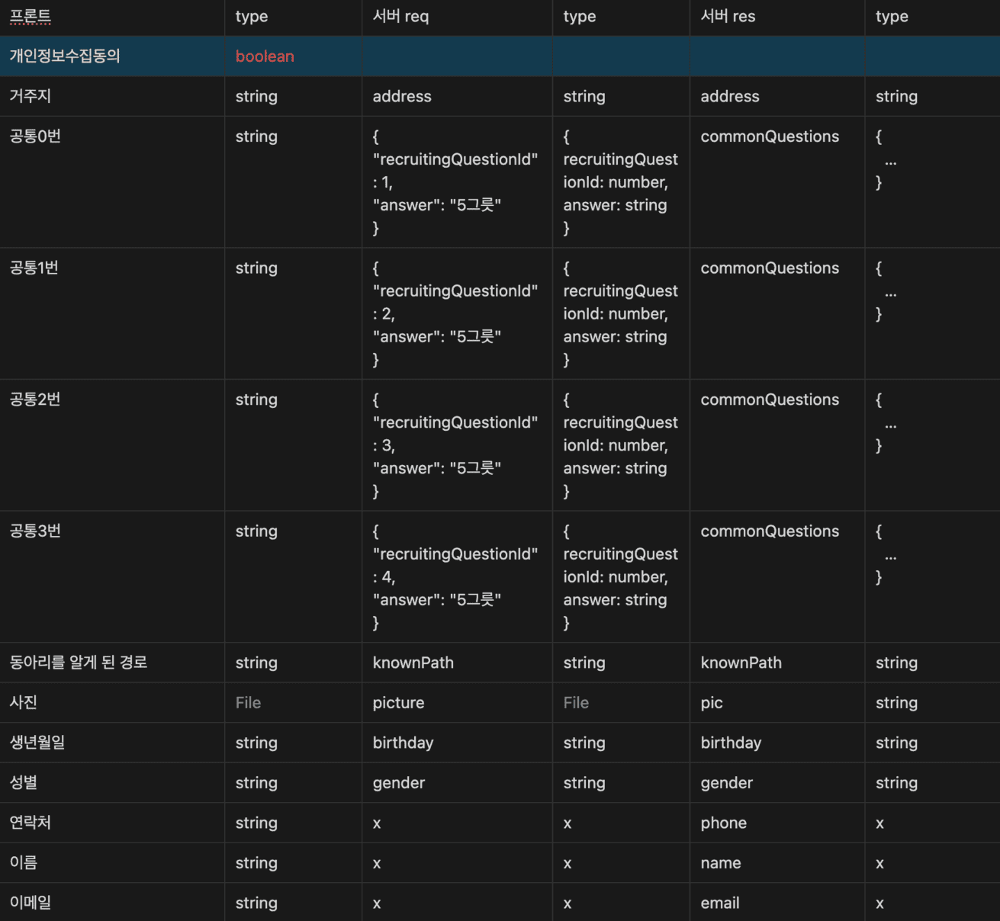
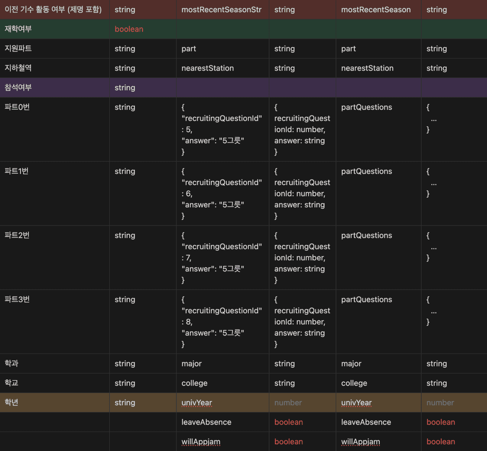
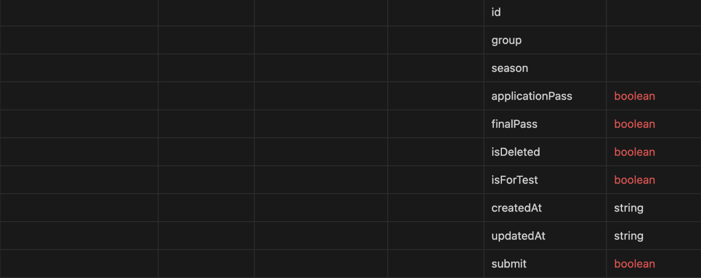
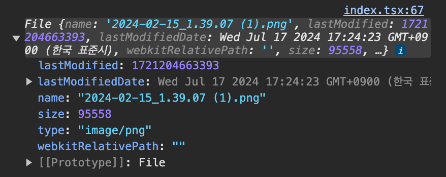

# 서버와 변수명 및 type 불일치

지원서를 작성하는 중 임시저장을 누르면 해당 데이터들이 서버에 저장된 후 다시 사이트 접속 시 해당 데이터들을 자동으로 불러와야 한다.
이때 서버에 보내야 하는 변수명과 우리가 사용하는 value의 변수명이 일치하지 않는 문제가 발생했다.

react-hook-form을 사용하는데 label명을 value의 변수명으로 사용하고 있어

```tsx
{
  이름: '000',
  학교: '00대학교',
  학년: '1학년'
}
```

이런 식으로 formValues를 받아왔는데, 실제 서버에 보낼때는

```tsx
{
  name: '000',
  college: '00대학교',
  univYear: 1,
}
```

위와 같이 보내야 했다.
그 결과 formValues를 바로 사용하지 못하고 데이터 형식을 다시 수정해야 하는 불편함이 생겼다.

또한 학년 같은 경우 우리 쪽에선 ‘1학년’, ‘2학년’, ‘3학년’… 이런 식으로 string 값을 사용하는 반면, 서버 쪽에선 1, 2, 3의 number 값을 사용하고 있었다. 따라서 만약 서버의 임시저장된 값을 불러와 사용하고 싶다면 1 → ‘1학년’ 이런 식으로 값의 변경이 필요했다.
이런 식으로 계속 짜다보니 아래와 같이 코드가 너무 더러워지고 있었고 서버와의 통일이 필요하다고 느꼈다.

```tsx
const handleDraftSubmit = () => {
  const mostRecentSeasonStrValue = formObject.getValues(
    '이전 기수 활동 여부 (제명 포함)',
  );
  const mostRecentSeasonStr =
    mostRecentSeasonStrValue === '해당사항 없음'
      ? '없음'
      : mostRecentSeasonStrValue;

  const univYearValue = formObject.getValues('학년');
  const univYear =
    univYearValue === '1학년'
      ? 1
      : univYearValue === '2학년'
        ? 2
        : univYearValue === '3학년'
          ? 3
          : univYearValue === '4학년'
            ? 4
            : null;

  const answers = [
    {
      recruitingQuestionId: 1,
      answer: formObject.getValues('공통0번'),
    },
    {
      recruitingQuestionId: 2,
      answer: formObject.getValues('공통1번'),
    },
    {
      recruitingQuestionId: 3,
      answer: formObject.getValues('공통2번'),
    },
    {
      recruitingQuestionId: 4,
      answer: formObject.getValues('공통3번'),
    },
  ];

  const formValues = {
    picture: formObject.getValues('사진')[0],
    part,
    address: formObject.getValues('거주지'),
    birthday: formObject.getValues('생년월일'),
    college: formObject.getValues('학교'),
    gender,
    knownPath,
    leaveAbsence: false,
    major: formObject.getValues('학과'),
    mostRecentSeasonStr,
    univYear,
    nearestStation: formObject.getValues('지하철역'),
    answers,
    willAppjam: false,
  };

  mutate(formValues);
};
```

## 데이터 변수명과 타입 파악

일단 서버와 프론트에서 사용되는 변수명과 타입을 전부 파악해 보았다.
이 중 수정이 필요한 부분에 대해 색깔 표시를 하였다.





문제가 되는 부분은 3가지였다.

- 재학여부, 참석여부, 개인정보수집동의 → 서버에서 넘어오는 데이터 없음
- 이전 기수 활동 여부 (제명 포함) → req 할 때(mostRecentSeasonStr)와 res 올 때(mostRecentSeason) 데이터 변수명 다름
- 학년 → 서버(number)와 프론트(string)의 데이터 타입이 다름

일단 해당 부분에 대해 서버에게 확인을 부탁하여 빠진 부분은 추가를, 상이한 부분은 통일을 요구했다.

## front와 back의 변수명 통일

현재 한글로 등록되어 있는 register 이름을 서버 변수명과 통일 시켰다.

```tsx
<input id={label} />
<span htmlFor={label}>{label}</span>
```

이런 느낌이었다면 name이란 속성을 하나 더 생성해서

```tsx
<input id={name} />
<span htmlFor={name}>{label}</span>
```

위와 같이 수정해 주었다.

이렇게 함으로써 getValues에서 바로 value를 가져다 서버에 보내줄 수 있게 되었다.

```tsx
// 전
const name = getValues('이름');
const gender = getValues('성별');
...
```

```tsx
// 후
const { name, gender, ... } = getValues();
```

# 보내고 받는 데이터 간의 타입 차이 발생

지원서에는 지원자의 사진을 받고 있다.
이때 사진을 전송할 대는 File type으로 보내는 반면
임시저장된 사진을 받아올 때는 url 주소인 string으로 받아오게 되는 것이다.


_서버에 보내는 File data_


_서버로부터 받아오는 사진 url data_

큰 문제가 없어 보이지만 임시저장된 데이터를 다시 전송할 때 문제가 발생했다.
서버 쪽에선 File data만 처리하게 되어 있어 string 값인 url을 보낼 수가 없었기 때문이다.

이를 해결하기 위해 2가지 변수를 생성해줬다.

1. File data를 담고 있는 `picture`
2. 임시저장된 url 주소를 담는 `pictureUrl`

그런 뒤 File data가 있으면 picture를 보내고 임서저장된 url이 있으면 pictureUrl을 보내주었다.
서버에서도 picture를 받으면 해당 파일을 firebase에 올린 뒤 url을 반환하고 pictureUrl을 받으면 해당 url 그대로 반환함으로써 해당 문제를 해결할 수 있었다.

파일을 첨부하여 서버에 보내는 것도 비슷한 느낌이라 동일하게 해결해주었다.

# 마치며

이외에도 자잘한 에러들이 많았어서 꽤나 애를 먹었다.
임시저장 그냥 데이터 서버에 보내주면 되는 게 아닌가 싶었는데
생각보다 고려해줘야 할 것도 많고 케이스도 많아서 시간이 많이 소요되었다.
그래도 문제없이 기능을 다 구현해서 다행인 거 같다.
이후엔 zod를 도입하여 type 안정성을 더 높일 예정이다.
