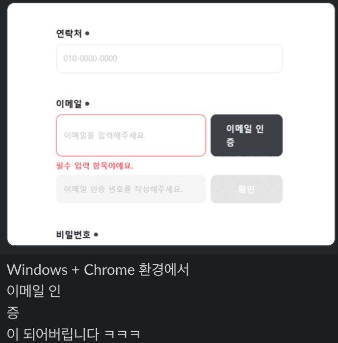
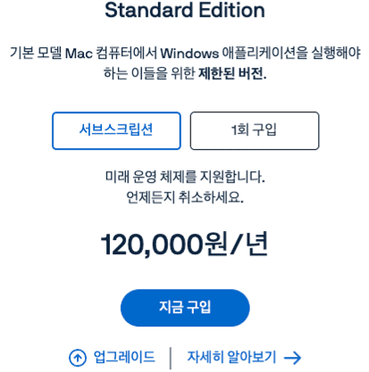
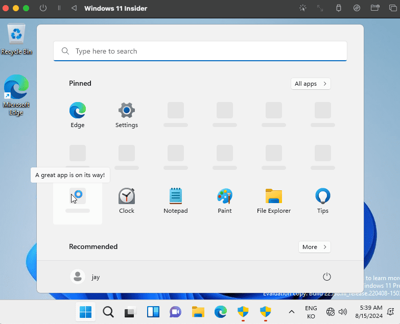
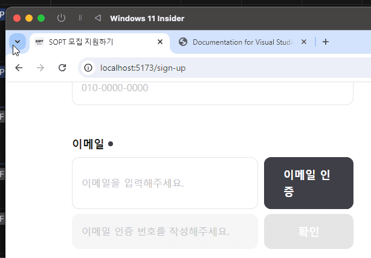
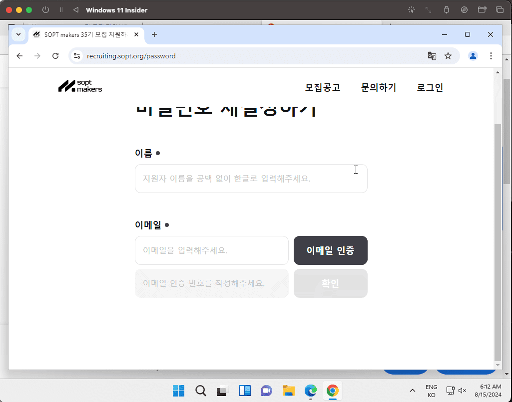

# 상황

Chrome, Arc, Firefox, Safari의 여러 브라우저에서 디자인들이 정상적으로 보여지는지 테스트를 한 후 최종 배포를 마친 상황이었다.
그런데 갑자기 디자인 에러 제보가 들어왔다.

_오잉스 🤔_

현재 우리 팀원들 모두 MacOS를 이용 중이었기에 QA를 하며 해당 이슈를 발견하지 못했었다.

현재 배포가 되어 있고 지원자를 모집 중이 중이었기에 빠르게 이슈 해결이 필요해 일단은 동생 컴퓨터를 이용해서 수정을 하였다.
하지만 매번 이렇게 동생 컴퓨터를 이용해서 테스트 할 수는 없기에 MacOS에서 windows를 동작시키는 방법이 필요했다.

# 여러 프로그램들

이를 지원해주는 여러 프로그램들이 있었다.

1. boot camp
2. parallels

일단 boot camp 같은 경우 무료라는 장점이 있었고, 애플에서 공식적으로 지원하는 어플리케이션이었다.
하지만 안타깝게도 최신 애플 실리콘 칩을 사용하는 맥북에는 사용이 불가능했다. 더 이상 애플에서 지원을 해주지 않았기 때문이다.

그래서 실리콘 칩에서도 사용가능한 parallels를 이용하려 했으나

가격이 어마무시했다.

따라서 이 두 방안은 실제로 적용하기 어려웠고 다른 방법이 필요했다.

# UTM으로 가상환경 실행

어떻게 하는게 좋을 지 고민을 하던 중 학교에서 배운 가상환경을 이용해서 windows를 동작시키면 되지 않을까라는 생각이 들었다.
따라서 UTM을 이용해 보기로 결정했다.

다행히도 구글링을 해보니 이에 대한 자료를 찾을 수 있었고 바로 적용을 해보기로 하였다.
[해당 블로그](https://techtree.tistory.com/98)에 설치 과정이 잘 정리되어 있어서 그대로 따라해줬다.

_성공!_

# 기타 에러들

## yarn install 스크립트 실행 불가능

yarn install을 하려고 하였으나 스크립트를 실행할 수 없다는 에러가 떴다. 
[해당 블로그](https://velog.io/@yerim1935/%EC%97%90%EB%9F%AC%EB%85%B8%ED%8A%B8-yarn-%EC%9D%B4-%EC%8B%9C%EC%8A%A4%ED%85%9C%EC%97%90%EC%84%9C-%EC%8A%A4%ED%81%AC%EB%A6%BD%ED%8A%B8%EB%A5%BC-%EC%8B%A4%ED%96%89%ED%95%A0-%EC%88%98-%EC%97%86%EC%9C%BC%EB%AF%80%EB%A1%9C-CUsersuserAppDataRoamingnpmyarn.ps1-%ED%8C%8C%EC%9D%BC%EC%9D%84-%EB%A1%9C%EB%93%9C%ED%95%A0-%EC%88%98-%EC%97%86%EC%8A%B5%EB%8B%88%EB%8B%A4)에 이슈 해결법 잘 정리 되어 있어서 따라 수정해줬다.

## 속도가 너무 느린 이슈

가상머신의 속도가 진짜 너무나도 느렸다.
yarn install 하는데 3분이 넘게 걸리고
뭐 좀만 무거워지려고 하면 재부팅되고 정말 못 쓸 기구라고 생각을 하던 찰나에
내가 메모리를 512MB로 설정해줬다는 사실을 깨닫게 되었다.
이를 4,096MB로 높여주니 정상적인 속도로 돌아왔다.

# 이슈 확인

reset을 통해 해당 이슈를 해결하기 전으로 돌아가 봤다.
windows 환경에서 실제로 해당 이슈가 발생하는지 확인하기 위해서였다.

실제로 디자인이 깨진 상태로 유지되고 있었다.
다시 되돌리니 정상상태로 돌아왔다.

inspection을 키고 css 속성들을 살펴보았는데
MacOS와 Windows에서 적용되는 css 속성들은 동일했다.
하지만 일단 해당 포스트는 MacOS에서 Windows 돌리기이므로
왜 디자인이 깨지게 되었는지는 다음 블로그 포스트에 업로드할 예정이다.
