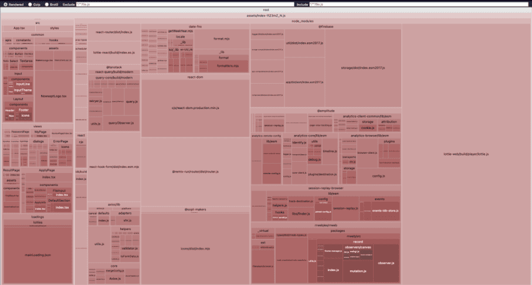

# 배경


build시 위와 같은 경고가 떴다.

1. code splitting을 이용하여 코드 사이즈를 줄여라.
2. eval의 사용으로 인해 risks가 커질 수 있다.

이를 해결하기 위해 빌드 최적화를 하기로 결정하였다.

# rollup-plugin-visualizer

## 설치

bundle을 분석하기 위한 라이브러리가 필요했다.
vite는 개발모드에선 esbuild를 최종 배포에는 rollup을 사용하기에 rollup 플러그인을 활용하였다.
그 중 가장 인기 있는 [rollup-plugin-visualizer](https://www.npmjs.com/package/rollup-plugin-visualizer)를 선택해주었다.


[vite-bundle-visualizer](https://www.npmjs.com/package/vite-bundle-visualizer)도 고려 대상이었으나 애초에 vite-bundle-visualizer가 rollup-plugin-visualizer을 dependency로 가지고 있기도 하고,
내가 필요한 기능인 번들 사이즈 분석 기능 면에서 rollup-plugin-visualizer보다 더 나은 사용성이나 편의성을 제공하는 것도 아니어서 README도 더 자세하고 사용자도 더 많은 rollup-plugin-visualizer을 사용하기로 결정하였다.

## 설정

```tsx
plugins: [
  // ...
  visualizer({
    filename: './dist/report.html',
    open: true,
    gzipSize: true,
    brotliSize: true,
  }) as PluginOption,
],
```

filename에 경로와 이름을 설정해주었다. 해당 파일이 GitHub에 올라가는 걸 방지하기 위해 .dist 안에 넣어주었다. 이를 설정하지 않을 경우 최상단에 stats.html 파일로 생성된다. 물론 .gitignore에 추가해도 되지만 build시 생성되는 파일이므로 통일성을 위해 .dist 안에 넣어주었다.

`open`을 true로 두어 build 완료 시 해당 html이 자동으로 열리도록 하였다. 매번 창을 열기 귀찮기도 했고 bundle size를 고려하면서 개발을 했는지 매번 체크해 주고 싶었기 때문이다.
`gzip size`와 `bortli size`도 보고 싶어서 true로 설정해줬다.

더 많은 option들은 [rollup plugin visualizer options](https://www.npmjs.com/package/rollup-plugin-visualizer#options)애서 볼 수 있다.

# 분석

yarn build를 해주니 아래와 같은 화면이 떴다.




이중 가장 많은 비중을 차지하는 건 lottie 이미지였다. 따라서 이에 대한 최적화가 먼저 필요했다.


_전체의 24.36%를 차지하고 있었다._

# lottie-react 라이브러리 코드 분석 및 적용

## lottie 관련 chunk 줄이기

우리 프로젝트에선 [lottie-react](https://www.npmjs.com/package/lottie-react)라는 라이브러리를 사용하고 있었다.<br />
하지만 찾아보니 lottie-react는 [lottie-web](https://www.npmjs.com/package/lottie-web)을 dependency로 가지고 있었다.

> 그렇다면 lottie-react가 아닌 lottie-web을 이용해서 필요한 부분만 내가 직접 개발할 수 있는게 아닐까?<br />
> 그럼 번들 사이즈도 줄일 수 있지 않을까?

라는 생각이 들어 lottie-web을 구현하기 위해 lottie-react에선 이를 어떻게 이용하여 구현했는지 분석해보기로 하였다.

## 라이브러리 분석

코드는 3개의 주요 파일로 구성되어 있었다.

1. Lottie
2. useLottie
3. useLottieInteractivity

### Lottie

Lottie.tsx는 useLottie와 useLottieInteractivity를 통해 구현된 Lottie 이미지를 렌더링 해주는 Component이다.
그렇기에 사실상 중요한 부분 useLottie와 useLottieInteractivity 였다. 이 곳에서 모든 action들이 처리가 되었다.

useLottie에서는 lottie animation을 로드하고 play, stop 등의 다양한 기능을 제공하고 있었다.
하지만 내가 필요한 부분은 첫 렌더링 되었을 때 로티 이미지를 동작시켜주는 부분 뿐이었기에 다른 코드들은 필요가 없었다.

### useLottie

일단 2개의 ref를 생성하였다.

```tsx
import { AnimationItem } from 'lottie-web';

const animationInstanceRef = useRef<AnimationItem>();
const animationContainer = useRef<HTMLDivElement>(null);
```

실질적인 lottie animation이 들어가는 animationInstanceRef와 그를 감싸줄 animationContainer이다.<br />
그런 뒤 animationData가 렌더링 되면 loadAnimation 함수를 실행시켜 ref에 animation을 등록해 주었다.

```tsx
const loadAnimation = (forcedConfigs = {}) => {
  // Return if the container ref is null
  if (!animationContainer.current) {
    return;
  }

  // Destroy any previous instance
  animationInstanceRef.current?.destroy();

  // Build the animation configuration
  const config: AnimationConfigWithData<T> = {
    ...props,
    ...forcedConfigs,
    container: animationContainer.current,
  };

  // Save the animation instance
  animationInstanceRef.current = lottie.loadAnimation(config);
  setAnimationLoaded(!!animationInstanceRef.current);

  // Return a function that will clean up
  return () => {
    animationInstanceRef.current?.destroy();
    animationInstanceRef.current = undefined;
  };
};

useEffect(() => {
  const onUnmount = loadAnimation();

  // Clean up on unmount
  return () => onUnmount?.();
  // eslint-disable-next-line react-hooks/exhaustive-deps
}, [animationData, loop]);
```

마지막으로 해당 ref를 div 태그에 할당시켜준 후 다른 기능들과 같이 return 해주었다.

```tsx
const View = <div style={style} ref={animationContainer} {...rest} />;

return {
  View,
  // ... play, stop 등의 다른 기능들
  animationContainerRef: animationContainer,
  animationLoaded,
  animationItem: animationInstanceRef.current,
};
```

### useLottieInteractivity

useLottieInteractivity는 스크롤이나 커서 위치 등에 따라 애니메이션을 제어하는 기능들이 포함되어 있었다. 하지만 내가 사용하는 lottie 이미지는 로딩 애니메이션 하나 밖에 없기에 사용자와의 인터렉트를 조절해 줄 필요가 없었다.

## 실제 코드에 적용해보기

이를 바탕으로 실제 코드에 적용해 보기로 하였다.
사용자 인터랙션 부분 다 빼고 정말 animaition만 반복되게 구현했다.
mainLoading과 buttonLoading 2군데에서 사용할 예정이라 공통된 component로 분리가 필요했다.
하지만 useLottie 처럼 여러 기능들이 있는 것이 아니므로 custon hook의 분리가 아닌 하나의 파일 안에 같이 구현을 해주었다.

```tsx
import lottie, {
  type AnimationConfigWithData,
  type AnimationItem,
} from 'lottie-web';
import { type CSSProperties, useEffect, useRef } from 'react';

const Lottie = ({
  animationData,
  style,
}: {
  animationData: unknown;
  style?: CSSProperties;
}) => {
  const animationInstanceRef = useRef<AnimationItem>();
  const animationContainer = useRef<HTMLDivElement>(null);

  const loadAnimation = () => {
    if (!animationContainer.current) {
      return;
    }

    animationInstanceRef.current?.destroy();

    const config: AnimationConfigWithData = {
      animationData,
      container: animationContainer.current,
    };

    animationInstanceRef.current = lottie.loadAnimation(config);

    return () => {
      animationInstanceRef.current?.destroy();
      animationInstanceRef.current = undefined;
    };
  };

  useEffect(() => {
    const onUnmount = loadAnimation();

    return () => onUnmount?.();
  }, [animationData]);

  return <div ref={animationContainer} style={style} />;
};

export default Lottie;
```

필요한 부분만 가져다 썼기에 코드가 많이 유사하다.


정상 작동하는 것을 확인할 수 있었다.

## 얼마나 줄었을까?


1,359.76kb → 1,350.14kb로 9kb 정도밖에 안 줄어들었다.
생각보다 너무 미미한 수치였다. 이럴 거면 그냥 lottie-react를 다시 쓰는 게 더 이득일 정도였다.

## lottie-web의 light 버전

번들 사이즈를 더 줄일 수 있을까 하고 구글링을 해보니 lottie-web의 light 버전을 찾을 수 있었다.


_기존_


_light 버전 도입 후_


_build 결과_

1,350.14kb → 1,099.27kb로 사이즈가 감소했으며 build 시간도 6.32s → 5.61s로 1초 가량 줄어들었다.

## lottie file 용량 줄이기

조금이라도 더 번들 크기를 감소시키기 위해 lottie file의 용량을 줄여보기로 하였다.
[lottie image 최적화 사이트](https://www.lottiemizer.com/ko/)를 이용해줬다.


미미하지만 17kb 더 줄일 수 있었다. 빌드 시간도 0.5s 세이브 했다.

## 결과


최종적으로 627.65kb (24.36%) → 386.35kb (16.84%)로 개선할 수 있었다.

> node_modules/lottie-web/build/player/lottie.js (17010:32): Use of eval in "node_modules/lottie-web/build/player/lottie.js" is strongly discouraged as it poses security risks and may cause issues with minification.

또한 위의 에러도 제거할 수 있었다.

# manual chunk

안내 메시지가 추천해준대로 `build.rollupOptions.output.manualChunks`를 이용하여 chunk를 분리해보기로 하였다.

## chunk란

.ts, .tsx, .vue 등의 파일에서 작업을 한다. 이때 브라우저는 해당 파일들을 읽지 못하기 때문에 .js로 변환하는 과정이 필요하다. 이는 빌드 과정을 통해 진행된다. 변환된 결과로써 하나의 .js 큰 파일을 가질 수 있는데 이는 별로 추천되지 않는다. 그 중에는 현재엔 필요없는 코드들도 포함되어 있기 때문이다. 따라서 하나의 큰 .js 파일이 아닌 여러 개의 작은 .js 파일로 쪼갠 뒤 필요한 것들만 불러와 사용하는 것이다.

이때 각각의 .js 파일들을 하나의 chunk라고 한다.

4개의 chunk로 이루어진 번들이 있다고 하면 이는 곧 4번의 HTTP requests를 요한다. 따라서 무분별한 chunk의 분리는 오히려 성능을 낮출 수도 있다.

## import 범위 축소

일단 id에 무엇이 찍히는지 콘솔을 찍어보았다.

```tsx
manualChunks: (id) => {
  console.log(id);
},
```


이때 locale과 관련된 것들이 너무나도 많이 import 되고 있음을 확인할 수 있었다.
우리는 ko만을 이용하고 있는데 다른 나라들 locale까지 import 되고 있었던 것이다.

locale를 ko만 import 하도록 범위를 제한해 줬다.

```tsx
import { ko } from 'date-fns/locale/ko';
```

또한 사용되지 않는 것들이 너무 많았다.


```tsx
import { format } from 'date-fns/format';
```

범위를 수정해주었다.


_전_


_후_

0.01kb 줄어듦을 확인할 수 있었으며, 사용되는 것들만 import 되고 있음도 확인할 수 있었다.
하지만 사실 너무나도 미비한 차이라 유의미한 결과를 냈다고 할 순 없었다.

이런 식으로 필요 없는 것들까지 같이 import 되고 있을 수도 있으며 추후에 더 큰 라이브러리를 사용할 경우 동일한 방법을 통해 번들 사이즈를 줄일 수 있다는 사실을 알게 된 것에 의의를 두기로 하였다.


대신 빌드 시간이 4초대로 줄어들게 되었다. 꽤나 긍정적으로 생각할 수 있다.

## chunk 분리

id를 콘솔 찍었을 때 firebase와 관련된 것들도 많았다. 하지만 firebase는 오직 지원하기 페이지에서 파일 첨부할 때만 필요한 라이브러리였기에 첫 페이지부터 불러올 필요는 없었다. 따라서 별도의 chunk로 분리해주기로 하였다.

firebase가 들어가는 것들은 firebase chunk로 묶어주었다.

```tsx
// vite.config.ts

build: {
  rollupOptions: {
    output: {
      manualChunks: (id) => {
        if (id.includes('firebase')) return 'firebase';
      },
    },
  },
},
```


1,082.55kb의 큰 chunk를 975.25kb, 107.04kb 두 개의 chunk로 쪼갤 수가 있었다.
이제 firebase chunk는 해당 라이브러리가 필요한 곳에서 로드될 것이다.


# lazy loading

하지만 아직 역시나 975.25kb는 크다는 경고가 남아있었다. 이를 개선하기 위해 두 번째로 추천해준 code split을 진행하기로 하였다. 그 중 lazy loading 방식을 채택하였다.

lazy loading이 필요한 곳은 아래와 같았다.

1. dialogs
2. error page, no more page
3. 각각의 페이지들

일단 모달창들과 에러 페이지들은 절대 첫 페이지에서 렌더링 될 일이 없는 친구들이다. 사용자가 페이지에 진입 후 어떠한 액션을 해야 뜨는 친구들이기에 lazy loading을 적용해주었다.
각각의 페이지들 또한 하나의 페이지 진입 시 다른 페이지 내용은 필요하지 않기에 lazy loading 적용해주었다.

```tsx
const DraftDialog = lazy(() =>
  import('views/dialogs').then(({ DraftDialog }) => ({ default: DraftDialog })),
);
const PreventApplyDialog = lazy(() =>
  import('views/dialogs').then(({ PreventApplyDialog }) => ({
    default: PreventApplyDialog,
  })),
);
const SubmitDialog = lazy(() =>
  import('views/dialogs').then(({ SubmitDialog }) => ({
    default: SubmitDialog,
  })),
);
const NoMore = lazy(() => import('views/ErrorPage/components/NoMore'));
```

그런 뒤 yarn build 해주었다.


그 결과 975.25kb 였던 chunk를 794.31kb와 그 외의 chunk들로 분리할 수가 있었다.
또한 최종적으로 최적화 전 6.11s 걸리던 빌드 시간을 4.99s로 1.2s 줄일 수 있었다.


_번들 최적화 전 Lighthouse 결과_


_번들 최적화 후 Lighthouse 결과_

# 참고자료

[Splitting vendor chunk with Vite and loading them async - DEV Community](https://dev.to/tassiofront/splitting-vendor-chunk-with-vite-and-loading-them-async-15o3)
[Splitting and Caching React Chunks - DEV Community](https://dev.to/pffigueiredo/splitting-and-caching-react-chunks-4c0c)
[Vite 환경에서 Bundle Analyzer로 빌드 최적화하기](https://velog.io/@aborrencce/Vite-환경에서-Bundle-Analyzer로-최적화하기)
