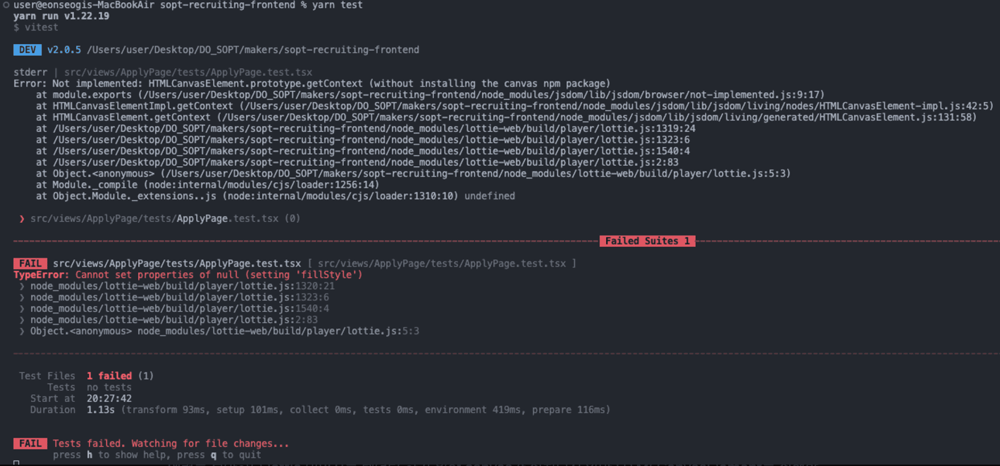
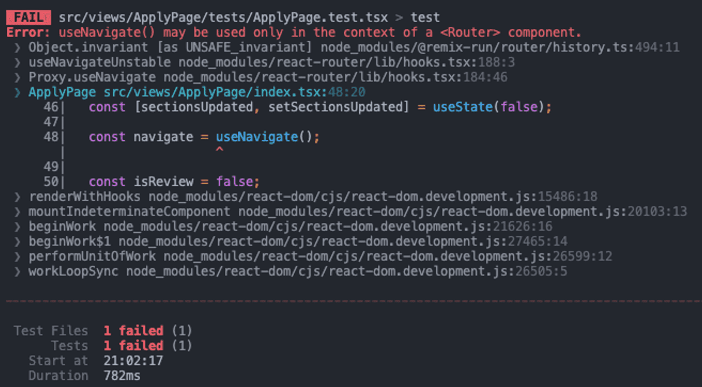
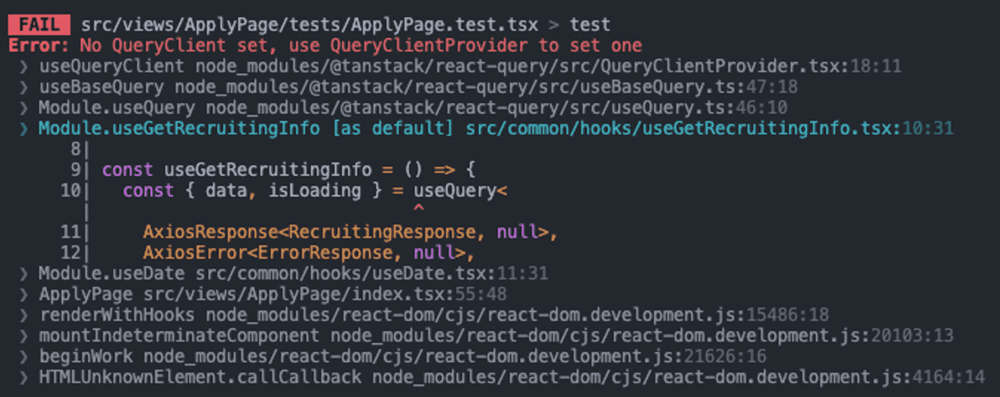
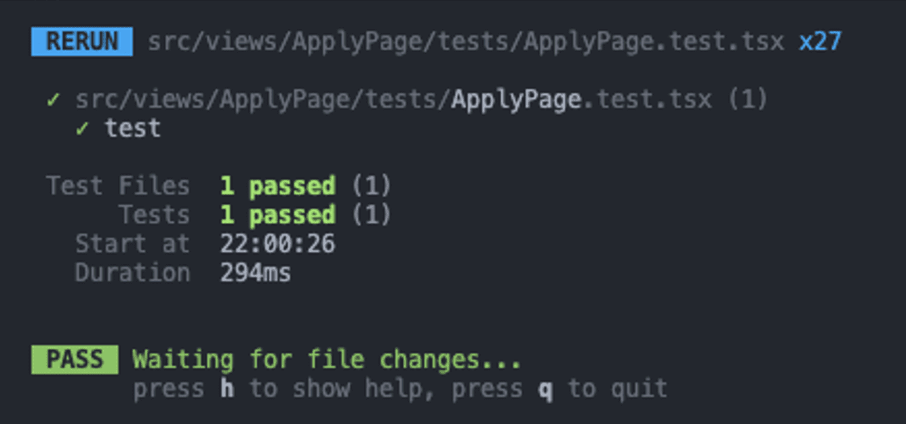
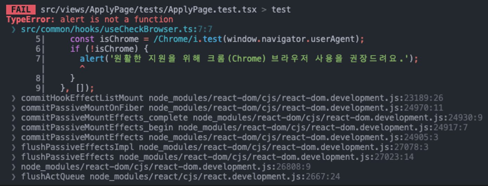
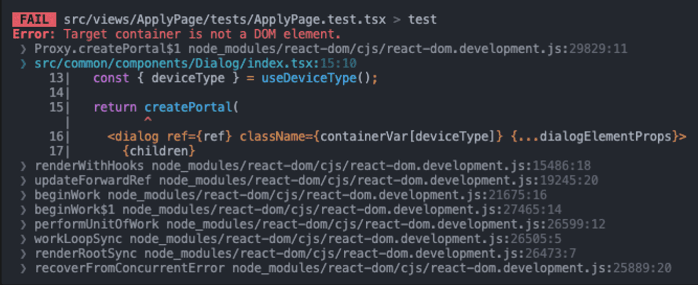
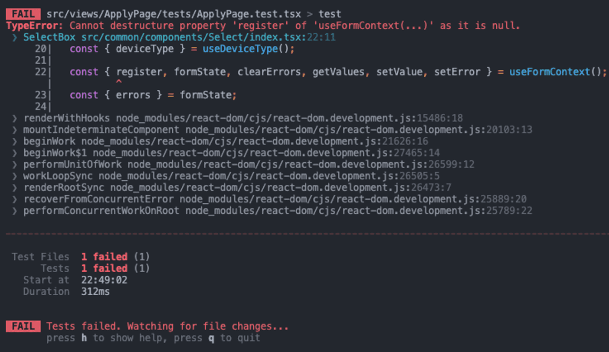
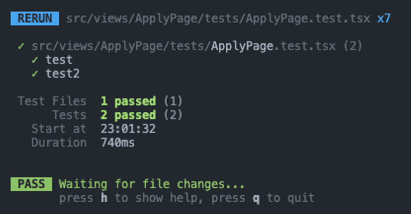

# 배경

새로운 기능을 개발하거나 기존 버그를 fix할 때마다 기존에 진행했었던 테스트(regression test)들을 다시 진행해줘야 했다.
사실 버그 수정하면서 고쳐진 코드로 인해 원래 잘 작동되던 기능이 작동 안 되던 적이 몇 번 있었었는데
그렇다고 매번 직접 테스트하기엔 너무나도 할 것들이 많고 귀찮으며 시간도 오래 걸렸다.
따라 이를 테스트 코드를 통해 편하게 진행하면 좋을 거 같단 생각이 들었다.

사실 테스트 코드를 짜기 어려운 이유 중 하나가 FE코드가 자주 바뀐다를 들 수가 있다.
VOC나 이벤트 등에 의해 UI가 자주 추가/삭제 되면 그때마다 테스트 코드를 다시 짜줘야 하기 때문이다.
하지만 우리의 지원서 서비스는 한 번 만든 걸 계속 사용할 예정이라 UI적으로 큰 변화가 없을 거라고 생각 되었기에
이로 인한 추가 리소스는 적을 것이라 판단했다.

현재 우리 코드에는 context도 사용하고 react query 등 여러 기능들이 들어가 있어
이러한 데이터가 테스트 코드에도 반영이 될 수 있도록 custom render를 만들어 줘야 했다.

# custom render 제작

```tsx
import { render, type RenderOptions } from '@testing-library/react';
import DeviceTypeProvider from 'contexts/DeviceTypeProvider';
import RecruitingInfoProvider from 'contexts/RecruitingInfoProvider';
import ThemeProvider from 'contexts/ThemeProvider';
import type { ReactElement, ReactNode } from 'react';

const AllTheProviders = ({ children }: { children: ReactNode }) => {
  return (
    <ThemeProvider>
      <DeviceTypeProvider>
        <RecruitingInfoProvider>{children}</RecruitingInfoProvider>
      </DeviceTypeProvider>
    </ThemeProvider>
  );
};

const customRender = (
  ui: ReactElement,
  options?: Omit<RenderOptions, 'wrapper'>,
) => render(ui, { wrapper: AllTheProviders, ...options });

export * from '@testing-library/react';
export { customRender as render };
```

위와 같이 custom render를 만들어 줬다. 방법은 [Setup | Testing Library](https://testing-library.com/docs/react-testing-library/setup/)에 다 나와있어서 쉬웠다.

그런 뒤 간단한 테스트를 해보기 위해 test 코드를 짜보았다.

```tsx
import { render } from 'tests/test-utils';
import ApplyPage from '..';

test('test', () => {
  render(<ApplyPage />);

  expect(true);
});
```

그러자 아래와 같은 에러가 떴다.



## fillStyle에 null 값 들어갈 수 없음

에러를 보아하니 lottie 이미지를 렌더링 하기 위한 canvas가 설치되지 않아 HTMLCanvasElement를 실행할 수 없다는 에러였다.

vitest.setup.ts 파일에 아래 코드를 추가해주어 빈 fillStyle을 넣어줌으로써 해결할 수 있었다.

```tsx
import { vi } from 'vitest';

/* @ts-ignore */
HTMLCanvasElement.prototype.getContext = () => {
  return {
    fillStyle: '',
    fillRect: vi.fn(),
  };
};
```

참고자료: [TypeError: Cannot set property 'fillStyle' of null · Issue](https://github.com/felippenardi/lottie-react-web/issues/21)

추후에 lottie 관련 테스트 하는 중 에러가 발생하면 [vite-canvas-mock](https://www.npmjs.com/package/vitest-canvas-mock) 라이브러리의 설치를 고려해봐도 좋을 거 같다.

## Router의 부재

다음엔 또 아래와 같은 에러가 떴다.



현재 custom render에는 `<Router>`가 없어서 useNavigate를 사용하지 못한다는 에러였다.

custom render를 MomeryRouter로 감싸줌으로써 해결할 수 있었다.

```tsx
const AllTheProviders = ({ children }: { children: ReactNode }) => {
  return (
    <MemoryRouter>
      <ThemeProvider>
        <DeviceTypeProvider>
          <RecruitingInfoProvider>{children}</RecruitingInfoProvider>
        </DeviceTypeProvider>
      </ThemeProvider>
    </MemoryRouter>
  );
};
```

참고자료 [React Router | Testing Library](https://testing-library.com/docs/example-react-router/)
[MemoryRouter v6.26.1 | React Router](https://reactrouter.com/en/main/router-components/memory-router)

하지만 위와 같이 할 경우 MemoryRouter의 props 들을 설정할 수가 없게 된다.
props들을 동적으로 설정해주기 위해 코드를 수정해주었다.

```tsx
// ...
import { MemoryRouter, type MemoryRouterProps } from 'react-router-dom';

interface AllTheProvidersProps extends MemoryRouterProps {
  children: ReactNode;
}

const AllTheProviders = ({
  children,
  ...memoryRouterProps
}: AllTheProvidersProps) => {
  return (
    <MemoryRouter {...memoryRouterProps}>
      <ThemeProvider>
        <DeviceTypeProvider>
          <RecruitingInfoProvider>{children}</RecruitingInfoProvider>
        </DeviceTypeProvider>
      </ThemeProvider>
    </MemoryRouter>
  );
};

const customRender = (
  ui: ReactElement,
  options?: Omit<RenderOptions, 'wrapper'>,
  memoryRouterProps?: MemoryRouterProps,
) =>
  render(ui, {
    wrapper: ({ children }) => (
      <AllTheProviders {...memoryRouterProps}>{children}</AllTheProviders>
    ),
    ...options,
  });
```

따라서 다음과 같이 memory router에 props를 추가할 수 있게 되었다.

```tsx
test('test', () => {
  render(<ApplyPage />, {}, { initialEntries: ['/test'] });
});
```

## query client provider 설정

그런 뒤 test를 하니 아래와 같은 에러가 떴다.



custom render에는 query client가 설정 되어있지 않아 useQuery를 사용할 수 없다는 에러였다.

query client를 생성한뒤 provider로 감싸주었다.

```tsx
const AllTheProviders = ({
  children,
  ...memoryRouterProps
}: AllTheProvidersProps) => {
  const queryClient = new QueryClient({
    defaultOptions: {
      queries: {
        refetchOnWindowFocus: false,
        refetchOnMount: false,
        refetchOnReconnect: false,
        gcTime: 1000 * 60 * 60,
        retry: false,
      },
    },
  });

  return (
    <QueryClientProvider client={queryClient}>{/* ... */}</QueryClientProvider>
  );
};
```

defaultOptions는 기존 사용하던 queryClient와 동일하게 해주었다.

참고자료
[Testing | TanStack Query React Docs](https://tanstack.com/query/v5/docs/framework/react/guides/testing#our-first-test)
[(번역) Testing React Query | highjoon-dev](https://highjoon-dev.vercel.app/blogs/5-testing-react-query)

```tsx
test('test', async () => {
  const { result } = renderHook(() => useGetDraft(), {
    wrapper: AllTheProviders,
  });

  await waitFor(() => result.current.draftData);

  // expect(result.current.draftData?.data.applicant).toBeDefined();
});
```

아직 msw 설정을 하지 않아 데이터가 없어 expect는 되지 않지만 위와 같이 할 경우 성공적으로 테스트가 진행됨을 확인할 수 있었다.



## window alert is not a function

테스트를 원래대로 돌려놓고 테스트 해보니 아래와 같은 에러가 떴다.



```tsx
export const AllTheProviders = ({
  children,
  ...memoryRouterProps
}: AllTheProvidersProps) => {
  window.alert = vitest.fn();
  window.scrollTo = vitest.fn();
  // ...
};
```

위와 같이 vitest 함수라는 걸 선언해줌으로써 해결할 수 있었다.

참고 자료
[reactjs - jest not implemented window.alert() - Stack Overflow](https://stackoverflow.com/questions/55088482/jest-not-implemented-window-alert)
[테스트 작성 시, window.alert 모킹하기 (jest.fn, jest.spyOn)](https://cheolsker.tistory.com/84)

이제는 아래와 같은 에러가 떴다.



dialog를 이용할 때 create portal을 이용하여 별도의 div로 빼주었는데 render하는 컴포넌트에는 해당 div가 포함되지 않아서 발생한 에러였다.

따라서 test하기 전에 똑같이 portal이 생성되는 div를 만들어 주면 됐다.

vitest의 beforeAll을 사용해 주었다. 모든 test를 시작하기 전에 modal을 위한 div를 생성해 준 뒤 test를 진행하도록 하였다. 사실 모든 곳에서 modal이 사용되는 건 아니여서 필요한 부분에서만 생성해주면 되는데 각각에서 매번 이를 진행해주는 것이 귀찮아서 그냥 global하게 설정해주었다. 만약 test 속도가 늦어진다면 분리하면 될 거 같다.

```tsx
// setupTest.ts

beforeAll(() => {
  const portalEl = document.createElement('div');
  portalEl.id = 'modal';
  document.body.appendChild(portalEl);
});
```

참고자료:
[How to test a component rendered using React.createportal?](https://stackoverflow.com/questions/76199033/how-to-test-a-component-rendered-using-react-createportal)

## form provider 부재

또 테스트를 해보았다. 또 에러가 발생했다.



react-hook-form의 FormProvider와 useFormContext를 이용하여 method를 전달해주고 있었는데 custom render에는 FormProvider를 찾을 수 없다는 에러였다.

해결법은 간단했다. FormProvider를 추가해주면 됐다.

```tsx
export const AllTheProviders = ({
  children,
  ...memoryRouterProps
}: AllTheProvidersProps) => {
  const method = useForm({ mode: 'onBlur' });

  return <FormProvider {...method}>{/* ... */}</FormProvider>;
};
```

# 결과

```tsx
import { render, screen } from 'tests/test-utils';
import BottomSection from '../components/BottomSection';
import { userEvent } from '@testing-library/user-event';
import SignInForm from 'views/SignInPage/components/SignInForm';

test('test', () => {
  render(<SignInForm />, {}, { initialEntries: ['/'] });

  const button = screen.getByRole('button', { name: /로그인/i });

  expect(button).toBeEnabled();
});

test('test2', async () => {
  const user = userEvent.setup();
  render(<BottomSection isReview={false} />, {}, { initialEntries: ['/'] });

  const checkbox = screen.getByRole('checkbox', { name: /개인정보/i });
  expect(checkbox).not.toBeChecked();

  await user.click(checkbox);
  expect(checkbox).toBeChecked();

  await user.click(checkbox);
  expect(checkbox).not.toBeChecked();
});
```

간단한 테스트 코드를 짜보았고 성공하는 걸 확인할 수 있었다.


